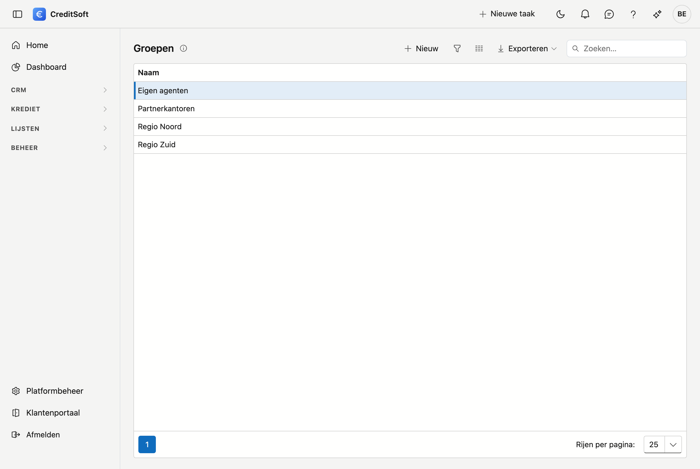

# Groepen

Groepen zijn een **vrije indeling van uw aanbrengers** — per regio, per soort samenwerking, per kantoor: u bepaalt zelf welke groepen bestaan en hoe ze heten. Op dit scherm onderhoudt u die lijst. Het toekennen zelf gebeurt op de fiche van de aanbrenger.

## Het scherm openen

Klik in de zijbalk op **CRM** en dan op **Groepen**.

{ .volle-breedte }

## De lijst

De tabel toont per groep de **naam**. Meer is er niet: een groep is een etiket, geen fiche.

- **Zoeken** — het zoekveld zoekt op naam.
- **Exporteren** — naar Excel of CSV.
- **Nieuw / bewerken** — klik op **Nieuw**, of **dubbelklik** een rij om ze te hernoemen.
- **Verwijderen** — een groep wordt **gearchiveerd**, niet definitief gewist. De aanbrengers die ze droegen blijven gewoon bestaan.

## Een groep toevoegen of bewerken

Een groep heeft enkel een **naam**. Vul die in en klik op **Opslaan**. Verwijderen doet u in hetzelfde venster.

## Een aanbrenger in een groep zetten

Dat doet u niet hier, maar op de fiche van de aanbrenger zelf: **CRM → Aanbrengers**, open de aanbrenger, en kies op het tabblad *Algemeen* — in het blok **Identiteit** — een waarde bij **Groepering**.

{ .volle-breedte }

!!! info "Eén groep per aanbrenger"
    Een aanbrenger hoort bij hoogstens één groep. Wilt u iemand op meerdere manieren indelen, dan is dat een keuze tussen die indelingen — of u geeft de groepen een naam die de combinatie uitdrukt.

!!! tip "De lijst is leeg bij de start"
    Er zijn geen vaste groepen: u begint met een lege lijst en maakt aan wat u nodig hebt. Zolang u geen groepen aanmaakt, blijft het veld *Groepering* op de aanbrengersfiche gewoon leeg.
