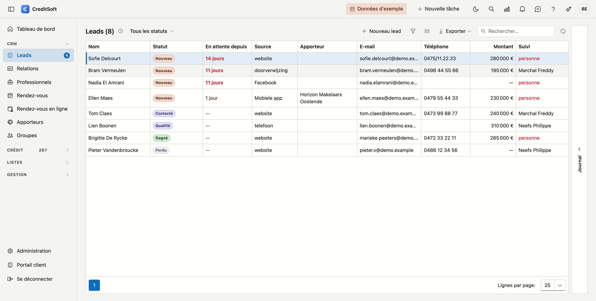
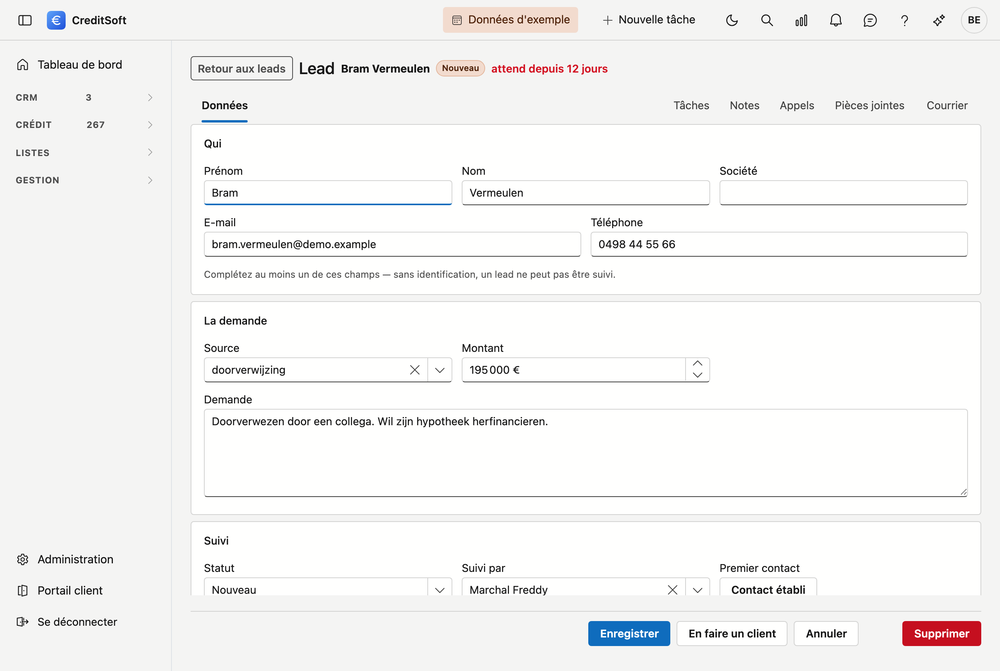
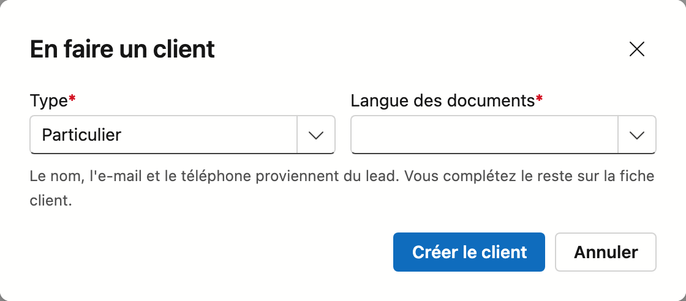

# Leads

Quelqu'un remplit votre formulaire de contact, téléphone, ou est recommandé par un client satisfait. C'est un **lead** : une demande émanant de quelqu'un qui n'est pas encore client. L'écran *Leads* retient qui a frappé à la porte, depuis combien de temps il attend, et qui assure le suivi.

## Ouvrir l'écran

Dans la barre latérale, cliquez sur **CRM**, puis sur **Leads**.

## La liste

La liste s'ouvre sur **celui qui attend le plus longtemps**, et non sur la dernière arrivée. Pour chaque lead, vous voyez : **nom**, **statut**, **attend depuis**, **source**, **e-mail**, **téléphone**, **montant** et **suivi**.

- **Attend depuis** — le temps écoulé depuis l'arrivée de la demande, tant qu'il n'y a pas eu de contact. À partir de deux jours, la valeur passe au rouge. S'il y a eu contact, un tiret s'affiche : le chronomètre est arrêté.
- **Suivi** — le collaborateur qui assure le suivi. Si **personne** apparaît en rouge, ce lead n'appartient à personne et il va rester en plan.
- **Filtre par statut** — en haut, vous choisissez tous les statuts ou un seul.
- **Rechercher** — le champ de recherche parcourt toutes les colonnes à la fois.
- **Choisir les colonnes** — affichez ou masquez des colonnes ; votre choix est mémorisé.
- **Exporter** — vers Excel ou CSV, avec les filtres actifs à ce moment-là.
- **Nouveau / modifier** — cliquez sur **Nouveau lead**, ou **double-cliquez** une ligne pour ouvrir la fiche.
- **Supprimer** — un lead est **archivé**, jamais effacé définitivement.

À côté de *Leads* dans le menu figure un compteur : le nombre de leads qui attendent encore un premier contact.

## Les cinq statuts

| Statut | Ce que cela signifie |
|---|---|
| **Nouveau** | Arrivé, personne n'a encore pris contact. |
| **Contacté** | Il y a eu contact. À partir d'ici, le chronomètre du temps d'attente s'arrête. |
| **Qualifié** | Une vraie demande avec une vraie chance — cela vaut la peine d'y consacrer du temps. |
| **Gagné** | Devenu client. |
| **Perdu** | Cela n'a rien donné. Notez pourquoi ; à la longue, cela se lit comme une tendance. |

Il n'y a délibérément pas davantage d'états. Un bureau de cinq personnes n'a pas besoin d'un entonnoir de vente à huit phases ; il a besoin que rien ne reste en plan.

## La fiche

Double-cliquez un lead pour ouvrir sa fiche. En haut figurent son nom, son statut et depuis combien de temps il attend.

{ .volle-breedte }

La fiche comporte trois blocs.

### Qui

**Prénom**, **Nom**, **Société**, **E-mail** et **Téléphone**. Aucun de ces champs n'est obligatoire en soi, mais **au moins un** doit être complété — sans identification, un lead ne peut pas être suivi.

### La demande

- **Source** — d'où vient ce lead : *site web*, *téléphone*, *recommandation*, *Facebook*, ce que vous utilisez. Le champ propose ce que vous avez déjà saisi auparavant, afin que l'orthographe reste constante, mais vous pouvez saisir librement. Ainsi, la liste des sources reste celle de **votre** bureau, et non celle que nous aurions imaginée.
- **Montant** — le montant dont il est question, pour autant que vous le sachiez déjà.
- **Provenance** — si ce lead est arrivé via une connexion, celle-ci est indiquée ici. Ce champ n'est pas modifiable : c'est un constat, pas une saisie.
- **Demande** — la demande telle qu'elle est arrivée, en texte libre.

### Suivi

- **Statut** — l'un des cinq ci-dessus.
- **Suivi par** — le collaborateur qui appelle. Si vous laissez ce champ vide, la liste affiche **personne** en rouge.
- **Premier contact** — dès qu'il y a eu contact, l'heure s'affiche ici. S'il n'y a pas encore eu de contact, un bouton **Contact établi** apparaît : un clic fixe l'heure *et* met le statut sur *Contacté*, sans devoir passer par une liste de choix.
- **Motif de la perte** — apparaît dès que vous mettez le statut sur *Perdu*.

## Du lead au client

Si cela aboutit, cliquez sur la fiche sur **En faire un client**.

CreditSoft ne demande que ce que le lead ignore :

- **Type** — particulier ou société. Si le lead porte un nom de société, ce champ est déjà sur *Société*.
- **Langue des documents** — obligatoire sur toute fiche client : elle détermine dans quelle langue ce client reçoit ses courriers et ses e-mails.
- **Forme juridique** — uniquement pour une société.

Le nom, l'e-mail et le téléphone proviennent du lead. Vous complétez le reste sur la fiche client, vers laquelle vous êtes dirigé immédiatement.

!!! warning "Cette personne existe-t-elle déjà ?"
    Si CreditSoft reconnaît une relation portant le même nom ou la même adresse e-mail, la fenêtre change : cette relation s'affiche et le bouton devient **Rattacher**. Le lead est alors rattaché au client existant, sans deuxième fiche. Vous pouvez malgré tout en créer un nouveau — mais c'est délibérément le second choix.

**Le lead ne disparaît pas.** Il reste dans la liste en *Gagné*, avec en haut de sa fiche un lien vers son client. Un an plus tard, vous voyez ainsi toujours quel canal a apporté des clients et lequel n'a apporté que du bruit — c'est toute la raison de tenir les leads à part.

Vous créez ensuite un dossier de crédit de la manière habituelle : **Crédit → Dossiers de crédit → Nouveau**, en y associant ce client.

## Ajouter un lead

Cliquez sur **Nouveau lead**, complétez ce que vous savez, puis cliquez sur **Enregistrer**.

!!! info "La même personne se manifeste deux fois"
    Si quelqu'un remplit deux fois votre formulaire, ou téléphone après avoir écrit, cela devient **un seul lead**. CreditSoft le reconnaît à son adresse e-mail ou à son numéro de téléphone et rattache la nouvelle demande à celle qui existe, avec sa date. Vous recevez alors le message indiquant que la personne figurait déjà.

    Un lead **gagné ou perdu** n'entre pas dans ce calcul. Celui qui revient un an plus tard représente une nouvelle demande, et non la réouverture d'un dossier clôturé.

!!! tip "Pourquoi le temps d'attente et non la date"
    Une date, il faut la convertir ; un temps d'attente, non. Et pour un lead, c'est le seul chiffre qui compte : celui qui attend deux jours a entre-temps appelé le bureau suivant.
