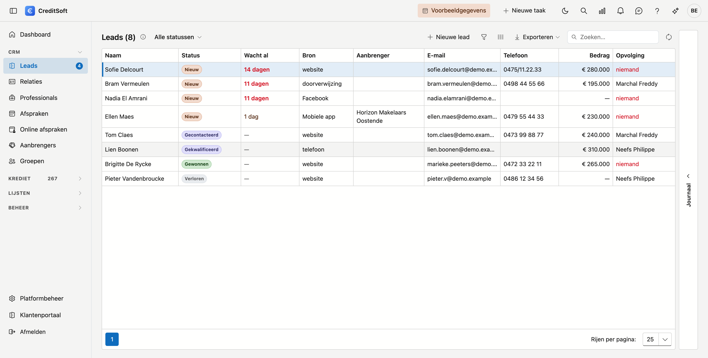
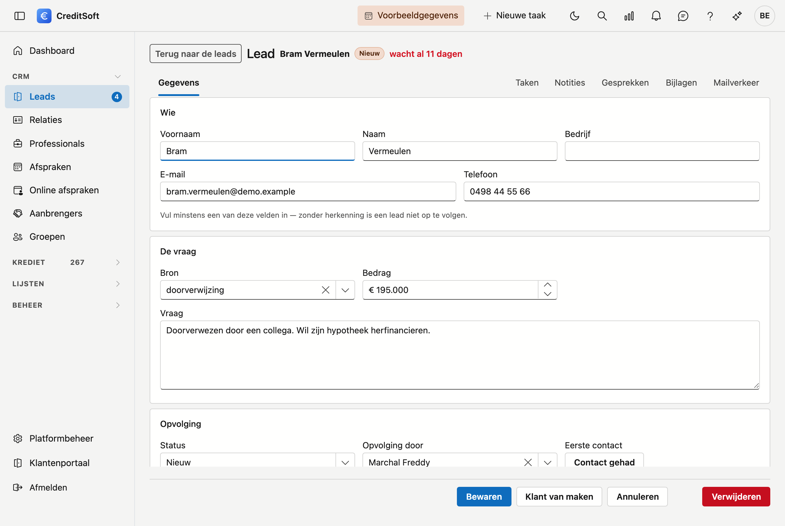
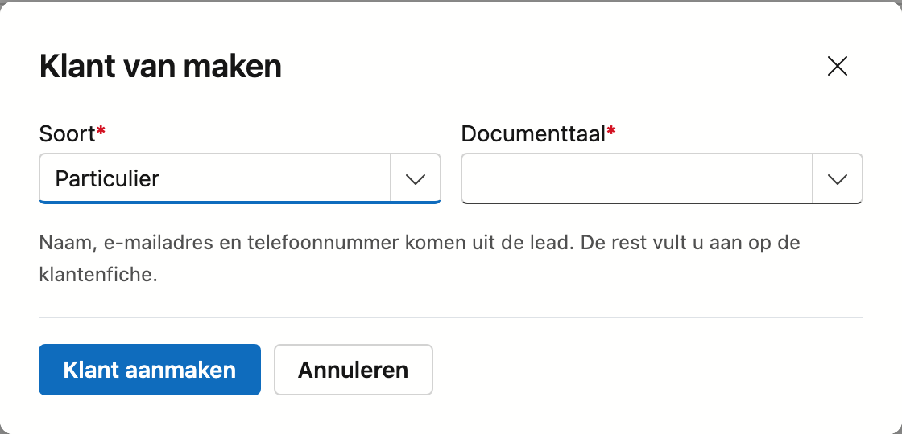

# Leads

Iemand vult uw contactformulier in, belt, of wordt doorverwezen door een tevreden klant. Dat is een **lead**: een vraag van iemand die nog geen klant is. Het scherm *Leads* houdt bij wie er aangeklopt heeft, hoe lang die al wacht, en wie hem opvolgt.

## Het scherm openen

Klik in de zijbalk op **CRM** en dan op **Leads**.

## De lijst

De lijst opent op **wie het langst wacht**, niet op wie het laatst binnenkwam. Per lead ziet u: **naam**, **status**, **wacht al**, **bron**, **e-mail**, **telefoon**, **bedrag** en **opvolging**.

- **Wacht al** — de tijd sinds de vraag binnenkwam, zolang er nog geen contact was. Vanaf twee dagen kleurt ze rood. Is er contact geweest, dan staat er een streepje: de klok is gestopt.
- **Opvolging** — de medewerker die deze lead opvolgt. Staat er **niemand** in het rood, dan is dit van niemand en blijft het liggen.
- **Filter op status** — bovenaan kiest u alle statussen, of één ervan.
- **Zoeken** — het zoekveld zoekt in alle kolommen tegelijk.
- **Kolommen kiezen** — toon of verberg kolommen; uw keuze wordt onthouden.
- **Exporteren** — naar Excel of CSV, met de filters die op dat moment aan staan.
- **Nieuw / bewerken** — klik op **Nieuwe lead**, of **dubbelklik** een rij om de fiche te openen.
- **Verwijderen** — een lead wordt **gearchiveerd**, niet definitief gewist.

Naast *Leads* in het menu staat een teller: het aantal leads dat nog op een eerste contact wacht.

## De vijf statussen

| Status | Wat het betekent |
|---|---|
| **Nieuw** | Binnengekomen, nog niemand heeft contact opgenomen. |
| **Gecontacteerd** | Er is contact geweest. Vanaf hier stopt de klok van de wachttijd. |
| **Gekwalificeerd** | Een echte vraag met een echte kans — de moeite om er tijd in te steken. |
| **Gewonnen** | Klant geworden. |
| **Verloren** | Niets geworden. Noteer waarom; dat leest later als een patroon. |

Meer standen zijn er bewust niet. Een kantoor van vijf mensen heeft geen verkooptrechter van acht fasen nodig; het heeft nodig dat niets blijft liggen.

## De fiche

Dubbelklik een lead om zijn fiche te openen. Bovenaan staat zijn naam, zijn status, en hoe lang hij al wacht.

{ .volle-breedte }

De fiche heeft drie blokken.

### Wie

**Voornaam**, **Naam**, **Bedrijf**, **E-mail** en **Telefoon**. Geen van die velden is op zich verplicht, maar er moet er **minstens één** ingevuld zijn — zonder herkenning is een lead niet op te volgen.

### De vraag

- **Bron** — waar deze lead vandaan komt: *website*, *telefoon*, *doorverwijzing*, *Facebook*, wat u ook gebruikt. Het veld stelt voor wat u eerder al invulde, zodat de schrijfwijze gelijk blijft, maar u kunt vrij typen. Zo blijft de bronlijst van úw kantoor, en niet van een lijst die wij bedacht hebben.
- **Bedrag** — het bedrag waar het over gaat, voor zover u het al weet.
- **Herkomst** — verscheen deze lead via een koppeling, dan staat hier welke. Dit veld is niet bewerkbaar; het is een vaststelling, geen invoer.
- **Vraag** — de vraag zoals ze binnenkwam, in vrije tekst.

### Opvolging

- **Status** — een van de vijf hierboven.
- **Opvolging door** — de medewerker die belt. Laat u dit leeg, dan toont de lijst **niemand** in het rood.
- **Eerste contact** — zodra er contact geweest is, staat hier het tijdstip. Was er nog geen contact, dan staat er een knop **Contact gehad**: één klik zet het tijdstip én de status op *Gecontacteerd*, zonder dat u eerst in een keuzelijst hoeft.
- **Reden van verlies** — verschijnt zodra u de status op *Verloren* zet.

## Van lead naar klant

Wordt er iets van, dan klikt u op de fiche op **Klant van maken**.

CreditSoft vraagt alleen wat de lead niet weet:

- **Soort** — particulier of bedrijf. Staat er een bedrijfsnaam op de lead, dan staat dit al op *Bedrijf*.
- **Documenttaal** — verplicht op elke klantenfiche: ze bepaalt in welke taal die klant zijn brieven en mails krijgt.
- **Rechtsvorm** — enkel bij een bedrijf.

Naam, e-mailadres en telefoonnummer komen uit de lead. De rest vult u aan op de klantenfiche, waar u meteen naartoe springt.

!!! warning "Bestaat die persoon al?"
    Herkent CreditSoft een relatie met dezelfde naam of hetzelfde e-mailadres, dan verandert het venster: u ziet die relatie staan en de knop heet **Koppelen**. De lead wordt dan aan de bestaande klant gehangen, zonder tweede fiche. Wilt u toch een nieuwe, dan kan dat — maar het is bewust de tweede keuze.

**De lead verdwijnt niet.** Hij blijft in de lijst staan als *Gewonnen*, met bovenaan zijn fiche een link naar zijn klant. Zo blijft na een jaar zichtbaar welk kanaal klanten opleverde en welk kanaal enkel ruis — en dat is de hele reden om leads apart bij te houden.

Een kredietdossier maakt u daarna op de gewone manier: **Krediet → Kredietdossiers → Nieuw**, met die klant erbij.

## Een lead toevoegen

Klik op **Nieuwe lead**, vul in wat u weet, en klik op **Bewaren**.

!!! info "Dezelfde persoon meldt zich twee keer aan"
    Vult iemand twee keer uw formulier in, of belt hij nadat hij al gemaild had, dan wordt dat **één lead**. CreditSoft herkent hem aan zijn e-mailadres of zijn telefoonnummer en hangt de nieuwe vraag onder de bestaande, met de datum erbij. U krijgt dan de melding dat de persoon er al stond.

    Een **gewonnen of verloren** lead telt daar niet in mee. Wie een jaar later terugkomt, is een nieuwe vraag en geen heropening van een afgesloten dossier.

!!! tip "Waarom de wachttijd en niet de datum"
    Een datum moet u omrekenen; een wachttijd niet. En bij leads is dat het enige getal dat telt: wie twee dagen wacht, heeft intussen het volgende kantoor gebeld.

## Het dagelijkse bericht

De kolom **Wacht al** kleurt rood, maar dat helpt enkel zolang iemand de lijst opent. Wie het druk heeft opent hem niet, en dat zijn net de dagen waarop er leads binnenkomen. Daarom kan CreditSoft u elke ochtend één mail sturen over wat blijft liggen.

U zet dat aan bij **Platformbeheer → Communicatie → Leadmeldingen**: vul daar in na hoeveel dagen een lead moet opvallen. Laat u dat veld leeg, dan komt er geen bericht. Het gaat naar dezelfde adressen als de melding bij een binnengekomen lead.

In die mail staan drie groepen:

| Groep | Wanneer een lead erin staat |
|---|---|
| **Nog niet gecontacteerd** | Hij wacht langer dan het ingestelde aantal dagen en er is nog geen eerste contact geweest. |
| **Zonder opvolger** | Er staat niemand bij *Opvolging*. |
| **Gekwalificeerd, maar geen taak of afspraak** | Hij staat op *Gekwalificeerd*, maar er staat niets ingepland. |

!!! info "Waarom een lead zonder opvolger meteen gemeld wordt"
    Bij de eerste groep wacht CreditSoft het ingestelde aantal dagen af. Bij deze niet: een lead die van niemand is, wordt door niemand opgepakt. Daar verandert wachten niets aan.

De derde groep is de stilste van de drie. Zo'n lead oogt in de lijst gezond — gecontacteerd, met een opvolger, en als kansrijk bestempeld — en juist daarom valt het niet op dat er sindsdien niets meer gebeurd is. Een taak of een afspraak **vooruit** haalt hem er weer uit. Een afspraak van vorige maand niet: dat is precies iemand die stilgevallen is.

Staan er meer dan tien leads in één groep, dan noemt de mail de tien die het langst wachten en meldt eronder hoeveel er nog zijn. Met zestig regels in een mail is niemand geholpen; de link naar de lijst staat eronder.

!!! tip "Geen bericht is goed nieuws"
    Is er niets te melden, dan komt er ook geen mail. Een dagelijks bericht dat elke ochtend *alles in orde* zegt, wordt binnen de week een filterregel — en dan mist u ook de mail die er wél toe doet.

Wat er in die mail staat, past u aan bij de [mailsjablonen](../administration/mail-templates.md), onder het sjabloon *Dagelijks leadoverzicht*.
