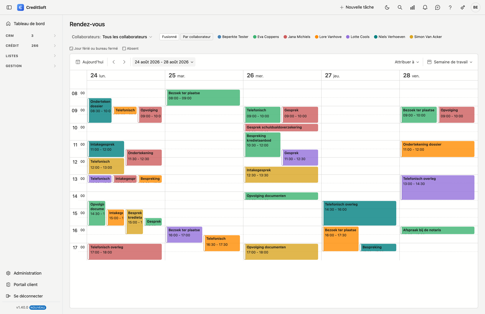
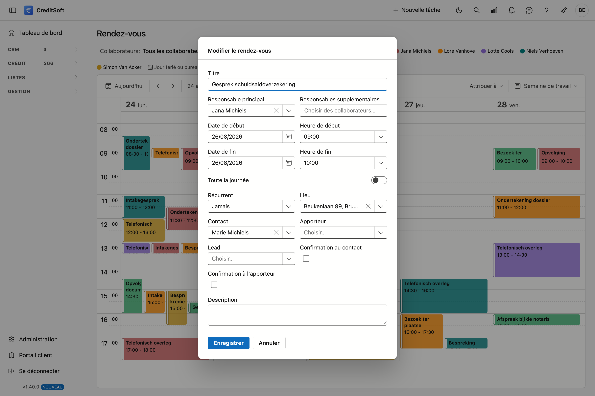

# Rendez-vous

L'agenda est **partagé** : chacun voit les rendez-vous de tous les collaborateurs, chacun dans sa propre couleur.

{ .volle-breedte }

## Ouvrir l'écran

Dans la barre latérale, cliquez sur **CRM**, puis sur **Rendez-vous**.

## Les couleurs

En haut figure une légende avec les collaborateurs. Chaque rendez-vous prend la couleur de son **responsable principal**, ce qui vous permet de voir d'un coup d'œil qui se trouve où.

Un collègue n'apparaît pas dans la légende ? C'est que la case **Afficher dans les listes de choix** est désactivée sur sa fiche de collaborateur. Cela se fait délibérément pour les personnes qui ont accès au programme mais ne travaillent pas sur les dossiers — un gérant, par exemple.

Avec **Collaborateurs** en haut, vous cochez qui vous souhaitez voir. Si vous ne cochez personne, vous les voyez tous. Ce filtre voit plus large que la couleur : il affiche aussi les rendez-vous où quelqu'un figure comme responsable **supplémentaire**.

!!! tip "Cocher deux noms affiche les deux agendas"
    Si vous cochez Jan *et* Piet, vous voyez les rendez-vous de Jan *et* ceux de Piet — pas uniquement ceux où ils figurent ensemble.

La pastille grise **Sans responsable** rassemble les rendez-vous dont on ne sait pas à qui ils appartiennent. Vous pouvez les ouvrir et y désigner quelqu'un après coup.

La pastille **ambre** **Via la page de réservation** rassemble les rendez-vous qu'un visiteur a réservés lui-même sur votre [page de réservation](online-afspraken.md). Ils sont hachurés tant qu'aucun collaborateur n'y figure — voir [Ce qu'une réservation en ligne fait dans votre agenda](#ce-quune-reservation-en-ligne-fait-dans-votre-agenda).

## Créer un rendez-vous

Cliquez sur une plage libre. Dans la fenêtre qui s'ouvre, vous renseignez :

- **Objet et description** — le sujet du rendez-vous.
- **Contact** — la relation que vous rencontrez.
- **Apporteur** — si le rendez-vous passe par un apporteur.
- **Lieu** — le bureau, chez le client, ou une adresse.
- **Responsables** — un responsable principal (qui détermine la couleur) et éventuellement des collègues supplémentaires.

## Envoyer une confirmation

Sous **Contact** et **Apporteur** figurent deux cases : **Confirmation au contact** et **Confirmation à l'apporteur**. Cochez-en une et enregistrez : la fenêtre de courriel s'ouvre avec la confirmation déjà remplie — le destinataire, l'objet avec la date, et un bloc indiquant quand et où le rendez-vous a lieu.

Le courriel ne part **pas tout seul**. Vous le relisez, ajoutez éventuellement une phrase, et l'envoyez vous-même. Si vous cochez les deux, le contact vient d'abord et l'apporteur ensuite.

!!! tip "Où retrouver la confirmation envoyée"
    Sur la fiche du contact ou de l'apporteur, sous **Journal → Courrier**. Vous y voyez ce qui a été envoyé exactement, avec la date et le destinataire.

Le texte lui-même se modifie dans **Gestion de la plateforme → Modèles d'e-mail**, modèle *Confirmation de rendez-vous*. Les espaces réservés `{{meeting.subject}}`, `{{meeting.date}}`, `{{meeting.from}}`, `{{meeting.to}}` et `{{meeting.location}}` sont remplis par CreditSoft avec les données du rendez-vous. Si vous préférez ne pas composer vous-même, utilisez `{{meeting.details}}` : c'est un bloc prêt à l'emploi indiquant quand et où.

## Modifier un rendez-vous

- **Déplacer** — glissez le rendez-vous vers un autre moment.
- **Modifier la durée** — tirez le bord inférieur ou supérieur.
- **Ouvrir** — double-cliquez sur le rendez-vous.

## Choisir l'affichage

En haut à droite, vous basculez entre jour, semaine de travail, semaine et mois. La semaine de travail affiche du lundi au vendredi et constitue l'affichage le plus pratique pour une semaine de bureau ordinaire.

### Fusionné ou par collaborateur

En haut figurent deux boutons :

| Bouton | Ce que vous voyez |
|---|---|
| **Fusionné** | Un seul agenda où tout le monde figure ensemble, distingué par la couleur. C'est l'affichage par défaut. |
| **Par collaborateur** | Une colonne par collaborateur, côte à côte, chacune avec sa couleur en tête. |

**Par collaborateur** est l'affichage pour attribuer : vous voyez d'un coup d'œil qui est encore libre à neuf heures, et vous faites glisser le rendez-vous vers sa colonne.

{ .volle-breedte }

Ce bouton bascule automatiquement en **affichage journalier**. Une semaine entière avec une colonne par collaborateur donne trente colonnes pour six collègues, et vous défilez alors latéralement dans votre propre agenda. Si vous voulez tout de même une semaine, choisissez-la simplement en haut à droite.

!!! info "Le filtre fonctionne dans les deux"
    Si vous cochez trois collaborateurs, vous voyez dans le premier affichage uniquement leurs rendez-vous, et dans le second trois colonnes.

## Les heures affichées

L'agenda s'ouvre de 8 à 18 heures. Si vous souhaitez d'autres heures, réglez-les vous-même dans [Mes données](../getting-started/mijn-gegevens.md) sous **Agenda à partir de** et **Agenda jusqu'à**. Si vous les laissez vides, le réglage de votre bureau s'applique.

Si un rendez-vous de la **période affichée** tombe en dehors de ces heures, l'agenda élargit l'affichage. Un
rendez-vous matinal ou tardif reste donc visible, même s'il sort de vos propres heures. Si vous naviguez vers une
semaine sans un tel rendez-vous, vos propres heures reviennent.

!!! tip "Les rendez-vous de plusieurs jours laissent vos heures tranquilles"
    Un congé ou une formation de deux jours doit lui aussi porter une heure de début, souvent arbitraire —
    minuit, ou deux heures du matin. Ces rendez-vous **n'élargissent pas** votre agenda : ils apparaissent dans
    la barre du haut, sur les jours qu'ils couvrent, et y restent entièrement visibles.

    S'il s'agit d'un **congé**, sa place est en réalité sous [Congés & jours de fermeture](../beheer/afwezigheden.md).
    Il y hachure l'agenda de tout le monde au lieu de n'occuper qu'une colonne.

## Ce qu'une réservation en ligne fait dans votre agenda

Lorsque quelqu'un réserve un moment sur votre [page de réservation](online-afspraken.md), ce rendez-vous figure **immédiatement dans l'agenda** — en ambre, hachuré, et au nom du visiteur.

Il n'a alors pas encore de collaborateur. C'est délibéré : c'est votre bureau qui a libéré l'heure, et on décide seulement ensuite qui mène l'entretien.

**L'attribution se fait comme pour tout autre rendez-vous.** Ouvrez-le et choisissez un **responsable principal**, ou passez l'agenda en **Par collaborateur** et faites-le glisser vers la bonne colonne. Dès lors, il prend sa couleur et figure normalement dans son agenda.

!!! info "Ce que contient le rendez-vous"
    L'adresse e-mail, le numéro de téléphone et ce que le visiteur a écrit se retrouvent dans la description et dans les coordonnées du rendez-vous.

!!! warning "Le visiteur annule ?"
    Si personne n'y figurait encore, le rendez-vous disparaît. S'il était déjà attribué, il **reste affiché**, barré et en rouge, avec la pastille **Annulé par le visiteur** dans la légende. Ainsi, le collègue qui l'avait dans son agenda voit que quelque chose a changé, plutôt que d'attendre pour rien.
