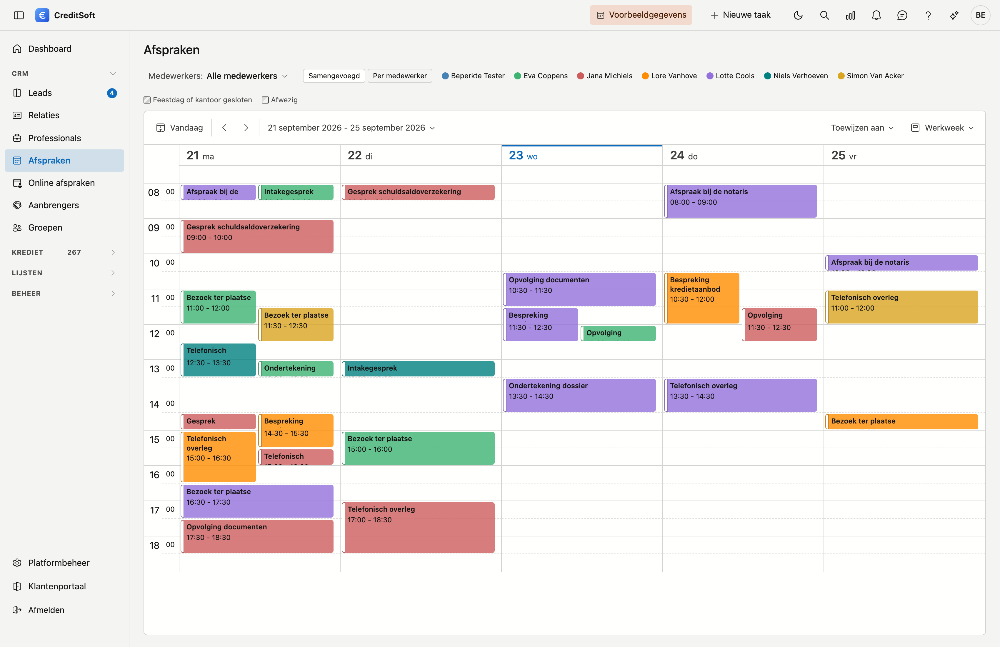
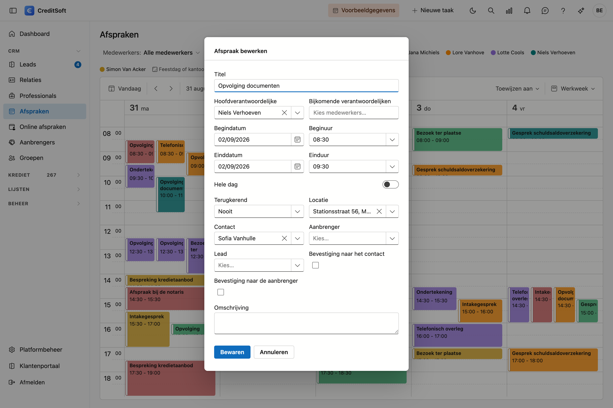

# Afspraken

De agenda is **gedeeld**: iedereen ziet de afspraken van alle medewerkers, elk in zijn eigen kleur.

{ .volle-breedte }

## Het scherm openen

Klik in de zijbalk op **CRM** en dan op **Afspraken**.

## De kleuren

Bovenaan staat een legende met de medewerkers. Elke afspraak krijgt de kleur van haar **hoofdverantwoordelijke**, zodat u in één blik ziet wie waar zit.

Verschijnt een collega niet in de legende? Dan staat op zijn medewerkerfiche het vinkje **Toon in keuzelijsten** uit. Dat gebeurt bewust voor mensen die wel toegang hebben tot het programma maar niet meewerken aan de dossiers — een zaakvoerder bijvoorbeeld.

Met de keuzelijst **Alle medewerkers** bovenaan houdt u één iemand over. Dat filter kijkt ruimer dan de kleur: het toont ook de afspraken waarop die persoon als **bijkomende** verantwoordelijke staat.

Het grijze bolletje **Zonder verantwoordelijke** verzamelt de afspraken die uit het vorige programma kwamen en waarvan niet meer te achterhalen is van wie ze waren. U kan ze aanklikken en er alsnog iemand op zetten.

## Een afspraak maken

Klik op een leeg tijdvak. In het venster dat opent, vult u in:

- **Onderwerp en omschrijving** — waar de afspraak over gaat.
- **Contact** — de relatie waarmee u afspreekt.
- **Tussenpersoon** — als de afspraak via een tussenpersoon loopt.
- **Locatie** — kantoor, bij de klant, of een adres.
- **Verantwoordelijken** — één hoofdverantwoordelijke (die de kleur bepaalt) en eventueel bijkomende collega's.

## Een bevestiging sturen

Onder **Contact** en **Tussenpersoon** staan twee vinkjes: **Bevestiging naar het contact** en **Bevestiging naar de tussenpersoon**. Vinkt u er één aan en bewaart u, dan opent het mailvenster met de bevestiging al ingevuld: de ontvanger, het onderwerp met de datum, en een blok met wanneer en waar de afspraak doorgaat.

De mail vertrekt **niet vanzelf**. U leest ze na, voegt eventueel een zin toe, en verstuurt zelf. Vinkt u beide aan, dan komt eerst het contact en daarna de tussenpersoon.

!!! tip "Waar u de verstuurde bevestiging terugvindt"
    Op de fiche van het contact of de tussenpersoon, onder **Journaal → Mailverkeer**. Daar staat wat er precies verstuurd is, met datum en ontvanger.

De tekst zelf past u aan bij **Platformbeheer → Mailsjablonen**, sjabloon *Bevestiging afspraak*. De plaatshouders `{{meeting.subject}}`, `{{meeting.date}}`, `{{meeting.from}}`, `{{meeting.to}}` en `{{meeting.location}}` vult CreditSoft in met de gegevens van de afspraak. Wilt u het niet zelf samenstellen, gebruik dan `{{meeting.details}}`: dat is een kant-en-klaar blokje met wanneer en waar.

## Een afspraak wijzigen

- **Verplaatsen** — sleep de afspraak naar een ander moment.
- **Duur wijzigen** — trek aan de onder- of bovenrand.
- **Openen** — dubbelklik op de afspraak.

## De weergave kiezen

Rechtsboven schakelt u tussen dag, werkweek, week en maand. De werkweek toont maandag tot vrijdag en is de handigste weergave voor een gewone kantoorweek.

## De uren die u ziet

De agenda opent van 8 tot 18 uur. Wilt u andere uren, dan stelt u die zelf in bij [Mijn gegevens](../getting-started/mijn-gegevens.md) onder **Agenda vanaf** en **Agenda tot**. Laat u ze leeg, dan geldt de instelling van uw kantoor.

Staat er een afspraak buiten die uren, dan toont de agenda die dag vanzelf ruimer. Een vroege of late afspraak blijft dus zichtbaar, ook als ze buiten uw eigen uren valt.
