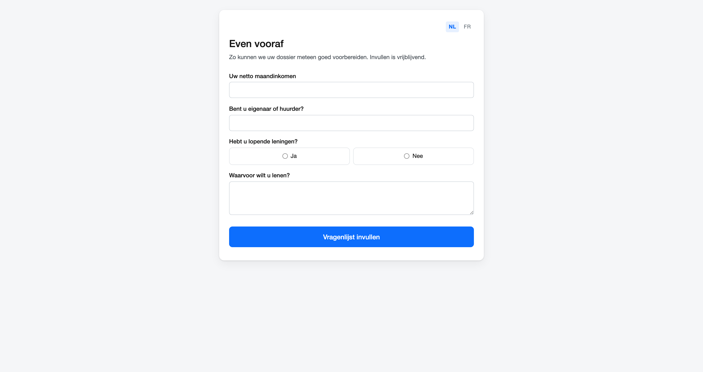

# Vragenlijst vooraf

Laat een bezoeker die online boekt meteen een paar vragen beantwoorden. Zo ligt er al iets op tafel vóór het gesprek begint — en hoeft u het eerste kwartier niet te besteden aan wat u ook per mail had kunnen vragen.

## Het scherm openen

**CRM → Online afspraken**, kies het kantoor, en klik rechts in **Instellingen** op **Opstellen** (of **Bewerken** als er al een lijst is).

!!! info "Per kantoor"
    Elk kantoor heeft zijn eigen lijst. Wat u hier instelt geldt dus niet voor de andere kantoren.

## Hoe het bij de bezoeker terechtkomt

Zodra iemand een moment boekt, zet CreditSoft een pagina met uw vragen klaar en zet de link in de **bevestigingsmail die er toch al uitgaat**. Eén mail dus, op het moment dat de bezoeker er nog met zijn hoofd bij is — en niet een tweede die uren later komt.

De pagina blijft geldig tot het begin van de afspraak. Daarna heeft ze geen zin meer.

## De zin in de mail staat bovenaan, en dat is met opzet

**Zonder die zin en die knoptekst komt er géén link in de mail** — ook al staan uw vragen klaar. Er wordt niets voor u verzonnen: die mail draagt uw naam en uw logo, dus de woorden erin zijn de uwe.

Daarom staat dat blok bovenaan het scherm. Stond het onderaan, dan zou u tien vragen opstellen en pas achteraf ontdekken waarom er niets vertrekt.

## De vragen

Elke rij is één vraag, in het Nederlands en het Frans, met een **soort antwoord**:

| Soort | Wat de bezoeker krijgt |
|---|---|
| **Korte tekst** | Eén regel |
| **Langere tekst** | Een tekstvak van enkele regels |
| **Getal** | Een veld dat alleen cijfers aanvaardt |
| **Datum** | Een datumkiezer |
| **E-mailadres** | Een veld dat de schrijfwijze controleert |
| **Telefoonnummer** | Een veld voor een nummer |
| **Ja of nee** | Twee knoppen |

De volgorde in de tabel is de volgorde op de pagina; met de pijltjes verplaatst u een rij.

!!! warning "Een vraag zonder Franse tekst verschijnt niet"
    Een Franstalige bezoeker krijgt dan die vraag gewoon niet te zien. Het scherm waarschuwt u daarvoor **vóór** u bewaart, samen met de andere zaken die stilzwijgend zouden misgaan.

!!! tip "Niets is verplicht voor de bezoeker"
    Wie maar de helft invult, verstuurt een geldig antwoord. Dat hoort zo: de lijst is vrijblijvend, en een pagina die pas doorlaat als alles ingevuld is, jaagt precies de mensen weg die vrijblijvend uitgenodigd werden.

## Eerst zelf bekijken

Met **Proefpagina maken** krijgt u een link naar precies wat de bezoeker ziet — geen nabootsing, maar dezelfde pagina. Handig om te controleren of uw vragen leesbaar zijn en of de Franse versie klopt.

Die proefpagina **vervalt vanzelf na een dag**, en wat u erop invult komt nergens terecht. Met **Intrekken** haalt u ze meteen weg.

## Wat er met de antwoorden gebeurt

Ze verschijnen **op de afspraak zelf**, onder de gegevens van de bezoeker. Open de afspraak in de agenda en u leest ze na vóór het gesprek.

Wat de bezoeker niet invulde, staat er als *niet ingevuld*. Dat is met opzet: dan ziet u dat de vraag gesteld is en overgeslagen, in plaats van u af te vragen of ze wel gesteld werd.

## De lijst weer afzetten

**Vragenlijst wissen** onderaan. Bezoekers krijgen dan geen vragen meer bij hun bevestiging. Antwoorden die al gegeven zijn, blijven gewoon op hun afspraak staan.
