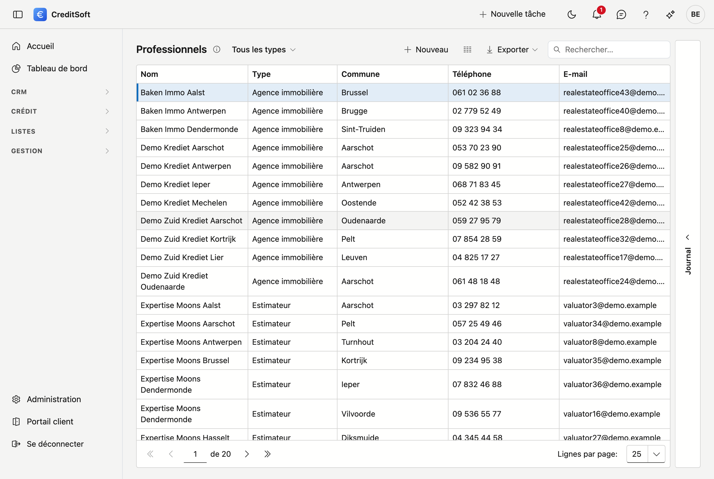

# Professionnels

Les professionnels sont les tiers externes avec lesquels votre bureau collabore : **notaires, comptables, estimateurs et agences immobilières** — regroupés dans une seule liste avec un **type**. Vous y faites référence depuis un dossier de crédit (p. ex. l'estimateur ou le notaire).

## Ouvrir l'écran

Dans la barre latérale, cliquez sur **Professionnels**.

## La liste

Le tableau affiche par professionnel : **nom**, **type**, **commune**, **téléphone** et **e-mail**.

- **Filtrer par type** — en haut, choisissez *Tous les types* ou un seul type (notaire, comptable, estimateur, agence immobilière).
- **Rechercher** — utilisez le champ de recherche pour chercher dans toutes les colonnes à la fois.
- **Choisir les colonnes** — affichez ou masquez des colonnes ; votre choix est mémorisé.
- **Exporter** — exportez la liste via Excel ou CSV.
- **Nouveau / modifier** — cliquez sur **Nouveau**, ou **double-cliquez** une ligne pour ouvrir la fiche.
- **Supprimer** — un professionnel est **archivé** (suppression douce), pas définitivement effacé ; il disparaît de la liste mais reste conservé.

### Journal

À droite de l'écran se trouve le tiroir **Journal**. Sélectionnez un professionnel et ouvrez-le : vous y trouvez ce
qui se passe autour de cette fiche — [tâches](../journaal/taken.md), [notes](../journaal/notities.md),
[pièces jointes](../journaal/bijlagen.md), [courrier](../journaal/mailverkeer.md) et l'[historique](../journaal/logboek.md)
des modifications.

Lorsque vous ouvrez la fiche, les mêmes parties figurent en haut sous forme d'**onglets** — vous ne devez
donc pas revenir à la liste pour les consulter. Le tiroir et les onglets affichent la même chose et
fonctionnent de manière identique sur chaque écran ; [Le journal](../journaal/overzicht.md) explique comment.

## La fiche d'un professionnel

**Nouveau** et un double-clic ouvrent tous deux la **fiche sur une page entière**. En haut figure un bouton de
retour vers la liste, suivi du type et du nom.

{ .volle-breedte }

La fiche se compose de trois blocs, avec en bas une barre de boutons qui reste visible.

### Général

- **Type** (obligatoire) — notaire, comptable, estimateur ou agence immobilière. Le type détermine la catégorie sous laquelle la partie figure dans la liste et où vous la retrouvez avec le filtre.
- **Nom** (obligatoire)
- **Adresse** — rue, numéro, boîte, code postal, commune, pays.
- **Contact** — téléphone, téléphone bureau, e-mail, site web.
- **Numéro de TVA** avec le bouton **Récupérer** — voir ci-dessous.
- **Compte bancaire** et **numéro interne**.
- **Langue des documents** (obligatoire) — la langue dans laquelle vous correspondez avec cette partie (néerlandais ou français). Elle détermine la langue des modèles d'e-mail et des documents établis pour elle.

!!! tip "Récupérer les données via le numéro de TVA"
    Saisissez le **numéro de TVA** et cliquez sur **Récupérer**. CreditSoft récupère l'entreprise depuis la
    Banque-Carrefour des Entreprises (BCE) et remplit automatiquement le **nom et l'adresse**. Rien trouvé ?
    Un message apparaît et vous complétez les données vous-même.

!!! tip "Code postal et commune"
    Tapez dans le champ **Code postal** : la liste affiche à la fois le code postal et la commune, vous
    pouvez donc chercher sur les deux — également sur *Gent* ou *Liège*. Lorsque vous choisissez un code
    postal, la **commune est toujours complétée**, même si un nom s'y trouvait déjà. Si vous videz la commune —
    avec la croix ou avec **Retour arrière** sur le texte sélectionné — le code postal est vidé lui aussi.

### Facturation

Un **contact de facturation** et une **adresse e-mail de facturation** distincts, liés à l'adresse du bloc
*Général*.

### Remarques

En bas se trouve un large champ **Remarques**, sur toute la largeur de la fiche, pour vos notes libres sur
cette partie.

## Enregistrer

La barre de boutons du bas reste visible pendant que vous faites défiler la fiche :

- **Enregistrer** — sauvegarde le professionnel.
- **Annuler** — retourne à la liste sans sauvegarder.
- **Supprimer** — archive le professionnel (à droite dans la barre).

À l'enregistrement, les **champs obligatoires manquants** (type, nom, langue des documents) et une **adresse
e-mail invalide** sont signalés. L'adresse e-mail est contrôlée dès qu'il y a quelque chose dans le champ,
même si vous ne l'avez pas modifiée vous-même. Les **numéros de téléphone sont mis en forme** dans la notation
officielle : si vous tapez `09/3724829`, vous lirez `09 372 48 29` après l'enregistrement.

!!! warning "Ce nom existe déjà"
    S'il existe déjà une partie **du même type** portant le même nom, CreditSoft vous demande si vous voulez
    tout de même enregistrer. C'est un avertissement, pas un blocage : deux bureaux peuvent porter le même nom.
    Ce qui est évité, c'est la faute de frappe qui crée une deuxième fois ce qui existe déjà.

    Le même nom sous un **autre** type n'est pas un doublon. Un même bureau peut être à la fois estimateur et
    agence immobilière ; ce sont deux rôles d'une même partie.
