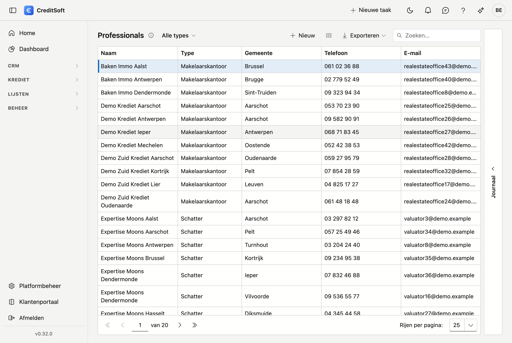

# Professionals

De professionals zijn de externe partijen waarmee uw kantoor samenwerkt: **notarissen, boekhouders, schatters en makelaarskantoren** — samengebracht in één lijst met een **type**. U verwijst ernaar vanuit een kredietdossier (bv. de schatter of de notaris).

## Het scherm openen

Klik in de zijbalk op **Professionals**.

## De lijst

De tabel toont per professional: **naam**, **type**, **gemeente**, **telefoon** en **e-mail**.

- **Filter op type** — bovenaan kiest u *Alle types* of één type (notaris, boekhouder, schatter, makelaarskantoor).
- **Zoeken** — gebruik het zoekveld om in alle kolommen tegelijk te zoeken.
- **Kolommen kiezen** — toon of verberg kolommen; uw keuze wordt onthouden.
- **Exporteren** — exporteer de lijst naar Excel of CSV.
- **Nieuw / bewerken** — klik op **Nieuw**, of **dubbelklik** een rij om de fiche te openen.
- **Verwijderen** — een professional wordt **gearchiveerd** (soft-delete), niet definitief gewist; hij verdwijnt uit de lijst maar blijft bewaard.

### Journaal

Rechts op het scherm zit de lade **Journaal**. Selecteer een professional en klap ze open: daar houdt u per
partij uw **taken, notities, bijlagen en mailverkeer** bij, plus het **logboek** van de wijzigingen.

## De fiche van een professional

**Nieuw** en een dubbelklik openen allebei de **fiche als een volledige pagina**. Bovenaan staat een
terugkeerlink naar de lijst, met daarnaast het type en de naam.

{ .volle-breedte }

De fiche bestaat uit drie blokken, met onderaan een knoppenbalk die in beeld blijft.

### Algemeen

- **Type** (verplicht) — notaris, boekhouder, schatter of makelaarskantoor. Het type bepaalt onder welke soort de partij in de lijst valt en waar u ze terugvindt met de filter.
- **Naam** (verplicht)
- **Adres** — straat, huisnummer, bus, postcode, gemeente, land.
- **Contact** — telefoon, kantoortelefoon, e-mail, website.
- **Btw-nummer** met de knop **Ophalen** — zie hieronder.
- **Bankrekening** en **intern nummer**.
- **Documenttaal** (verplicht) — de taal waarin u met deze partij correspondeert (Nederlands of Frans). Ze bepaalt in welke taal de mailsjablonen en documenten voor deze partij worden opgemaakt.

!!! tip "Gegevens ophalen via het btw-nummer"
    Vul het **btw-nummer** in en klik op **Ophalen**. CreditSoft haalt de onderneming op uit de Kruispuntbank
    van Ondernemingen (KBO) en vult **naam en adres** automatisch in. Niet gevonden? Dan verschijnt een melding
    en vult u de gegevens zelf aan.

!!! tip "Postcode en gemeente"
    Typ in het veld **Postcode**: de keuzelijst toont zowel de postcode als de gemeente, dus u kunt op
    beide zoeken — ook op *Gent* of *Liège*. Kiest u een postcode, dan wordt de **gemeente altijd mee
    ingevuld**, ook als er al iets stond. Maakt u de gemeente leeg — met het kruisje, of met **Backspace**
    op de geselecteerde tekst — dan wordt de postcode mee leeggemaakt.

### Facturatie

Een apart **facturatiecontact** en **facturatie-e-mailadres**, bij het adres uit het blok *Algemeen*.

### Opmerkingen

Onderaan staat een breed veld **Opmerkingen** over de volle breedte van de fiche, voor vrije notities over
deze partij.

## Opslaan

De knoppenbalk onderaan blijft in beeld terwijl u door de fiche scrolt:

- **Opslaan** — bewaart de professional.
- **Annuleren** — keert terug naar de lijst zonder te bewaren.
- **Verwijderen** — archiveert de professional (rechts in de balk).

Bij het opslaan worden **ontbrekende verplichte velden** (type, naam, documenttaal) en een **ongeldig
e-mailadres** gemeld. Het e-mailadres wordt gecontroleerd zolang er iets in het veld staat, ook als u het niet
zelf hebt gewijzigd. **Telefoonnummers worden opgemaakt** in de officiële notatie: typt u `09/3724829`, dan
staat er na het bewaren `09 372 48 29`.

!!! warning "Dezelfde naam bestaat al"
    Staat er al een partij **van hetzelfde type** met dezelfde naam in de lijst, dan vraagt CreditSoft of u
    toch wil bewaren. Dat is een waarschuwing, geen blokkade: twee kantoren mogen dezelfde naam dragen. Wat ze
    tegenhoudt is de tikfout waarbij u een tweede keer aanmaakt wat er al staat.

    Dezelfde naam onder een **ander** type is geen dubbel. Eén bureau kan zowel schatter als makelaarskantoor
    zijn; dat zijn twee rollen van dezelfde partij.
