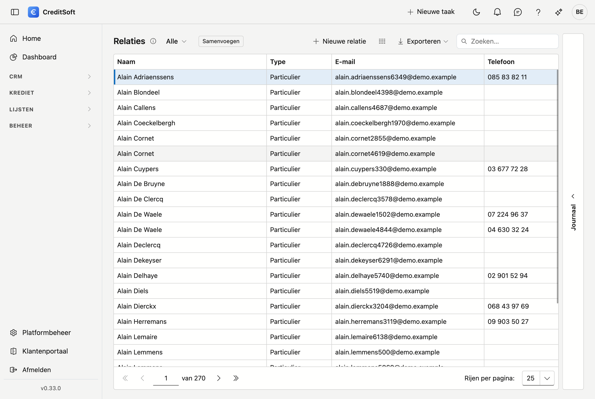

# Relaties

Alle personen en bedrijven waarmee u te maken hebt, staan in één lijst: klanten, borgen, eigenaars en contactpersonen — één scherm met een filter.

## Het scherm openen

Klik in de zijbalk op **CRM** en dan op **Relaties**.

## De lijst

- **Filter op soort** — bovenaan kiest u alles, enkel de particulieren of enkel de bedrijven.
- **Zoeken** — het zoekveld zoekt in alle kolommen tegelijk.
- **Sorteren en filteren** — klik op een kolomkop om te sorteren; onder elke kop staat een filterveld.
- **Kolommen kiezen** — toon of verberg kolommen; uw keuze wordt onthouden.
- **Exporteren** — naar Excel of CSV, met de filters die op dat moment aan staan.
- **Nieuw / bewerken** — klik op **Nieuw**, of **dubbelklik** een rij om de fiche te openen.
- **Verwijderen** — een relatie wordt **gearchiveerd** (soft-delete), niet definitief gewist.
- **Groeperen** — met [groepen](groups.md) deelt u relaties in zoals het u past: per regio, per kantoor, per campagne.

### Journaal

Rechts op het scherm zit de lade **Journaal**. Selecteer een relatie en klap ze open: daar houdt u per relatie
uw **taken, notities, bijlagen en mailverkeer** bij, plus het **logboek** van de wijzigingen.

## Particulier of bedrijf

Een relatie is ofwel een **particulier** ofwel een **bedrijf**. Dat kiest u bovenaan de fiche en het bepaalt welke velden u te zien krijgt: bij een particulier de geboortedatum en de burgerlijke staat, bij een bedrijf de rechtsvorm en het btw-nummer.

!!! tip "Bedrijfsgegevens automatisch ophalen"
    Vult u bij een bedrijf het **btw-nummer** in en klikt u op **Ophalen**, dan haalt CreditSoft de naam, de
    rechtsvorm en het adres rechtstreeks op uit de Kruispuntbank van Ondernemingen. U hoeft ze niet over te
    typen en er sluipen geen tikfouten in.

## De fiche van een relatie

**Nieuw** en een dubbelklik openen allebei de **fiche als een volledige pagina**. Bovenaan staat een
terugkeerlink naar de lijst, met daarnaast de soort en de naam.

{ .volle-breedte }

De fiche heeft **twee tabbladen**, en daaronder een blok **Opmerkingen** en een knoppenbalk die in beeld blijft.

### Tabblad "Algemene informatie" (particulier)

- **Naam** (verplicht) en **voornaam**
- **Documenttaal** (verplicht) — zie hieronder
- **Contact** — telefoon, gsm, e-mail, website
- **E-mail ongeldig** — een vinkje om te markeren dat een adres niet meer werkt, zonder het weg te gooien
- **Aanspreking** en **intern nummer**
- **Hoofdadres** — straat, huisnummer, bus, postcode, gemeente, land

### Tabblad "Bijkomende informatie" (particulier)

Alles wat u voor een kredietdossier nodig hebt: **geboortedatum, -plaats en -land**, **rijksregisternummer**,
**nationaliteit**, geslacht, taal, **identiteitskaart** met geldigheidsdata, **burgerlijke staat**,
huwelijksstelsel en -datum, **partner**, kinderen en personen ten laste, **beroep**, werkgever, in dienst
sinds, contracttype en functie. Verder het **contacttype**, de **contactbron** en de datum van het eerste
contact.

### Bij een bedrijf

Daar heten de tabbladen **Algemeen** en **Overig**. Op het eerste staan de bedrijfsnaam, de **rechtsvorm**, het
btw-nummer met de knop **Ophalen**, het interne nummer, de documenttaal en de contactgegevens; op het tweede
duidt u aan of het bedrijf een **klant** en/of een **leverancier** is.

### De documenttaal

Op elke fiche staat een **documenttaal**. Die bepaalt in welke taal deze relatie haar brieven en e-mails krijgt — los van de taal waarin u zelf werkt. Een Franstalige klant krijgt dus Franse documenten, ook als uw scherm in het Nederlands staat.

Dit veld is **verplicht**. Laat u het leeg, dan weet het programma niet welke sjabloontaal het moet gebruiken.

!!! tip "Postcode en gemeente"
    Typ in het veld **Postcode**: de keuzelijst toont zowel de postcode als de gemeente, dus u kunt op
    beide zoeken — ook op *Gent* of *Liège*. Kiest u een postcode, dan wordt de **gemeente altijd mee
    ingevuld**. Maakt u de gemeente leeg — met het kruisje, of met **Backspace** op de geselecteerde tekst —
    dan wordt de postcode mee leeggemaakt.

## Opslaan

De knoppenbalk onderaan blijft in beeld terwijl u door de fiche scrolt: **Opslaan**, **Annuleren** en, rechts,
**Verwijderen**.

Bij het opslaan worden **ontbrekende verplichte velden** en een **ongeldig e-mailadres** gemeld. Het
e-mailadres wordt gecontroleerd zolang er iets in het veld staat, ook als u het niet zelf hebt gewijzigd.
**Telefoonnummers worden opgemaakt** in de officiële notatie: typt u `09/3724829`, dan staat er na het bewaren
`09 372 48 29`.

!!! warning "Deze relatie bestaat mogelijk al"
    Bestaat er al een relatie met **dezelfde naam of hetzelfde e-mailadres**, dan toont CreditSoft welke, en
    vraagt of u toch wil bewaren. Dat is een waarschuwing, geen blokkade — naamgenoten bestaan. Ze houdt tegen
    dat u een tweede keer aanmaakt wat er al staat.
