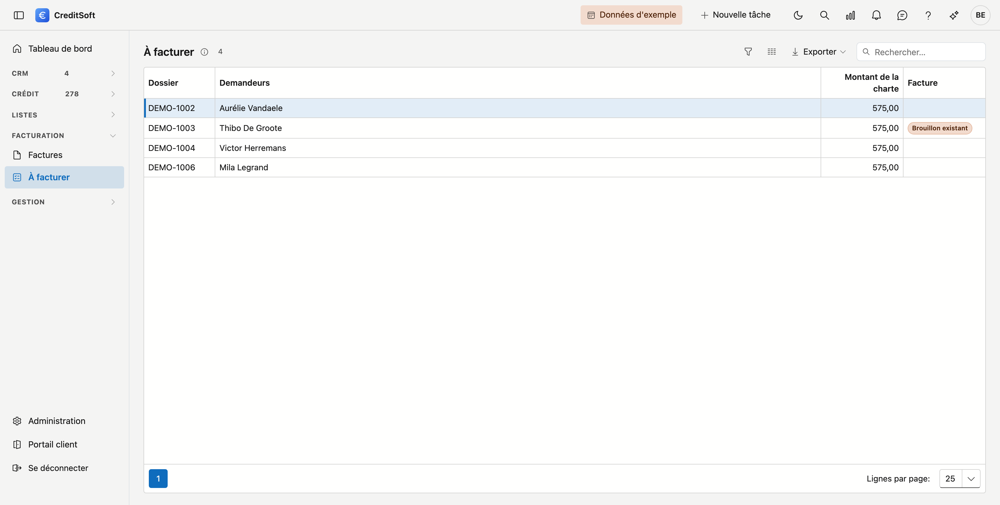

# À facturer

Vous trouvez ici les dossiers de crédit avec une **charte** pour lesquels il n'existe pas encore de facture définitive. Ainsi, vous n'oubliez aucun dossier.

## Ouvrir l'écran

Dans le menu de gauche, cliquez sur **À facturer**, sous *Facturation*.

## La liste

{ .volle-breedte }

Pour chaque dossier, vous voyez le **numéro de dossier**, les **demandeurs** et le **montant de la charte**.

Double-cliquez une ligne. Une nouvelle [facture](facturen.md) s'ouvre avec le **premier demandeur** comme client, le **dossier** rempli et le **montant de la charte** comme ligne. Vérifiez-la, enregistrez-la et rendez-la définitive.

Si la colonne **Facture** indique *Brouillon existant*, un brouillon existe déjà pour ce dossier. Un double-clic ouvre alors ce brouillon, pour que personne n'en commence un deuxième.

Dès que la facture d'un dossier est définitive, le dossier disparaît de cette liste. Un dossier déjà facturé avant que vous ne factureriez avec CreditSoft n'y figure pas non plus.

## Définir une charte

La charte d'un dossier, et son montant, se règlent sur le dossier de crédit lui-même, dans l'onglet *Factures* — voir [Dossiers de crédit](../credit-management/credit-files.md#factures).

## Voir aussi

- [Factures](facturen.md)
- [Dossiers de crédit](../credit-management/credit-files.md)
