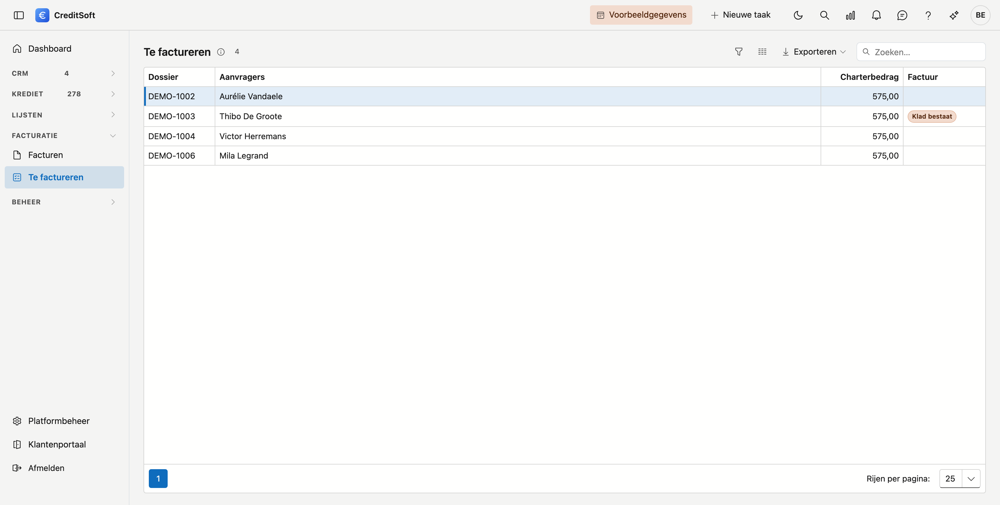

# Te factureren

Hier staan de kredietdossiers met een **charter** waarvoor nog geen definitieve factuur bestaat. Zo vergeet u geen enkel dossier te factureren.

## Het scherm openen

Klik in het menu links op **Te factureren**, onder *Facturatie*.

## De lijst

{ .volle-breedte }

Per dossier ziet u het **dossiernummer**, de **aanvragers** en het **charterbedrag**.

Dubbelklik een rij. Er opent een nieuwe [factuur](facturen.md) met de **eerste aanvrager** als klant, het **dossier** ingevuld en het **charterbedrag** als lijn. Kijk ze na, bewaar en maak ze definitief.

Staat er in de kolom **Factuur** *Klad bestaat*, dan is er voor dat dossier al een klad. Een dubbelklik opent dan dat klad, zodat niemand een tweede begint.

Zodra de factuur van een dossier definitief is, verdwijnt het dossier uit deze lijst. Ook een dossier dat al gefactureerd werd vóór u met CreditSoft factureerde, staat hier niet.

## Een charter instellen

Of een dossier een charter heeft, en voor welk bedrag, stelt u in op het kredietdossier zelf, op het tabblad *Facturen* — zie [Kredietdossiers](../credit-management/credit-files.md#facturen).

## Zie ook

- [Facturen](facturen.md)
- [Kredietdossiers](../credit-management/credit-files.md)
