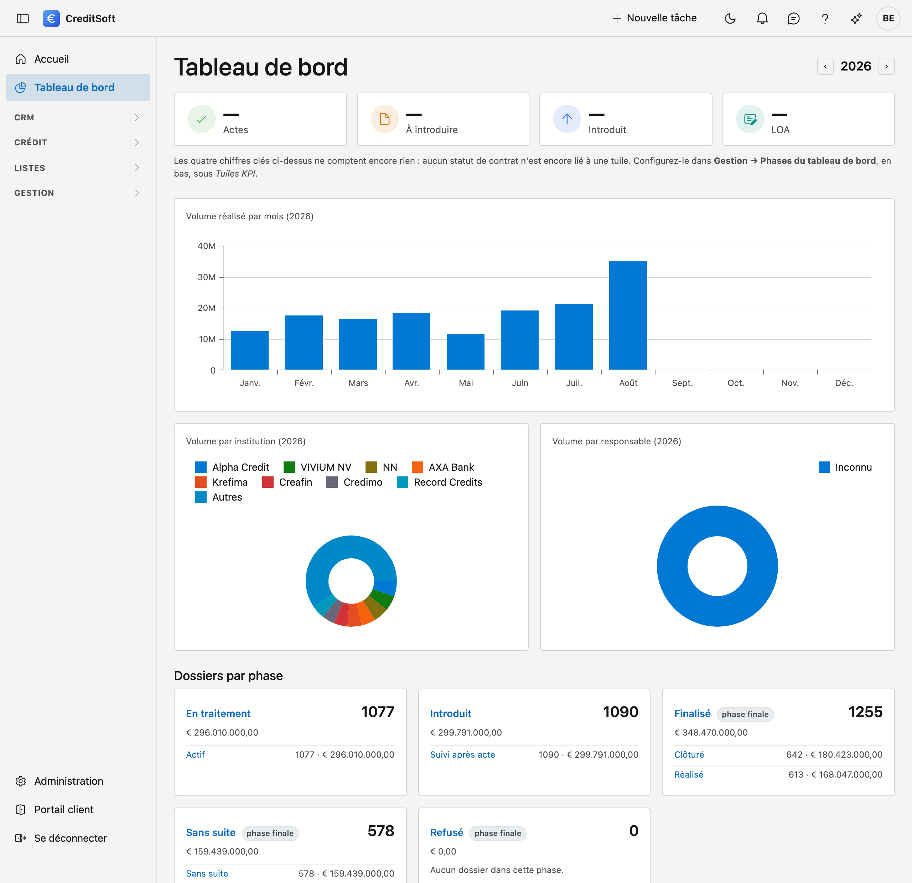

# Le tableau de bord

Le tableau de bord est votre écran d'accueil. D'un coup d'œil, vous voyez combien de dossiers se trouvent dans quelle phase et ce que font les indicateurs.

{ .volle-breedte }

## Les quatre tuiles du haut

Les tuiles colorées comptent des **contrats**, pas des dossiers. Chaque tuile représente une étape du traitement administratif :

| Tuile | Ce qui y est compté |
|---|---|
| **Actes** | Les contrats dont l'acte est passé |
| **À introduire** | Les contrats prêts à être introduits |
| **Introduits** | Les contrats déposés auprès de l'organisme |
| **LOA** | Les contrats au dernier stade avant traitement |

Quels statuts de contrat comptent dans quelle tuile, c'est vous qui le déterminez — voir [la répartition en phases](../beheer/dashboard-fases.md). Les statuts que vous ne rattachez nulle part ne comptent dans aucune tuile.

!!! tip "Des tirets au lieu de chiffres ?"
    C'est qu'aucun statut de contrat n'est encore lié à une tuile. Vous voyez un tiret et non un zéro, car
    zéro signifierait qu'il n'y a réellement rien à compter. Sous les tuiles, une phrase vous mène au réglage.

## Le pipeline : les dossiers par phase

Sous les tuiles, vos dossiers sont regroupés par **phase**. Une phase est un groupe de statuts que vous composez vous-même — par exemple *En traitement*, *Introduit*, *Finalisé*.

- Cliquez sur une phase pour voir les dossiers concernés.
- Les dossiers dont le statut n'a pas été classé sont regroupés sous **non classés**.

!!! tip "Quelque chose figure dans la mauvaise colonne ?"
    Cela tient alors à la répartition et non au dossier. Un dossier suit la phase de son statut ; si vous déplacez un statut vers une autre phase, tous les dossiers portant ce statut suivent. Vous ajustez cela sous **Administration → Phases du tableau de bord**.

## Pourquoi votre tableau de bord diffère de celui d'un collègue

Le tableau de bord affiche ce que vous êtes autorisé à voir. Si vous n'avez pas accès à certains dossiers, ceux-ci ne sont pas comptés dans vos chiffres non plus. Deux collègues peuvent donc voir des nombres différents, et c'est normal.
