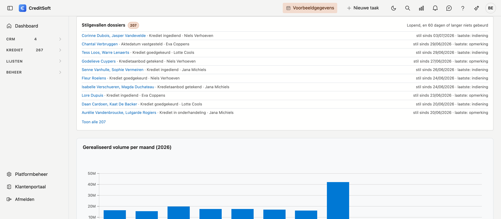
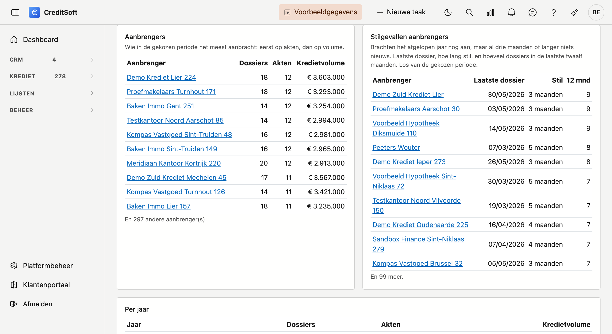

# Het dashboard

Het dashboard is uw startscherm. In één oogopslag ziet u hoeveel dossiers er in welke fase zitten en wat de kerncijfers doen.

{ .volle-breedte }

## Mededelingen van het kantoor

Staat er een mededeling voor de medewerkers klaar, dan staat ze helemaal bovenaan, boven de tabbladen: op
*Vandaag* en op *Productie*. Een waarschuwing valt op door haar kleur. Is er niets, dan is er ook geen blok.

Wie een mededeling schrijft, kiest bij **Voor** de *Medewerkers* of *Allebei*. Hoe dat gaat en hoe lang een
bericht blijft staan, leest u bij [Mededelingen](../beheer/mededelingen.md).

## Aan de slag

Draagt uw omgeving nog **voorbeeldgegevens**, dan staat bovenaan het dashboard het blok *Aan de slag*. Het
wijst u de drie instellingen aan die de rest bepalen, met een teller die zegt hoeveel u er af hebt.

{ .volle-breedte }

| Stap | Waarom die eerst |
|---|---|
| **Vul uw Bedrijfsfiche in** | Uw naam, adres en logo verschijnen op elke brief en elk document dat u verstuurt |
| **Stel uw Verzendadressen in** | Zonder verzendadres vertrekt er geen enkele e-mail uit uw omgeving |
| **Voeg uw Gebruikers toe** | Zij verschijnen daarna als eigenaar van een dossier en als verantwoordelijke van een taak |

Klik op **Openen** bij een stap en u staat op het juiste scherm.

**U hoeft nergens een vinkje te zetten.** Een stap vinkt zichzelf af zodra u er iets aan gewijzigd hebt. De
teller kijkt naar wat *u* hebt gedaan, niet naar wat er staat: uw omgeving komt met een voorbeeldnaam, een
voorbeeld-verzendadres en een lijst voorbeeldmedewerkers, en die tellen niet mee.

!!! tip "U kunt vrij oefenen"
    De dossiers, relaties en taken die u ziet zijn verzonnen. U kunt ze bewerken en verwijderen zonder iets
    stuk te maken. Er vertrekt ook geen e-mail uit deze omgeving naar buiten, zolang de voorbeeldgegevens er
    staan.

Wilt u het blok niet zien, klik dan op **Verbergen**. Die keuze geldt voor u alleen en blijft bewaard; uw
collega's zien het blok gewoon verder. Hebt u alle drie de stappen gedaan, dan verdwijnt het vanzelf.

Laat ons weten wanneer de voorbeeldgegevens weg mogen. Wat u zelf hebt ingevoerd blijft dan staan, en het
verzenden van e-mail gaat op dat moment open.

## De vier tegels bovenaan

De gekleurde tegels tellen **contracten**, niet dossiers. Elke tegel is een combinatie van twee dingen: wat een contractstatus **betekent**, en om welke **productsoort** het gaat.

| Tegel | Wat erin geteld wordt | Periode |
|---|---|---|
| **Aktes** | Gerealiseerde **hypothecaire** kredieten | het gekozen jaar |
| **In te dienen** | Contracten die nog ingediend moeten worden, ongeacht het product | alle jaren |
| **Ingediend** | Ingediende **hypothecaire** kredieten | alle jaren |
| **LOA** | Gerealiseerde **leningen op afbetaling** | alle jaren |

**LOA staat voor Lening Op Afbetaling.** Die tegel telt dus hetzelfde als *Aktes* — gerealiseerde contracten — maar voor een andere productsoort. Dat onderscheid komt uit uw productenlijst en ligt vast; u hoeft het niet in te stellen.

U geeft alleen aan **wat een contractstatus betekent**: *gerealiseerd*, *in te dienen* of *ingediend*. Dat doet u onder [Platformbeheer → Dashboard-fases](../beheer/dashboard-fases.md), onderaan bij *Contractstatussen*. Statussen zonder betekenis tellen nergens mee.

!!! info "Waarom telt maar één tegel per jaar?"
    Boven de tegels staan pijltjes om van jaar te wisselen. Alleen **Aktes** volgt dat jaar: die telt op de datum van de akte, en die datum is bekend. Een akte met een datum later dit jaar telt pas mee zodra die datum voorbij is — tot dan is ze gepland, niet gerealiseerd. Dat geldt ook voor de drie grafieken, en zo telt ook het tabblad *Productie* van een aanbrenger. De drie andere tegels tellen alles wat er ooit is ingegeven, omdat de datums van die contracten nog niet allemaal ingevuld zijn. Het label onder elke tegel zegt zelf over welke periode ze gaat — *2026* of *alle jaren* — zodat u vier cijfers niet per ongeluk als vier jaarcijfers leest. Wijst u de pijltjes aan, dan staat het er ook: het jaar geldt voor *Aktes* en voor de drie grafieken.

!!! tip "Staan er streepjes in plaats van cijfers?"
    Dan draagt nog geen enkele contractstatus een betekenis. U ziet een streepje en geen nul, want nul zou betekenen dat er echt niets te tellen valt. Onder de tegels staat een zin die u naar de instelling brengt.

!!! info "Een kantoor zonder contracten"
    Sommige kantoren kwamen over uit een versie van CreditSoft die geen contracten kende. Dan tellen de tegels
    **dossiers**: *Aktes* zijn de dossiers met een aktedatum dit jaar die voorbij is, *In te dienen* en *Ingediend*
    de lopende dossiers zonder en mét een indieningsdatum. *LOA* staat dan op **niet beschikbaar zonder contracten**:
    om een lening op afbetaling te herkennen is de productsoort van een contract nodig — een zin onder de tegels zegt
    het. Bemiddelt uw kantoor zulke leningen, zet dan bij Dashboard-fases
    [*Gerealiseerd zonder akte*](../beheer/dashboard-fases.md#gerealiseerd-zonder-akte) aan: *LOA* telt dan de
    gerealiseerde dossiers zonder akte, op de datum waarop het aanbod getekend werd. Koppel wel uw statussen aan [fases](../beheer/dashboard-fases.md): zonder fases
    herkent het dashboard geen afgesloten dossier, en telt het dat als *In te dienen*.

## De drie grafieken

Meteen onder de tegels staan drie grafieken, naast elkaar. Ze gaan alle drie over **hetzelfde jaar** — dat u met de pijltjes
bovenaan kiest — en over het **gerealiseerde volume**, dus over kredieten die effectief doorgingen.

{ .volle-breedte }

Een krediet telt er op zijn **aktedatum**. Een lening op afbetaling krijgt geen akte: staat bij Dashboard-fases
[*Gerealiseerd zonder akte*](../beheer/dashboard-fases.md#gerealiseerd-zonder-akte) aan, dan telt een gerealiseerd
dossier zonder akte op de datum waarop het aanbod getekend werd, en zegt een regel onder de grafieken dat.

- **Gerealiseerd volume per maand** — één staaf per maand. Zo ziet u meteen welke maanden dragen en welke
  achterblijven.
- **Volume per instelling** — een ringgrafiek met de verdeling over de kredietinstellingen. Dossiers waar
  geen instelling op staat, komen samen onder *Onbekend*.
- **Volume per verantwoordelijke** — dezelfde verdeling, maar per medewerker. Dossiers waar niemand op
  staat, komen samen onder *Geen eigenaar*. Is dat het grootste stuk, dan is dat geen storing maar werk: er
  is nog niemand aangeduid.

Is er in het gekozen jaar niets te tonen, dan staat er *"Geen gegevens voor dit jaar."* in plaats van een lege ring. Een
grafiek die leegblijft terwijl de tegels wél cijfers tonen, betekent bijna altijd dat het jaartal
hierboven niet staat waar u denkt. Bemiddelt uw kantoor vooral leningen op afbetaling, kijk dan ook of
*Gerealiseerd zonder akte* aan staat.

## Wat er afloopt

Onder de vier tegels staan twee blokken die zeggen wat er **vandaag actie vraagt**: *Termijn verstreken* en
*Termijn nadert*. Ze kijken naar vier datums op een kredietdossier — de uiterste datum om de **offerte** te
tekenen, om de **akte** te verlijden, de vervaldag van de **opschortende voorwaarden**, en tot wanneer het
**EPC-attest** geldig is. U vult ze in op het kredietdossier: de eerste drie in de kaart met de datums, het
EPC-attest bij het pand.

Per regel ziet u de klant, over welke termijn het gaat en wanneer die valt. Klik erop en u staat op het dossier.

Alleen dossiers die **nog lopen** tellen mee: staat de status van een dossier in een eindfase, dan verdwijnt het
uit deze blokken. Een dossier waarvan de status nergens is ingedeeld blijft er wél in staan — niet-ingedeeld is
geen bewijs dat een dossier af is.

!!! tip "Hoever het vooruitkijkt, kiest u zelf"
    Standaard veertien dagen. U verzet dat bij **Platformbeheer &rarr; Dashboard-fases**.

**Verstreken termijnen blijven altijd staan**, ook oudere. Dat is met opzet: een termijn die maanden geleden
verliep op een dossier dat nog loopt, is geen ruis maar een vondst — ofwel klopt de status niet, ofwel ligt het
dossier stil. Elk blok toont de acht meest recente. Zitten er meer achter, dan klikt u op
**Toon de … andere**: de volledige lijst klapt open in het blok zelf, met een eigen schuifbalk zodat de
rest van het dashboard op zijn plaats blijft. **Toon er minder** klapt ze weer dicht.

Staat er niets? Dan zegt het blok dat, in plaats van leeg te blijven.

## Opvolging van lopende kredieten

Een krediet dat geakteerd is, vraagt later nog aandacht. Daarvoor staan onder de termijnen twee kaarten:
*Herbekijken* en *Renteherziening*. Ze verschijnen zodra er iets op te volgen is.

{ .volle-breedte }

**Herbekijken** toont de dossiers waarop iemand een datum **Herbekijken op** zette — bijvoorbeeld een jaar na
de akte, bij een dossier dat u wil nalopen. U zet die datum op het
[kredietdossier](../credit-management/credit-files.md#dossiergegevens), met een korte reden die hier achter de
naam verschijnt. De kaart kijkt even ver vooruit als de termijnen. Een datum die voorbij is, staat in het rood
en blijft staan tot u ze op het dossier leegmaakt of verzet.

**Renteherziening** toont de dossiers met een contract waarvan de rente binnen **zes maanden** herzien wordt,
met de variabiliteit achter de naam. Ze vertrekt van de **eerste renteherziening** op het contract en telt
daarna verder met de jaren van de variabiliteit: bij *Variabel 10/5/5* staat een contract na tien jaar op de
lijst, en daarna om de vijf jaar opnieuw, zonder dat u iets hoeft te doen. Een herziening die na het einde van
de looptijd valt, verschijnt niet: dan is het krediet afbetaald. Alleen dossiers waarvan de akte verleden is,
tellen mee.

De jaren per variabiliteit vult uw kantoor in onder
[Platformbeheer → Keuzelijsten](../beheer/keuzelijsten.md#de-variabiliteit-wanneer-de-rente-herzien-wordt).
Staan ze er niet, dan kent CreditSoft geen volgende herziening en blijft de kaart voor die contracten leeg.

Beide kaarten tonen de eerste acht, de vroegste datum bovenaan. Zitten er meer achter, dan klikt u op
**Toon de … andere**, zoals bij de termijnen.

!!! info "Waarom de status hier niet meetelt"
    Bij de termijnen verdwijnt een dossier zodra zijn status in een eindfase staat. Hier niet: een geakteerd
    krediet stáát in een eindfase, en precies dan begint deze opvolging.

## Stilgevallen dossiers

Onder de opvolging staat **Stilgevallen dossiers**: de lopende dossiers waarop al **60 dagen of langer** niets gebeurde. Het recentst stilgevallen dossier staat bovenaan — dat is nog te redden.

{ .volle-breedte }

- **Wat telt als activiteit:** het dossier bewaren, een opmerking, een taak, een mail, een gesprek, een notitie of bijlage in het journaal, een gewijzigd contract, een gevraagd document dat binnenkwam of beoordeeld werd, en de datums van invoer, indiening, goedkeuring en ondertekening van het aanbod. Een dossier **openen** telt niet. Achter *laatste:* ziet u wat het laatste spoor was.
- **Lopend** betekent: geen akte, en een status die niet in een afsluitende fase staat — dezelfde regel als het tabblad *Productie*. Zonder ingestelde [Dashboard-fases](../beheer/dashboard-fases.md) toont het blok hoe u ze instelt, en geen getal.
- **Meer dan een jaar stil** staat apart onderaan, met een link naar die dossiers. Vaak zijn het dossiers die afgesloten moeten worden.
- **Toon alle** opent de lijst [Kredietdossiers](../credit-management/credit-files.md) met precies de stilgevallen dossiers.

## De pijplijn: dossiers per fase

Onder de tegels staan uw dossiers gegroepeerd per **fase**. Een fase is een groep statussen die u zelf samenstelt — bijvoorbeeld *In behandeling*, *Ingediend*, *Afgewerkt*.

{ .volle-breedte }

- Klik op een fase om de dossiers erachter te zien.
- Dossiers met een status die u niet hebt ingedeeld, komen samen onder **niet ingedeeld**.

Hebt u **nog geen enkele** status aan een fase gekoppeld, dan staan al uw dossiers onder *niet ingedeeld*
en zegt het dashboard dat met één zin en een knop **Fases instellen**. Er ontbreekt dan niets aan uw
dossiers — enkel de indeling.

!!! tip "Staat er iets in de verkeerde kolom?"
    Dan ligt dat aan de indeling en niet aan het dossier. Een dossier volgt de fase van zijn status; verhuist u een status naar een andere fase, dan verhuizen alle dossiers met die status mee. U past dat aan onder **Platformbeheer → Dashboard-fases**.

## Het tabblad Productie

Bovenaan het dashboard staan twee tabbladen. **Vandaag** is wat hierboven beschreven staat: wat er ligt en wat er afloopt. **Productie** toont hoe uw kantoor draait — dezelfde cijfers als het tabblad *Productie* op de fiche van een [aanbrenger](../crm/contributors.md), maar voor alle dossiers samen.

{ .volle-breedte }

- **Periode en soort.** Kies *Alles*, *Dit jaar*, *Vorig jaar* of *Laatste 12 maanden*, en eventueel één productsoort. De jaarpijltjes van *Vandaag* gelden hier niet; ze verdwijnen zodra u op *Productie* staat.
- **De tegels**: de dossiers ingevoerd in de periode, de akten met hun volume, de omzetting en het deel dat afviel, het gemiddelde krediet, de doorlooptijd van indiening tot akte, en hoeveel dossiers er nu lopen — met de akten die al gepland zijn. Staat [*Gerealiseerd zonder akte*](../beheer/dashboard-fases.md#gerealiseerd-zonder-akte) aan, dan telt een gerealiseerd dossier zonder akte hier als akte op de datum van het getekende aanbod; *Indiening tot akte* rekent enkel met echte akten.
- **De grafieken**: dossiers en akten per maand, de omzetting per jaar van invoer, de akten per kredietverstrekker en waarom dossiers afvielen. Onderaan staat een tabel per jaar.
- **Aanbrengers**: wie in de gekozen periode het meest aanbracht — eerst op akten, dan op volume. Klik een naam om de fiche te openen.
- **Stilgevallen aanbrengers**: wie het afgelopen jaar nog aanbracht, maar al drie maanden of langer niets nieuws. U ziet de datum van het laatste dossier en hoeveel dossiers er de laatste twaalf maanden waren, zodat u weet wie u best eerst belt. Deze lijst volgt de gekozen periode niet.

{ .volle-breedte }

**Waarom afgevallen** toont de [reden van afvallen](../credit-management/credit-files.md#reden-van-afvallen) die op de dossiers staat. Een dossier zonder reden staat er onder de naam van zijn fase, met *geen reden opgegeven*. Onder de grafiek leest u bij hoeveel afgevallen dossiers er een reden is ingevuld — zo ziet u of de grafiek het hele verhaal vertelt. Zijn er meer dan acht soorten, dan komen de kleinste samen onder *Andere redenen*: de grafiek telt altijd alle afgevallen dossiers.

{ .volle-breedte }

### Per kredietverstrekker

De tabel **Per kredietverstrekker** zet dezelfde cijfers naast elkaar per bank — de kredietverstrekker van het dossier. Per rij: de dossiers, de akten met hun volume, de omzetting, het deel dat afviel, het deel dat **de bank weigerde**, en de doorlooptijd van indiening tot akte, met tussen haakjes op hoeveel akten die rust. De onderste regel is het kantoor, met dezelfde cijfers als de tegels bovenaan.

{ .volle-breedte }

- Een percentage verschijnt pas vanaf vijf afgesloten dossiers; daaronder staat een streepje. Een omzetting van 100 % op twee dossiers zegt niets.
- *Geweigerd door de bank* telt de afgevallen dossiers met een [reden van afvallen](../credit-management/credit-files.md#reden-van-afvallen) die van de bank komt. Welke redenen dat zijn, stelt u in bij [Keuzelijsten](../beheer/keuzelijsten.md#de-reden-van-afvallen). Draagt nog geen enkel afgevallen dossier een reden, dan staat er een streepje — niet 0 %.
- Een **⚠️** bij de doorlooptijd betekent dat bij die bank de indieningsdatum vaak op of na de akte ligt. Dan is die datum waarschijnlijk achteraf ingevuld, en zegt de doorlooptijd weinig. Een indiening na de akte telt nooit mee; onder de tegels leest u hoeveel akten daardoor wegvallen.

!!! tip "Een streepje bij Omzetting en Afgevallen?"
    Dan is er nog geen dossierstatus aan een afsluitende fase gekoppeld, en valt er niet te zeggen welk dossier afgelopen is. Het tabblad zegt dat zelf; u stelt het in bij **Platformbeheer → Dashboard-fases**.

## Iedereen ziet hetzelfde kantoor

Het dashboard toont de cijfers van het hele kantoor. Iedereen die het mag openen, ziet dezelfde aantallen. Hoe het volume over uw medewerkers verdeeld is, ziet u in de grafiek per verantwoordelijke. De twee lijsten met aanbrengers op het tabblad *Productie* ziet u enkel als u ook aanbrengers mag bekijken.
