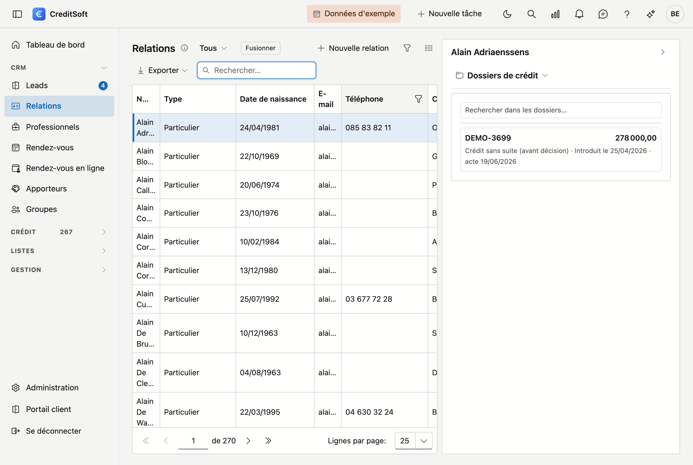

# Travailler avec les listes

Presque chaque écran de CreditSoft affiche une **liste** : relations, dossiers, apporteurs, tâches. Elles
fonctionnent toutes de la même manière. Ce que vous apprenez ici vaut donc partout — vous ne devez pas le
redécouvrir écran par écran.

## Rechercher

En haut à droite se trouve un **champ de recherche**. Ce que vous tapez est cherché dans **toutes les colonnes
à la fois** — vous ne devez donc pas savoir dans quelle colonne se trouve l'information. Chercher sur une
partie d'un mot fonctionne : *bruy* trouve aussi bien *De Bruyne* que *Bruyninckx*.

## Trier

Cliquez sur un **en-tête de colonne** pour trier sur cette colonne ; cliquez à nouveau pour inverser l'ordre.

Le tri ne tient pas compte des majuscules : *De Bruyne* et *de bruyne* se suivent, au lieu de former deux
groupes. Et pour une liste bilingue, le tri suit **votre** langue — si vous travaillez en français,
*Britannique* précède *Brésilien*, exactement comme dans un alphabet français.

## Filtrer

Sous chaque en-tête se trouve un **champ de filtre**. Vous y filtrez une colonne à la fois, et vous pouvez
combiner plusieurs filtres : par exemple commune *Gand* et type *Particulier*.

Certains écrans disposent en outre d'un **filtre rapide** en haut — chez Relations par exemple un choix entre
tout, uniquement les particuliers ou uniquement les entreprises.

## Choisir les colonnes

Le bouton **Choisir les colonnes** affiche ou masque des colonnes. Toutes ne sont pas actives par défaut : il
en existe davantage qu'il n'en tient à l'écran.

!!! tip "Votre choix est mémorisé"
    Les colonnes que vous affichez, leur ordre et leur largeur restent enregistrés pour la prochaine fois — par
    écran et par utilisateur. Votre collègue peut donc avoir une tout autre disposition que vous, sans que cela
    vous gêne.

## Exporter

Le bouton **Exporter** vous laisse le choix entre **Excel (.xlsx)**, **CSV** et parfois **PDF**.

Ce que vous obtenez correspond exactement à ce que vous voyez à ce moment-là : les **filtres et le tri** actifs
sont repris, et les colonnes que vous avez masquées n'y figurent pas. Si vous voulez tout, désactivez d'abord
vos filtres.

## Ouvrir une ligne

**Double-cliquez** une ligne pour l'ouvrir. Sur la plupart des écrans, le bouton **Nouveau** ouvre une fiche
vierge.

## Supprimer

Supprimer signifie dans CreditSoft **archiver**, et non effacer. La ligne disparaît de la liste mais continue
d'exister, afin que tout ce qui y renvoie reste lisible. Ce que vous avez supprimé se retrouve dans la
[Corbeille](../administration/recycle-bin.md) — et vous pouvez l'y restaurer.
