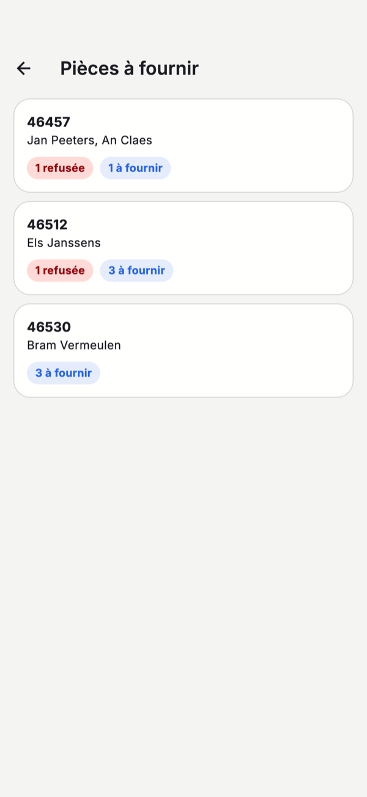

# L'application mobile

Avec l'application CreditSoft sur votre iPhone, vos dossiers vous accompagnent aussi hors du bureau : chez le
client, chez le notaire ou entre deux rendez-vous. L'application travaille sur les mêmes données que CreditSoft
au bureau — ce que vous faites dans l'application s'y retrouve immédiatement.

[Télécharger l'application sur l'App Store](https://apps.apple.com/be/app/creditsoft/id6748912369){ .md-button .md-button--primary target="_blank" rel="noopener" }

!!! info "Android"
    La version Android a été soumise à Google Play et y apparaîtra dès que Google l'aura approuvée.

## Pour qui

L'application s'adresse à deux types d'utilisateurs, qui se connectent tous deux avec leur **compte CreditSoft
habituel** :

- **Les collaborateurs du bureau** voient tous les dossiers du bureau, comme sur l'ordinateur.
- **Les apporteurs** ne voient que leurs propres dossiers et les clients qu'ils ont eux-mêmes apportés. Un
  apporteur peut se connecter dès que le bureau lui a donné accès ; cela se fait sur sa fiche, comme décrit
  pour [le portail apporteurs](../portaal/index.md).

Il n'est pas possible de créer un compte dans l'application. Vous n'en avez pas encore ? Demandez-le à votre
bureau.

## Accueil

{ .eigen-breedte style="width:280px" }

En haut, vous voyez vos chiffres : combien de dossiers, pour quel montant total de crédit, combien se sont
ajoutés cette année et combien d'actes sont planifiés. En dessous :

- **Apporter un client** et **Chercher un dossier** — les deux choses que vous faites le plus souvent en
  déplacement.
- **Prochain rendez-vous** — votre prochain rendez-vous, avec le jour, l'heure et l'objet.
- **Pièces à fournir** — combien de documents manquent encore ou ont été refusés, sur l'ensemble de vos
  dossiers.

La barre du bas mène à **Dossiers**, aux clients que vous avez **Apportés**, et à vos **Rendez-vous** par jour.

## Rechercher et ouvrir un dossier

Sous **Dossiers**, vous recherchez par nom du client, numéro de dossier ou numéro de contrat. Touchez un dossier
pour l'ouvrir.

{ .eigen-breedte style="width:280px" }

Le dossier affiche le client, le montant du crédit et le statut, le prêteur et le numéro de contrat, et le
**gestionnaire du dossier**. Vous l'appelez ou lui écrivez directement avec **Appeler** ou **Envoyer un
e-mail**.

Sous **Documents**, vous voyez l'état de chaque pièce : **À fournir**, **Approuvé** ou **Refusé**. Pour une
pièce refusée, la raison est indiquée, pour que vous sachiez ce qui doit changer.

## Pièces à fournir

{ .eigen-breedte style="width:280px" }

Touchez **Pièces à fournir** sur la page d'accueil pour voir tous les dossiers où il manque encore quelque
chose. Pour chaque dossier, vous voyez combien de pièces sont **refusées** et combien sont encore **à fournir**.
Touchez un dossier pour l'ouvrir et fournir la pièce.

## Photographier un document

{ .eigen-breedte style="width:280px" }

Dans un dossier, touchez une pièce à fournir ou refusée. Vous pouvez alors :

- **Prendre une photo** — une photo par page ou par face. Toutes les photos ensemble forment **un seul pdf**.
- **Depuis la galerie** — choisir une photo qui se trouve déjà sur votre téléphone.
- **Choisir un pdf** — un pdf qui se trouve déjà sur votre téléphone.

Une page ratée se retire avec la croix. Touchez ensuite **Envoyer**. La pièce arrive au bureau dans
[Documents à valider](../credit-management/document-validation.md) ; si elle est refusée, vous le voyez dans
l'application, avec la raison.

Les photos prises dans l'application n'arrivent pas dans la galerie de votre téléphone. Ensemble, les photos
d'une même pièce ne peuvent pas dépasser 20 Mo.

## Apporter un client

{ .eigen-breedte style="width:280px" }

Avec **Apporter un client**, vous transmettez quelqu'un au bureau. Indiquez au moins un **nom**, et un
**numéro de téléphone** ou une **adresse e-mail**. Le type de demande, un montant indicatif et une remarque
aident le bureau à bien accueillir le client dès le premier contact.

Cochez que **le client accepte** d'être contacté, et touchez **Transmettre au bureau**. Au bureau, le client
arrive comme [lead](../crm/leads.md).

Sous **Apportés**, vous suivez où en est la demande : **Nouveau**, **En cours**, **Devenu client** ou **Sans
suite**.

## Langue et affichage

Si votre téléphone est en français, l'application est en français ; sinon, elle est en néerlandais. Si votre
téléphone utilise le mode sombre, l'application aussi.

Pour vous déconnecter, touchez vos initiales en haut à droite, puis **Se déconnecter** en bas. Vous êtes
déconnecté sur cet appareil.
