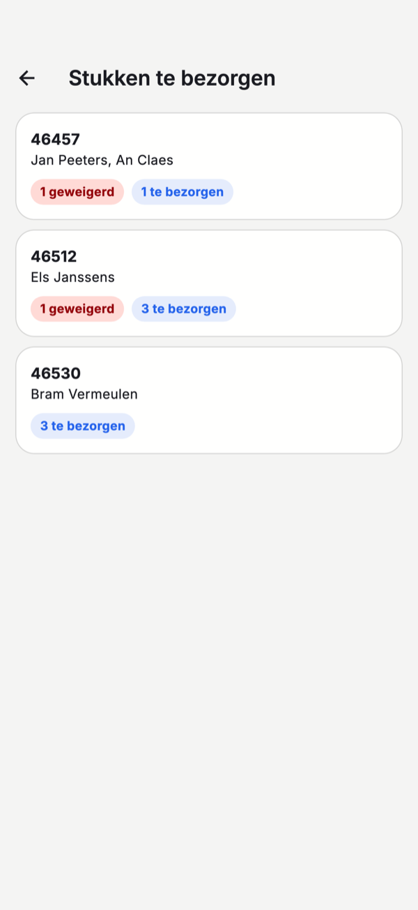

# De mobiele app

Met de CreditSoft-app op uw iPhone heeft u uw dossiers ook bij de hand als u niet op kantoor bent: bij de
klant, bij de notaris of tussen twee afspraken. De app werkt op dezelfde gegevens als CreditSoft op kantoor —
wat u in de app doet, staat meteen ook daar.

[Download de app in de App Store](https://apps.apple.com/be/app/creditsoft/id6748912369){ .md-button .md-button--primary target="_blank" rel="noopener" }

!!! info "Android"
    De Android-versie is ingediend bij Google Play en verschijnt daar zodra Google ze goedkeurt.

## Voor wie

De app is er voor twee soorten gebruikers, en beide melden zich aan met hun **gewone CreditSoft-account**:

- **Medewerkers van het kantoor** zien alle dossiers van het kantoor, zoals op de computer.
- **Aanbrengers** zien enkel hun eigen dossiers en de klanten die zij zelf aanbrachten. Een aanbrenger kan
  inloggen zodra het kantoor hem toegang gaf; dat gebeurt op zijn fiche, zoals beschreven bij
  [het aanbrengersportaal](../portaal/index.md).

Een account aanmaken kan niet in de app zelf. Heeft u er nog geen, vraag het dan aan uw kantoor.

## Home

{ .eigen-breedte style="width:280px" }

Bovenaan ziet u uw cijfers: hoeveel dossiers, voor welk totaal kredietbedrag, hoeveel er dit jaar bij kwamen
en hoeveel aktes er gepland zijn. Daaronder:

- **Klant aanbrengen** en **Dossier zoeken** — de twee dingen die u onderweg het vaakst doet.
- **Volgende afspraak** — uw eerstvolgende afspraak, met dag, uur en onderwerp.
- **Stukken te bezorgen** — hoeveel documenten er nog ontbreken of geweigerd werden, over al uw dossiers heen.

Met de balk onderaan gaat u naar **Dossiers**, naar de klanten die u **Aangebracht** heeft, en naar uw
**Afspraken** per dag.

## Een dossier opzoeken en openen

Onder **Dossiers** zoekt u op de naam van de klant, het dossiernummer of het contractnummer. Tik een dossier
aan om het te openen.

{ .eigen-breedte style="width:280px" }

Het dossier toont de klant, het kredietbedrag en de status, de kredietgever en het contractnummer, en de
**dossierbeheerder**. Die belt of mailt u meteen met **Bellen** of **Mailen**.

Onder **Documenten** staat per stuk hoe het ervoor staat: **Te bezorgen**, **Goedgekeurd** of **Geweigerd**.
Bij een geweigerd stuk staat de reden erbij, zodat u weet wat er anders moet.

## Stukken te bezorgen

{ .eigen-breedte style="width:280px" }

Tik op de startpagina op **Stukken te bezorgen** voor de lijst van alle dossiers waar nog iets ontbreekt. Per
dossier ziet u hoeveel stukken **geweigerd** zijn en hoeveel er nog **te bezorgen** zijn. Tik een dossier aan
om het te openen en het stuk aan te leveren.

## Een document fotograferen

{ .eigen-breedte style="width:280px" }

Tik in een dossier op een stuk dat nog te bezorgen of geweigerd is. Dan kunt u:

- **Foto nemen** — één foto per bladzijde of per kant. Alle foto's samen worden **één pdf**.
- **Uit de galerij** — een foto kiezen die al op uw telefoon staat.
- **Pdf kiezen** — een pdf die al op uw telefoon staat.

Een bladzijde die niet goed is, haalt u weg met het kruisje. Tik daarna op **Versturen**. Het stuk komt op
kantoor binnen bij [Te valideren](../credit-management/document-validation.md); wordt het geweigerd, dan ziet
u dat in de app, met de reden.

Foto's die u in de app neemt, komen niet in de fotogalerij van uw telefoon terecht. Samen mogen de foto's van
één stuk niet groter zijn dan 20 MB.

## Een klant aanbrengen

{ .eigen-breedte style="width:280px" }

Met **Klant aanbrengen** geeft u iemand door aan het kantoor. Vul minstens een **naam** in, en een
**telefoonnummer** of **e-mailadres**. De soort vraag, een indicatief bedrag en een opmerking helpen het kantoor
om de klant meteen goed te woord te staan.

Vink aan dat **de klant akkoord gaat** om gecontacteerd te worden, en tik op **Doorgeven aan kantoor**. Op
kantoor komt de klant binnen als [lead](../crm/leads.md).

Onder **Aangebracht** volgt u hoe het ermee staat: **Nieuw**, **In behandeling**, **Klant geworden** of **Niet
doorgegaan**.

## Taal en weergave

Staat uw telefoon in het Frans, dan is de app Frans; anders is ze Nederlands. Gebruikt uw telefoon de donkere
modus, dan doet de app dat ook.

Afmelden doet u met een tik op uw initialen rechtsboven, en dan onderaan **Afmelden**. U wordt afgemeld op dat
toestel.
