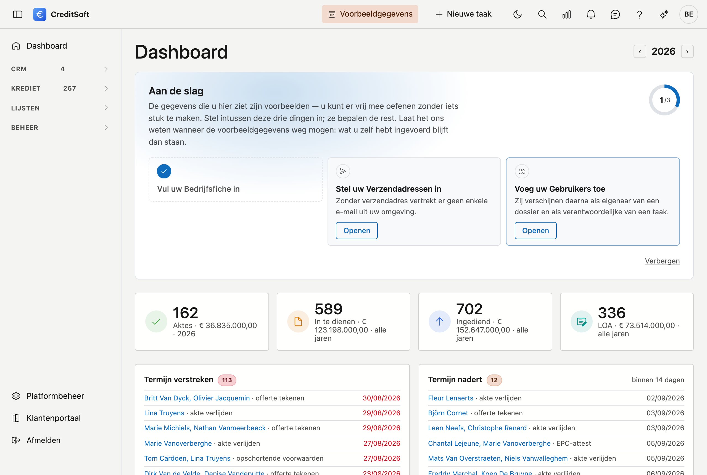
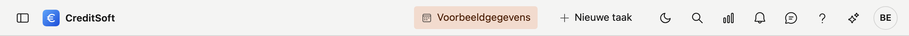

# Navigeren in CreditSoft

Deze pagina geeft een kort overzicht van hoe u uw weg vindt in CreditSoft: het menu links, de balk bovenaan en uw persoonlijke voorkeuren.

Na het aanmelden komt u op uw **dashboard**. Geeft uw rol daar geen toegang toe, dan ziet u een korte
startpagina die u naar het menu verwijst.

## Het menu links

Aan de linkerkant staat het **hoofdmenu**. Het toont de schermen waartoe u toegang hebt; klik op een item om het te openen. Het menu is gegroepeerd — de dagelijkse werkschermen staan bovenaan, beheer-schermen onder de kop **Beheer**.

{ width="240" }

Welke items u ziet, hangt af van uw rol: niet iedereen heeft toegang tot alle schermen.

### Het menu in- en uitklappen

Bovenaan links staat een knop om het menu **in te klappen**. Klapt u het in, dan wordt de menubalk smaller en hebt u meer ruimte voor het scherm zelf. Klik nogmaals om het weer uit te klappen.

### Onderaan het menu

- **Klantenportaal** — opent het klantenportaal van ADM One in een **nieuw tabblad**.
- **Afmelden** — meldt u veilig af.
- **Het versienummer** (bijvoorbeeld *v0.3.0*) — klik erop om **"Wat is nieuw"** te openen: de release notes met de nieuwste updates en verbeteringen.

## De balk bovenaan

Rechtsboven staan de knoppen die u overal bij u hebt, van links naar rechts:

- **Nieuwe taak** — noteer iets dat moet gebeuren **zonder eerst een dossier of relatie te openen**. Handig
  wanneer u aan de telefoon zit en iets niet wil vergeten. Wat u hier maakt, komt in het scherm
  [Taken](../credit-management/tasks.md) terecht, samen met de taken die bij een dossier of relatie horen.
- **Zoeken** (het vergrootglas) — zoek vanaf elk scherm naar een relatie, een dossier, een aanbrenger, een professional of een lead. Zie [Zoeken vanaf elk scherm](zoeken.md).
- **Licht of donker** (het maantje) — wisselt tussen de lichte en de donkere weergave.
- **Meldingen** (het belletje) — zie hieronder.
- **Feedback** (het tekstballon-icoon) — stuur ons een melding of suggestie. Uw bericht komt rechtstreeks bij
  ons terecht.
- **Help** (het vraagteken) — opent de uitleg voor het scherm waarop u staat, met een link naar deze
  volledige handleiding.
- **Vraag het de handleiding** — zie hieronder.
- **Uw avatar** (de ronde knop met uw initialen of foto) — opent uw [voorkeuren](voorkeuren.md).

### Het belletje: uw achterstallige taken

Het belletje telt de **taken die bij u openstaan en waarvan de vervaldatum voorbij is**. Nadrukkelijk enkel
die van u — niet die van het hele kantoor, want dan zegt het getal niets over wat u moet doen.

Klik erop en u ziet welke taken het zijn. Staat er niets, dan is er niets over tijd.

!!! note "Waarom *Alles gelezen* niets doet"
    Een achterstallige taak is geen bericht dat u kunt wegklikken: ze verdwijnt door ze **af te werken of te
    verzetten**. De teller volgt dus de werkelijkheid en niet een leesstatus. De knop *Alles gelezen* staat er
    wel — die hoort bij het meldingenpaneel zelf — maar heeft hier geen effect.

### Vraag het de handleiding

Deze knop opent een **hulp-assistent** die uw vraag in gewone taal beantwoordt op basis van deze handleiding.
Vraag bijvoorbeeld *"waar vind ik het logboek van een relatie?"* en u krijgt het antwoord met een verwijzing
naar de pagina waar het vandaan komt.

Hij put uitsluitend uit de handleiding. Staat iets er niet in, dan zegt hij dat — en dan is dat een gat in de
handleiding, geen gebrek aan de toepassing. Laat het ons weten via de feedback-knop.

### Vraag het uw eigen cijfers

!!! info "Alleen met een eigen AI-sleutel"
    Deze tweede assistent verschijnt **alleen** wanneer uw kantoor in het ADM One-portaal een eigen
    AI-sleutel heeft ingesteld. Staat die er niet, dan bestaat deze lade niet en verandert er niets voor u.
    De hulp-assistent hierboven werkt wél altijd — die loopt op onze centrale sleutel.

Waar de hulp-assistent uit de handleiding put, kijkt deze naar **uw eigen dossiers**. U stelt uw vraag in
gewone taal en krijgt een tabel terug. Zes vragen zijn voorbereid:

| Vraag | Wat u krijgt |
|---|---|
| Dossiers per status | Aantal kredietdossiers per status in een periode — te tellen op ingavedatum of op aktedatum |
| Ingediend per maand | Aantal ingediende dossiers per maand, met het totale krediet- en commissiebedrag |
| Geakteerde dossiers | De dossiers met een akte in een periode, met kredietverstrekker, bedrag en aktedatum |
| Gerealiseerde dossiers | De gerealiseerde dossiers in een periode, met kredietbedrag en commissie per dossier |
| Per aanbrenger | Wat elke aanbrenger opbracht: aantal dossiers, kredietbedrag en commissie |
| Per kredietverstrekker | Wat er per kredietverstrekker gerealiseerd is, met de gemiddelde quotiteit |

!!! note "Dezelfde cijfers als uw rapporten"
    Deze zes vragen lopen over precies dezelfde berekening als de rapporten onder **Lijsten**. Ze geven dus
    altijd hetzelfde getal — anders zou u niet weten welk van de twee u moet geloven.

## Uw voorkeuren

Klik op uw **avatar** rechtsboven om het voorkeuren-paneel te openen: uw profielfoto, de accentkleur, de
grootte van de weergave, de taal en tweestapsverificatie.

{ width="330" }

Wat er precies in staat — en waarom uw taal en kleuren níét meeverhuizen naar een andere computer — leest u op
[Uw voorkeuren](voorkeuren.md). Uw eigen contactgegevens, agendakleur en mailhandtekening staan op
[Mijn gegevens](mijn-gegevens.md).
