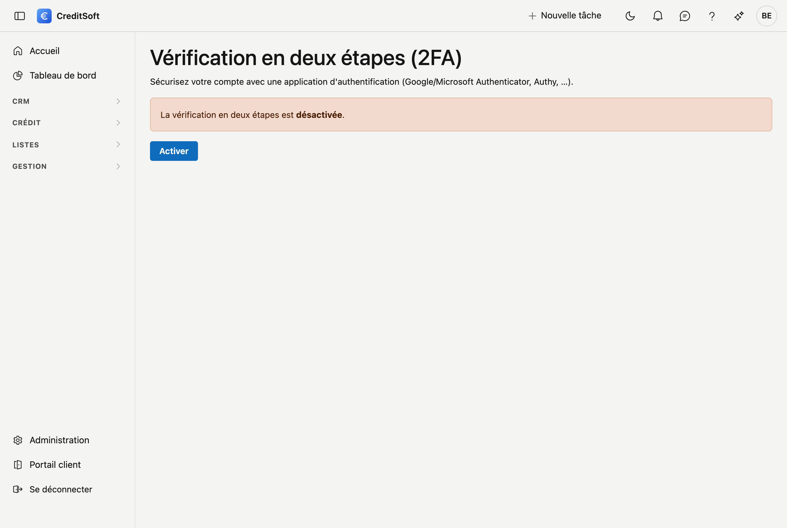

# Vérification en deux étapes (2FA)

La **vérification en deux étapes** sécurise davantage votre compte. En plus de votre mot de passe, CreditSoft demande alors, lors de la connexion, un **code à usage unique** issu d'une application d'authentification (par exemple Google Authenticator, Microsoft Authenticator ou Authy). Ainsi, personne ne peut se connecter avec votre seul mot de passe.

## Activer

1. En haut à droite, cliquez sur votre **avatar** et choisissez **Vérification en deux étapes**.
2. Cliquez sur **Activer**.
3. **Scannez le QR code** avec votre application d'authentification. Si le scan ne fonctionne pas, saisissez manuellement la **clé** affichée dans l'application.
4. L'application affiche maintenant un code à 6 chiffres. Saisissez-le sous **Code de l'application** et cliquez sur **Vérifier et activer**.

La vérification en deux étapes est maintenant **activée**.

## Codes de récupération

Après l'activation, vous recevez une série de **codes de récupération**. Conservez-les en lieu sûr. Chaque code est utilisable **une seule fois** et sert de solution de secours si vous n'avez pas votre application d'authentification à portée de main.

Vous pouvez à tout moment générer de **nouveaux codes de récupération** via le même écran ; les anciens sont alors annulés.

## Se connecter avec la vérification en deux étapes

Désormais, après votre nom d'utilisateur et votre mot de passe, CreditSoft demande une étape supplémentaire : **saisissez le code de votre application d'authentification** et cliquez sur **Vérifier**.

Vous n'avez pas votre application à portée de main ? Cliquez alors sur **Application indisponible ? Utilisez un code de récupération** et saisissez l'un de vos codes de récupération conservés.

## Désactiver

Si vous souhaitez désactiver la vérification en deux étapes, retournez sur **avatar → Vérification en deux étapes** et cliquez sur **Désactiver**.
