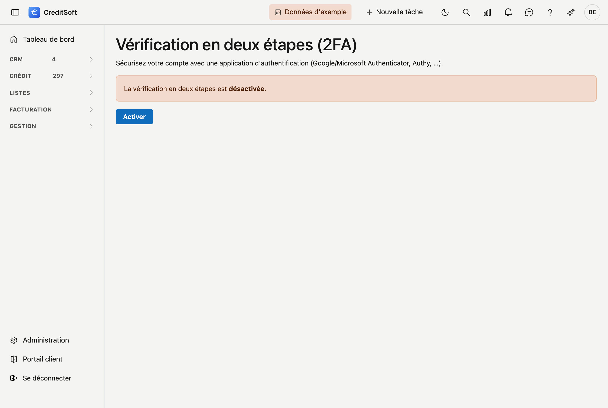

# Vérification en deux étapes (2FA)

La **vérification en deux étapes** sécurise davantage votre compte. En plus de votre mot de passe, CreditSoft demande alors, lors de la connexion, un **code à usage unique** issu d'une application d'authentification (par exemple Google Authenticator, Microsoft Authenticator ou Authy). Ainsi, personne ne peut se connecter avec votre seul mot de passe.

## Activer

1. En haut à droite, cliquez sur votre **avatar** et choisissez **Vérification en deux étapes**.
2. Cliquez sur **Activer**.
3. **Scannez le QR code** avec votre application d'authentification. Si le scan ne fonctionne pas, saisissez manuellement la **clé** affichée dans l'application.
4. L'application affiche maintenant un code à 6 chiffres. Saisissez-le sous **Code de l'application** et cliquez sur **Vérifier et activer**.

La vérification en deux étapes est maintenant **activée**.

## Codes de récupération

Après l'activation, vous recevez une série de **codes de récupération**. Conservez-les en lieu sûr. Chaque code est utilisable **une seule fois** et sert de solution de secours si vous n'avez pas votre application d'authentification à portée de main.

Vous pouvez à tout moment générer de **nouveaux codes de récupération** via le même écran ; les anciens sont alors annulés.

## Se connecter avec la vérification en deux étapes

Lorsque la vérification en deux étapes est active, CreditSoft demande une étape supplémentaire après votre nom d'utilisateur et votre mot de passe : **saisissez le code de votre application d'authentification** et cliquez sur **Vérifier**.

Vous n'avez pas votre application à portée de main ? Cliquez alors sur **Application indisponible ? Utilisez un code de récupération** et saisissez l'un de vos codes de récupération conservés.

## Se connecter avec une clé d'accès

Avec une **clé d'accès** (passkey), vous vous connectez avec l'empreinte digitale, le visage ou le code PIN de votre
appareil — sans mot de passe ni code. Ce n'est possible que si la vérification en deux étapes est **activée** : la
clé d'accès remplace alors les deux étapes à la fois.

**Ajouter une clé d'accès**

1. Allez dans **avatar → Vérification en deux étapes**. Sous **Clés d'accès** figurent celles que vous avez déjà.
2. Sous **Nom de cet appareil**, saisissez un nom reconnaissable, par exemple *Portable bureau*.
3. Cliquez sur **Ajouter une clé d'accès** et suivez la demande de votre appareil (empreinte, visage ou code PIN).

**Se connecter**

Sur l'écran de connexion, cliquez sur **Se connecter avec une clé d'accès** et confirmez sur votre appareil. Votre
mot de passe et le code restent valables, par exemple sur un autre appareil sans clé d'accès.

Avec **Renommer** et **Supprimer**, vous gérez vos clés d'accès. Une clé d'accès est liée à l'adresse de CreditSoft
et à l'appareil sur lequel vous l'avez créée.

## Désactiver

Si vous souhaitez désactiver la vérification en deux étapes, retournez sur **avatar → Vérification en deux étapes**,
cliquez sur **Désactiver** et confirmez avec votre mot de passe. Vos **clés d'accès sont alors supprimées** — sans
vérification en deux étapes, vous ne pouvez plus vous connecter avec elles.
