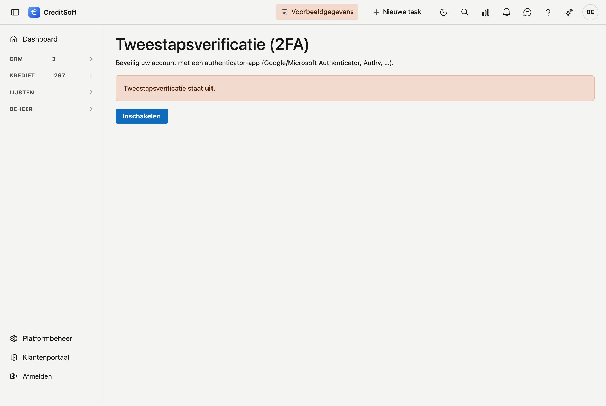

# Tweestapsverificatie (2FA)

Met **tweestapsverificatie** beveiligt u uw account extra. Naast uw wachtwoord vraagt CreditSoft dan bij het aanmelden een **eenmalige code** uit een authenticator-app (bijvoorbeeld Google Authenticator, Microsoft Authenticator of Authy). Zo kan niemand met alleen uw wachtwoord binnengeraken.

## Inschakelen

1. Klik rechtsboven op uw **avatar** en kies **Tweestapsverificatie**.
2. Klik op **Inschakelen**.
3. **Scan de QR-code** met uw authenticator-app. Lukt scannen niet, voer dan de getoonde **sleutel** handmatig in de app in.
4. De app toont nu een code van 6 cijfers. Vul die in bij **Code uit de app** en klik op **Verifiëren en inschakelen**.

Tweestapsverificatie staat nu **aan**.

## Herstelcodes

Na het inschakelen krijgt u een reeks **herstelcodes**. Bewaar die op een veilige plaats. Elke code is **eenmalig** bruikbaar en dient als noodoplossing als u uw authenticator-app niet bij de hand hebt.

U kunt later altijd **nieuwe herstelcodes** aanmaken via hetzelfde scherm; de oude vervallen dan.

## Aanmelden met tweestapsverificatie

Staat tweestapsverificatie aan, dan vraagt CreditSoft na uw gebruikersnaam en wachtwoord een extra stap: **voer de code uit uw authenticator-app in** en klik op **Verifiëren**.

Hebt u uw app niet bij de hand? Klik dan op **App niet beschikbaar? Gebruik een herstelcode** en voer een van uw bewaarde herstelcodes in.

## Uitschakelen

Wilt u tweestapsverificatie weer uitzetten, ga dan opnieuw naar **avatar → Tweestapsverificatie** en klik op **Uitschakelen**.
