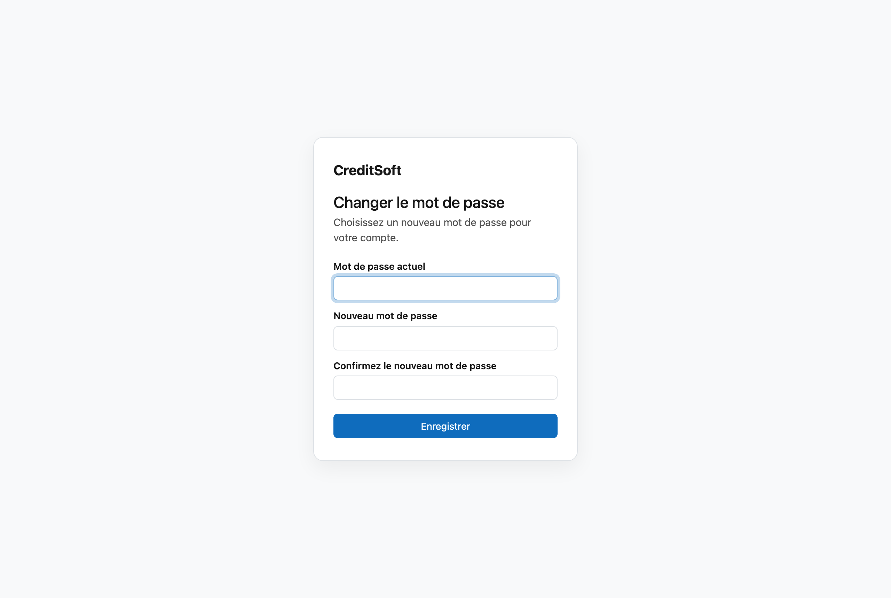

# Changer le mot de passe

Vous changez votre mot de passe sur un seul écran, comportant trois champs : votre mot de passe **actuel**, le
**nouveau**, et ce nouveau mot de passe **une seconde fois** en confirmation.

## Quand vous le rencontrez

- **À votre première connexion.** Lorsque votre administrateur crée un compte pour vous, vous recevez un mot de
  passe **temporaire**. CreditSoft vous amène ensuite directement à cet écran : le mot de passe temporaire doit
  disparaître avant que vous ne poursuiviez. C'est volontaire — un mot de passe qu'une autre personne a choisi
  pour vous n'est pas votre mot de passe.
- **Quand vous souhaitez le changer vous-même.** C'est possible à tout moment : ouvrez votre avatar en
  haut à droite → **Toutes les préférences…** et cliquez en bas, sous *Sécurité*, sur
  **Changer le mot de passe**.

## Le remplissage

Le nouveau mot de passe et sa confirmation doivent être **exactement identiques** ; s'ils diffèrent, CreditSoft
vous le signale et rien ne change. Ressaisissez-les alors — vous ne perdez rien.

!!! tip "Préférez la longueur à la complexité"
    Une phrase dont vous vous souvenez est plus sûre qu'un mot court truffé de caractères étranges. Et pour
    CreditSoft, utilisez un mot de passe que vous n'employez nulle part ailleurs.

## Mot de passe oublié

Si vous avez perdu votre mot de passe, cliquez sur **Mot de passe oublié ?** sur l'écran de connexion. Saisissez
l'adresse e-mail de votre compte et cliquez sur **Envoyer le lien**. Vous recevrez un e-mail avec un lien pour
définir un nouveau mot de passe. Cet écran-ci ne vous sera d'aucune utilité : il demande votre mot de passe actuel,
précisément ce dont vous ne disposez plus.

- Le lien est valable **une heure** et ne fonctionne **qu'une seule fois**. S'il a expiré, demandez-en simplement un
  nouveau.
- La réponse est **toujours la même**, même si l'adresse ne correspond à aucun compte. Ainsi, personne ne peut
  tester qui possède un compte.
- Pas reçu d'e-mail ? Vérifiez vos courriers indésirables, ou adressez-vous à votre administrateur.

## Un verrou de plus

Un mot de passe solide arrête celui qui ne le connaît pas. Il n'arrête personne qui met la main dessus. C'est
à cela que sert la [vérification en deux étapes](tweestapsverificatie.md) : votre mot de passe seul ne suffit
alors plus pour entrer.
