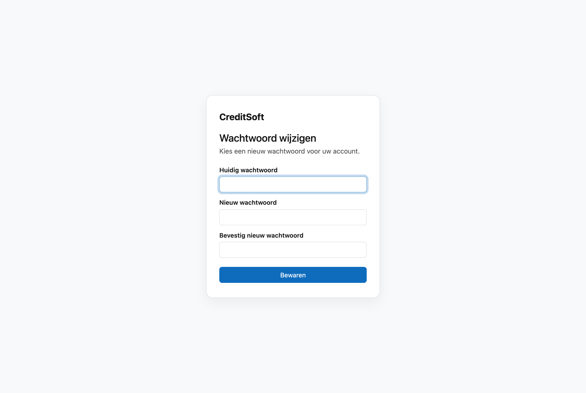

# Wachtwoord wijzigen

Uw wachtwoord verandert u op één scherm, met drie velden: uw **huidige** wachtwoord, het **nieuwe**, en dat
nieuwe **nog een keer** ter bevestiging.

## Wanneer u het te zien krijgt

- **Bij uw eerste aanmelding.** Maakt uw beheerder een account voor u aan, dan krijgt u een **tijdelijk**
  wachtwoord. CreditSoft brengt u daarna meteen naar dit scherm: het tijdelijke wachtwoord moet weg vóór u
  verder werkt. Dat is met opzet — een wachtwoord dat iemand anders voor u koos, is geen wachtwoord van u.
- **Wanneer u het zelf wil veranderen.** Dat kan altijd: open uw avatar rechtsboven → **Alle voorkeuren…** en klik onderaan bij *Beveiliging* op **Wachtwoord wijzigen**.

## Het invullen

Het nieuwe wachtwoord en de bevestiging moeten **exact gelijk** zijn; verschillen ze, dan zegt CreditSoft dat
en verandert er niets. Vul daarna opnieuw in — u verliest niets.

!!! tip "Kies iets lang boven iets ingewikkeld"
    Een zin die u onthoudt is veiliger dan een kort woord met vreemde tekens erin. En gebruik voor CreditSoft
    een wachtwoord dat u nergens anders gebruikt.

## Uw wachtwoord vergeten

Bent u uw wachtwoord kwijt, dan klikt u op het aanmeldscherm op **Wachtwoord vergeten?**. Vul het e-mailadres
van uw account in en klik op **Link versturen**. U krijgt dan een mail met een link om een nieuw wachtwoord in te
stellen. Dit scherm hebt u daar niet voor nodig — het vraagt immers uw huidige wachtwoord, en dat is net wat u
niet meer hebt.

- De link is **één uur** geldig en werkt **één keer**. Is hij verlopen, vraag dan gewoon een nieuwe aan.
- U krijgt **altijd hetzelfde antwoord**, ook als het adres niet bij een account hoort. Zo kan niemand uitproberen
  wie een account heeft.
- Geen mail ontvangen? Kijk in uw spam, of vraag het aan uw beheerder.

## Nog een slot erbij

Een sterk wachtwoord houdt iemand tegen die het niet kent. Het houdt niemand tegen die het wél te pakken
krijgt. Daarvoor zet u [tweestapsverificatie](tweestapsverificatie.md) aan: dan volstaat uw wachtwoord alleen
niet meer om binnen te raken.
