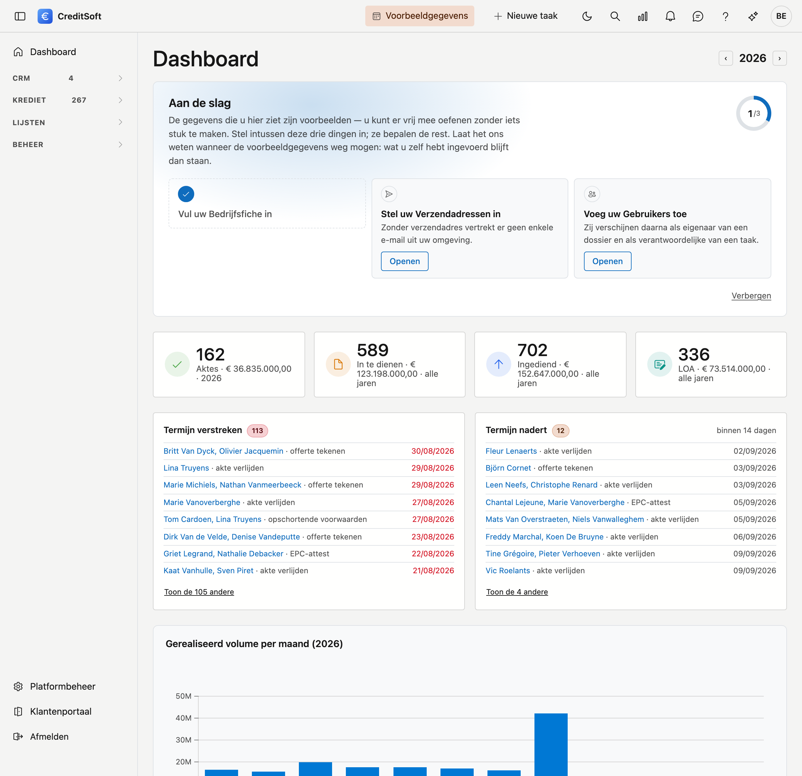

---
hide:
  - navigation
  - toc
---

# Elk kredietdossier van aanvraag tot commissie

CreditSoft brengt uw dossiers, aanvragers, panden, documenten en commissies samen
in één toepassing. Wat u vandaag in mappen, mails en rekenbladen bijhoudt, staat
hier bij het dossier waar het thuishoort.

[Aan de slag](getting-started/navigatie.md){ .cs-knop .cs-knop--vol }
[Alle onderwerpen](#alle-onderwerpen){ .cs-knop .cs-knop--rand }

{ .off-glb }

:material-folder-open-outline:

### Alles bij het dossier

Aanvragers, panden, contracten, documenten en het volledige journaal staan bij het
kredietdossier zelf. Niemand hoeft nog te zoeken waar een stuk bewaard is.

:material-account-multiple-check-outline:

### Uw klant levert zelf aan

Via het klantenportaal laadt uw klant zijn documenten op met een persoonlijke link.
U beoordeelt ze; wat u afkeurt, vraagt de toepassing automatisch opnieuw.

:material-calculator-variant-outline:

### Commissie die zichzelf rekent

Leg per aanbrenger vast wat er afgesproken is — direct, gespreid of in termijnen —
en CreditSoft zet de maandbedragen klaar voor het borderel en de fiche 281.50.

## Alle onderwerpen

-   :material-rocket-launch-outline:{ .lg .middle } **Aan de slag**

    ---

    Uw weg vinden in het scherm, het dashboard lezen en tweestapsverificatie
    instellen.

    [:octicons-arrow-right-24: Navigeren in CreditSoft](getting-started/navigatie.md)

-   :material-file-document-outline:{ .lg .middle } **Kredieten**

    ---

    Kredietdossiers opvolgen, en de kredietinstellingen en verzekeraars waarmee
    uw kantoor samenwerkt.

    [:octicons-arrow-right-24: Kredietdossiers](credit-management/credit-files.md)

-   :material-format-list-checks:{ .lg .middle } **Lijsten**

    ---

    Taken, dossieropvolging, schattingen en verzekeringscontracten — elk in een
    eigen overzicht.

    [:octicons-arrow-right-24: Taken](credit-management/tasks.md)

-   :material-account-group-outline:{ .lg .middle } **Relatiebeheer**

    ---

    Relaties, professionals en aanbrengers, met hun afspraken en groepen.

    [:octicons-arrow-right-24: Relaties](crm/relations.md)

-   :material-cog-outline:{ .lg .middle } **Beheer**

    ---

    Bedrijfsfiche, gebruikers en rollen, mailsjablonen, keuzelijsten, prullenbak
    en het actielogboek.

    [:octicons-arrow-right-24: Bedrijfsfiche](administration/company-profile.md)

-   :material-lifebuoy:{ .lg .middle } **Hulp nodig?**

    ---

    Gebruik de **zoekbalk** bovenaan om snel een onderwerp te vinden. Wissel
    tussen lichte en donkere modus via het icoon rechtsboven.

    [:octicons-arrow-right-24: Aan de slag](getting-started/navigatie.md)

Deze handleiding **groeit mee met het platform**: telkens een scherm volledig is
nagekeken en vrijgegeven, komt de bijhorende pagina erbij.
