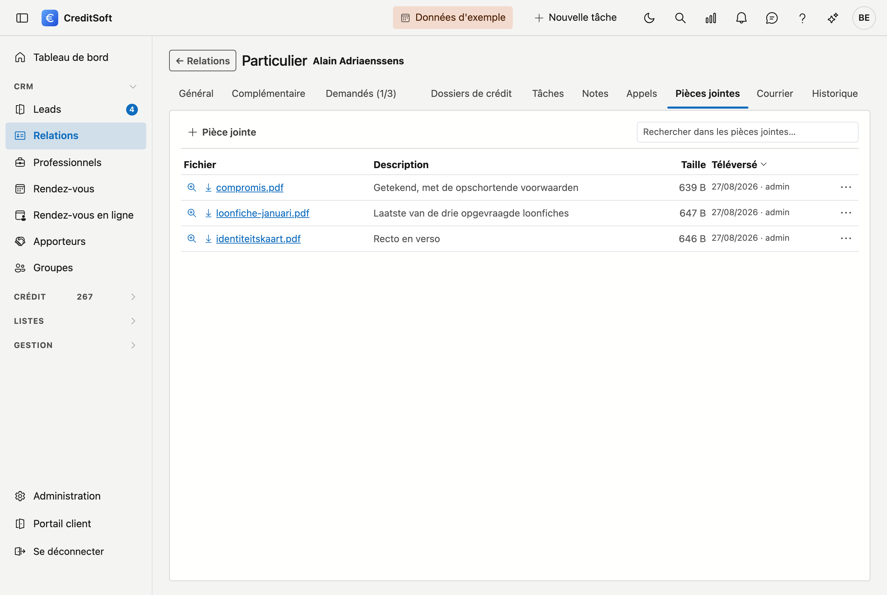

# Pièces jointes

Sous **Pièces jointes**, vous conservez les fichiers qui appartiennent à une fiche : une carte d'identité, une
fiche de paie, une offre signée, un plan. Ils restent auprès de la fiche, même lorsque la personne qui les a
téléversés n'est plus là.

## Téléverser des fichiers

Cliquez sur **Ajouter**. Dans la fenêtre qui s'ouvre :

1. Donnez éventuellement une **description** — à quoi sert le document. C'est plus pratique qu'un nom de fichier
   comme *scan0012.pdf*.
2. **Faites glisser** les fichiers dans la zone marquée, ou cliquez dessus pour les choisir. Vous pouvez en
   téléverser **plusieurs à la fois** ; ils apparaissent dans une petite liste que vous pouvez encore ajuster
   avant d'enregistrer.
3. Cliquez sur **Enregistrer**.

!!! warning "2 Mo maximum par fichier"
    Les fichiers plus volumineux sont refusés. Un scan qui dépasse cette limite a généralement été réalisé à une
    résolution trop élevée — rescannez à un réglage plus bas, ou scindez le document.

## Ce que la liste affiche

Sur une fiche, les pièces jointes figurent dans un tableau avec **Nom**, **Description**, **Taille** et
**Téléversé le**.

Si vous travaillez dans le **volet latéral** à côté d'une liste, la place manque pour des colonnes. Chaque
pièce jointe y forme un bloc : le nom du fichier en haut, puis la taille et la date sur une ligne, puis la
description sur toute la largeur. Le menu **⋯** se trouve en haut à droite du bloc. Vous voyez les mêmes
informations, les unes sous les autres au lieu de côte à côte, sans devoir défiler latéralement.

Un nom de fichier long ou une description longue se répartit sur plusieurs lignes.

## Ouvrir une pièce jointe

- **Cliquez sur le nom du fichier** pour le télécharger.
- S'il s'agit d'un **PDF**, le menu de droite propose également **Consulter** : le document s'ouvre alors dans
  une fenêtre au sein même de CreditSoft, sans téléchargement préalable. Pour les autres types de fichiers, le
  téléchargement est la voie à suivre.

## Modifier ou supprimer

Le menu à droite de chaque pièce jointe propose **Modifier la description** — la description change, le fichier
lui-même non — et **Supprimer**, avec confirmation. Les pièces jointes supprimées arrivent dans la
[Corbeille](../administration/recycle-bin.md).

## Rechercher et exporter

Le **champ de recherche** filtre la liste au fur et à mesure de la frappe. Le bouton à côté exporte la liste vers
**Excel** ou **CSV**. Il s'agit de la liste des pièces jointes, pas des fichiers eux-mêmes.

## Joindre des pièces à un e-mail

Ce qui figure ici peut être envoyé directement lorsque vous rédigez un e-mail depuis le journal : dans le
[Courrier](mailverkeer.md), vous cochez les pièces jointes de cette fiche. Vous ne devez donc pas les
télécharger pour les téléverser à nouveau.
