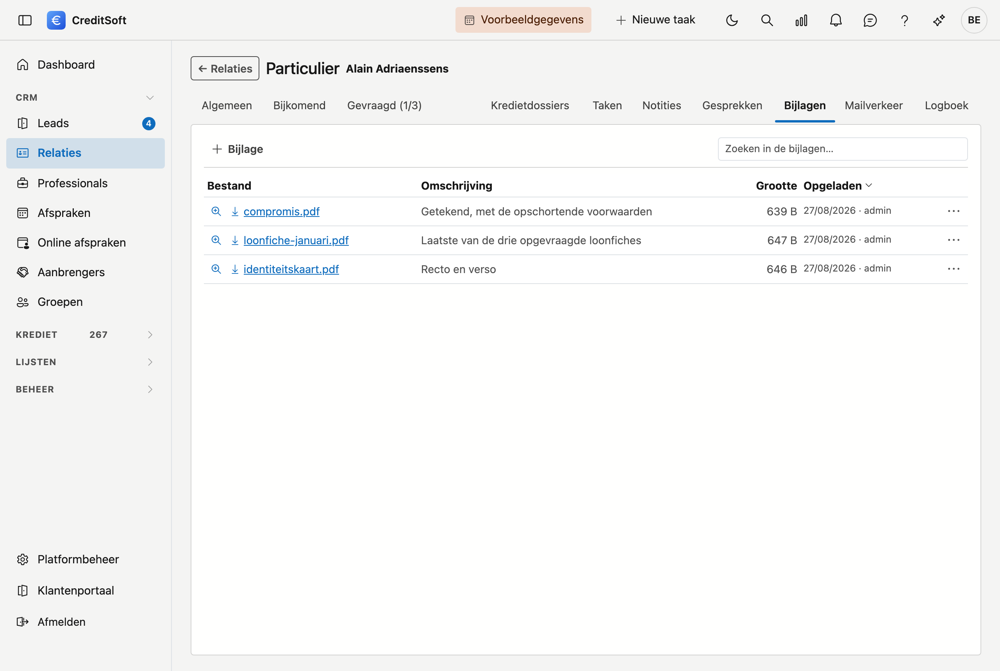

# Bijlagen

Onder **Bijlagen** bewaart u de bestanden die bij een fiche horen: een identiteitskaart, een loonfiche, een
getekende offerte, een plan. Ze blijven bij de fiche staan, ook wanneer degene die ze opgeladen heeft er niet
meer is.

## Bestanden opladen

Klik **Toevoegen**. In het venster dat opent:

1. Geef eventueel een **omschrijving** — waarvoor het document dient. Dat is handiger dan een bestandsnaam als
   *scan0012.pdf*.
2. **Sleep** de bestanden naar het gemarkeerde vak, of klik erop om ze te kiezen. U kunt er **meerdere tegelijk**
   opladen; ze verschijnen in een lijstje dat u nog kan bijwerken vóór u bewaart.
3. Klik **Bewaren**.

!!! warning "Maximaal 25 MB per bestand"
    Grotere bestanden worden geweigerd. Een scan die over die grens gaat, is meestal op een te hoge resolutie
    gemaakt — scan opnieuw op een lagere instelling, of splits het document.

## Wat u in de lijst ziet

Op een fiche staan de bijlagen in een tabel met **Naam**, **Omschrijving**, **Grootte** en **Opgeladen op**.

Werkt u in de **zijlade** naast een lijst, dan is er te weinig plaats voor kolommen. Daar krijgt elke bijlage
een eigen blok: bovenaan de bestandsnaam, daaronder grootte en datum op één regel, en daaronder de
omschrijving over de volle breedte. Het **⋯**-menu staat rechtsboven in het blok. U ziet dezelfde gegevens,
onder elkaar in plaats van naast elkaar, en u hoeft niet zijwaarts te schuiven.

Een lange bestandsnaam of een lange omschrijving breekt over meerdere regels.

## Een bijlage openen

- **Klik op de bestandsnaam** om het bestand te downloaden.
- Is het een **PDF**, dan staat er in het menu rechts ook **Bekijken**: die opent het document in een venster
  in CreditSoft zelf, zonder dat u het eerst moet downloaden. Voor andere bestandssoorten is downloaden de weg.

## Aanpassen of verwijderen

In het menu rechts van elke bijlage staat **Omschrijving aanpassen** — de omschrijving verandert, het bestand
zelf niet — en **Verwijderen**, met een bevestiging. Verwijderde bijlagen komen in de
[Prullenbak](../administration/recycle-bin.md).

## Zoeken en exporteren

Het **zoekveld** filtert de lijst terwijl u typt. De knop ernaast exporteert de lijst naar **Excel** of **CSV**.
Dat is de lijst van bijlagen, niet de bestanden zelf.

## Bijlagen meesturen met een mail

Wat hier staat, kunt u rechtstreeks meesturen wanneer u vanuit het journaal een mail opstelt: in het
[Mailverkeer](mailverkeer.md) kiest u de bijlagen van deze fiche aan met een vinkje. U hoeft ze dus niet eerst
te downloaden om ze weer op te laden.
