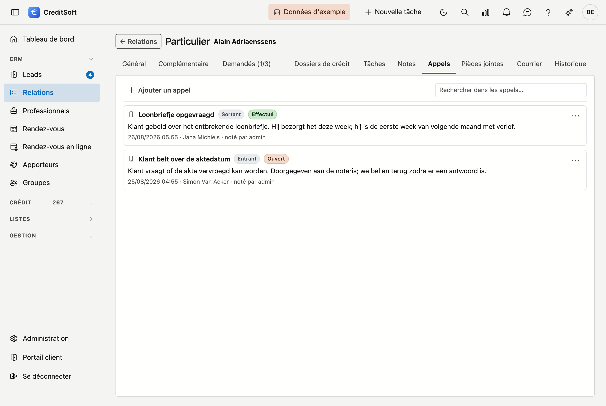

# Appels

Un **appel** est le compte rendu d'un coup de téléphone : qui a appelé, quand, à quel sujet et ce qui en est
ressorti. Là où une [note](notities.md) peut être tout ce que vous souhaitez consigner, cette partie ne traite
que d'une seule chose — le téléphone — et retient donc ce dont vous aurez besoin plus tard.

Cela fait une différence en cas de discussion ultérieure. « Nous en avons parlé le 14 août, appel sortant, c'est
mon collègue qui vous avait au bout du fil » n'est pas la même conversation que « cela figure quelque part dans
nos notes ».

## Noter un appel

Cliquez sur **Ajouter un appel**. Trois champs sont à remplir vous-même :

- **Objet** — le sujet de l'appel. Une ligne suffit.
- **Moment** — quand vous avez appelé, avec l'heure. Rempli sur maintenant par défaut ; vous pouvez le corriger
  si vous notez l'appel après coup.
- **Mené par** — le collaborateur ou l'apporteur qui a appelé. Si vous êtes collaborateur, vous y figurez déjà.

Deux champs sont déjà positionnés sur le cas le plus courant et peuvent rester tels quels :

- **Sens** — **Sortant** si vous avez appelé, **Entrant** si vous avez été appelé.
- **Résultat** — ce que l'appel a donné. Voir ci-dessous.

Le **compte rendu** en dessous est libre et peut être aussi long que nécessaire.

## Les cinq résultats

| Résultat | Quand |
|---|---|
| **Effectué** | Vous avez eu la personne et l'appel est traité |
| **Reçu** | Vous avez été appelé et vous avez décroché |
| **Message laissé** | Vous êtes tombé sur la messagerie et y avez laissé un message |
| **Ouvert** | L'appel demande encore une suite |
| **Annulé** | L'appel n'a pas eu lieu |

**Ouvert** et **Message laissé** reçoivent une étiquette orange dans la liste : ce sont les deux qui appellent
encore une action. S'il faut vraiment que quelqu'un fasse quelque chose à une date donnée, créez-en une
[tâche](taken.md) — elle apparaîtra alors aussi dans l'aperçu des tâches et dans la cloche des notifications.

## Ce que vous voyez dans la liste

Les appels figurent les uns sous les autres, le plus récent en haut. Pour chaque appel, vous voyez l'objet, le
sens et le résultat sous forme d'étiquettes, puis le compte rendu. La ligne grise en dessous indique quand
l'appel a eu lieu, qui l'a mené et qui l'a noté.

Si la date ne porte pas d'heure, seul le jour de cet appel a été conservé.

## Modifier ou supprimer

À droite de chaque appel se trouve un bouton de menu avec **Modifier** et **Supprimer**. La suppression demande
une confirmation et place l'appel dans la [Corbeille](../administration/recycle-bin.md).

## Rechercher

Le **champ de recherche** en haut filtre au fur et à mesure de la frappe, sur l'objet, le compte rendu et le nom
de la personne qui a appelé.
