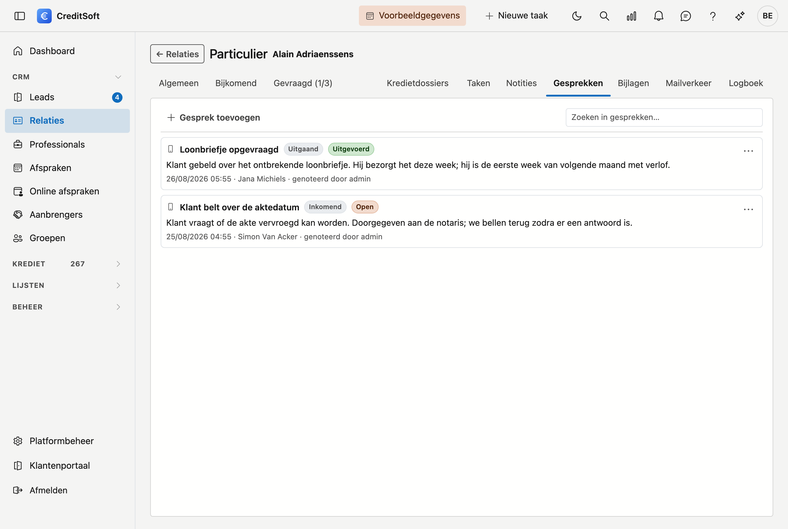

# Gesprekken

Een **gesprek** is het verslag van een telefoontje: wie er belde, wanneer, waarover het ging en wat eruit kwam.
Waar een [notitie](notities.md) alles kan zijn wat u wil vastleggen, gaat dit onderdeel over één ding — de
telefoon — en houdt het daarom vast wat u bij een telefoontje later nodig hebt.

Dat maakt een verschil bij discussies achteraf. "We hebben dat besproken op 14 augustus, uitgaand gesprek, mijn
collega had u aan de lijn" is een ander gesprek dan "dat staat ergens in onze notities".

## Een gesprek noteren

Klik **Gesprek toevoegen**. Drie velden moet u zelf invullen:

- **Onderwerp** — waar het gesprek over ging. Eén regel volstaat.
- **Tijdstip** — wanneer u belde, met het uur erbij. Staat standaard op nu; u kunt het terugzetten als u het
  gesprek achteraf noteert.
- **Gevoerd door** — de medewerker of aanbrenger die belde. Bent u zelf medewerker, dan staat u er al in.

Twee velden staan al goed voor het meest voorkomende geval en kunt u laten staan:

- **Richting** — **Uitgaand** als u belde, **Inkomend** als u gebeld werd.
- **Resultaat** — wat het opleverde. Zie hieronder.

Het **gespreksverslag** eronder is vrij en mag zo lang zijn als nodig.

## De vijf resultaten

| Resultaat | Wanneer |
|---|---|
| **Uitgevoerd** | U hebt de persoon gesproken en het gesprek is afgehandeld |
| **Ontvangen** | U werd gebeld en hebt opgenomen |
| **Voicemail ingesproken** | U kreeg de voicemail en hebt een bericht achtergelaten |
| **Open** | Het gesprek vraagt nog een vervolg |
| **Geannuleerd** | Het gesprek ging niet door |

**Open** en **Voicemail ingesproken** krijgen een oranje label in de lijst: dat zijn de twee waar nog iets mee
moet gebeuren. Moet er echt iemand iets doen op een datum, maak er dan een [taak](taken.md) van — dan komt het
ook in het takenoverzicht en op het belletje terecht.

## Wat u in de lijst ziet

De gesprekken staan onder elkaar, het recentste bovenaan. Per gesprek ziet u het onderwerp, de richting en het
resultaat als label, en daaronder het verslag. De grijze regel eronder zegt wanneer het gesprek plaatsvond, wie
het voerde en wie het noteerde.

Staat er geen uur bij de datum, dan is van dat gesprek enkel de dag bewaard.

## Aanpassen of verwijderen

Rechts van elk gesprek staat een menuknop met **Bewerken** en **Verwijderen**. Verwijderen vraagt een
bevestiging en zet het gesprek in de [Prullenbak](../administration/recycle-bin.md).

## Zoeken

Het **zoekveld** bovenaan filtert terwijl u typt, over het onderwerp, het verslag en de naam van wie belde.
