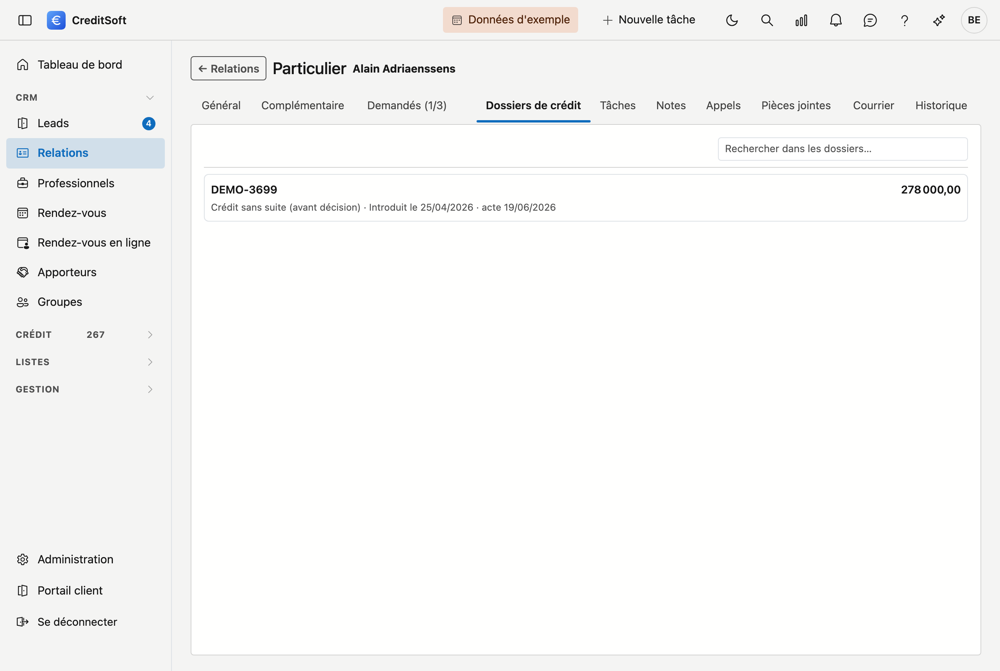

# Dossiers de crédit

La rubrique **Dossiers de crédit** affiche les dossiers dans lesquels cette relation figure comme
**demandeur**, le plus récent en haut. Elle existe pour un moment précis : le client appelle, vous le
recherchez, et vous voulez voir immédiatement quel crédit est en cours sans devoir retourner à la liste des
dossiers.

{ .volle-breedte }

## Ce que vous voyez

Chaque dossier occupe sa propre ligne. En haut le **numéro de dossier** et à droite le **montant du
crédit** ; en dessous, en gris, le reste :

**Actif · Introduit le 27/04/2026 · en cours**

| Élément | Signification |
|---|---|
| Le **statut** | Où en est le dossier — *Actif*, *Réalisé*, *Sans suite*… |
| **Introduit le** | Quand le dossier a été introduit. La liste est triée sur cette date, la plus récente en haut. |
| **acte** ou **en cours** | Si l'acte a été passé, sa date figure ici. Sinon, le dossier est toujours en cours. |

**Cliquez sur une ligne** pour ouvrir le dossier. Pour retrouver un dossier précis, le champ de recherche en
haut filtre sur le numéro et le statut.

## Ce que ce n'est pas

- **Vous ne pouvez rien modifier ici.** Cette rubrique donne un aperçu ; les modifications se font sur le
  dossier lui-même.
- **Un nouveau dossier ne se crée pas ici**, mais avec le bouton **Nouveau dossier de crédit** sur la fiche.
- **Seuls les demandeurs comptent.** Si quelqu'un figure sur un dossier comme notaire, expert ou autre partie,
  ce dossier n'apparaît pas ici — il n'est alors pas emprunteur.

## Si la liste reste vide

Deux messages distincts, au sens différent :

- *« Cette relation ne figure dans aucun dossier de crédit. »* — il n'y en a pas, et c'est exact.
- *« Cette relation n'est pas encore liée à des dossiers de la version précédente. »* — la relation ne porte
  pas encore de numéro de liaison. Sans ce numéro, CreditSoft ne peut rattacher aucun dossier existant à cette
  relation. C'est une question de reprise des données, pas de cette fiche.
