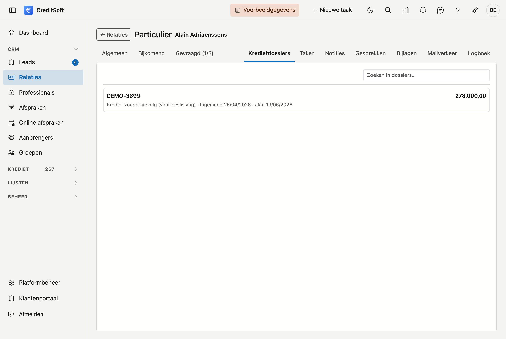

# Kredietdossiers

Het onderdeel **Kredietdossiers** toont de dossiers waarin deze relatie als **aanvrager** staat, het recentste
bovenaan. Het bestaat voor één moment: de klant belt, u zoekt hem op, en u wilt meteen zien welk krediet er
loopt zonder eerst naar de dossierlijst terug te moeten.

{ .volle-breedte }

## Wat u ziet

Elk dossier staat op een eigen regel. Bovenaan het **dossiernummer** en rechts het **kredietbedrag**;
eronder in het grijs de rest:

**Actief · Ingediend 27/04/2026 · loopt nog**

| Wat | Betekenis |
|---|---|
| De **status** | Waar het dossier staat — *Actief*, *Gerealiseerd*, *Zonder gevolg* … |
| **Ingediend** | Wanneer het dossier is ingediend. Hierop is de lijst gesorteerd, recentste bovenaan. |
| **akte** of **loopt nog** | Is de akte verleden, dan staat die datum er. Zo niet, dan loopt het dossier nog. |

**Klik op een regel** om het dossier te openen. Zoekt u iets bepaalds, dan filtert het zoekveld bovenaan op
dossiernummer en status.

## Wat het niet is

- **U kunt hier niets wijzigen.** Dit onderdeel kijkt mee; wijzigen doet u op het dossier zelf.
- **Een nieuw dossier maakt u niet hier**, maar met de knop **Nieuw kredietdossier** op de fiche.
- **Alleen aanvragers tellen mee.** Staat iemand op een dossier als notaris, schatter of andere partij, dan
  verschijnt dat dossier hier niet — hij is dan geen kredietnemer.

## Als de lijst leeg blijft

Twee verschillende meldingen, met een verschillende betekenis:

- *"Deze relatie staat in geen enkel kredietdossier."* — er is niets, en dat klopt.
- *"Deze relatie is nog niet gekoppeld aan dossiers uit de vorige versie."* — de relatie draagt nog geen
  koppelnummer. Zonder dat nummer kan CreditSoft geen bestaande dossiers aan haar hangen. Dat is een kwestie
  van de gegevensovername, niet van deze fiche.
