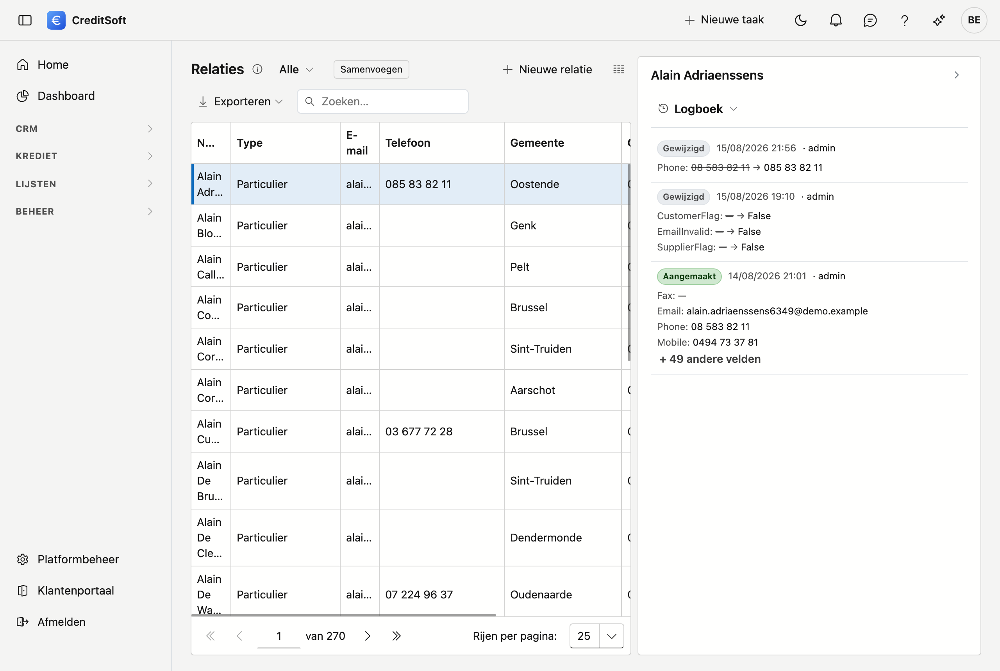

# Logboek

Het **Logboek** toont wat er met deze fiche gebeurd is: wie welk veld wijzigde, wanneer, en van welke waarde
naar welke. Het is de vraag *"wie heeft dat aangepast?"* — beantwoord zonder dat iemand het zich moet
herinneren.

## Wat u ziet

De regels staan **van jong naar oud**, de recentste bovenaan. Elke regel begint met een label dat zegt wat er
gebeurde:

| Label | Betekenis |
|---|---|
| **Aangemaakt** | De fiche werd toegevoegd. Eronder staan de waarden waarmee ze begon. |
| **Gewijzigd** | Er veranderde iets. Per veld staat de oude waarde doorstreept, dan een pijl, dan de nieuwe. |
| **Verwijderd** | De fiche ging naar de [Prullenbak](../administration/recycle-bin.md). |

Naast het label staan het **tijdstip** en de **gebruiker**. Een veld dat leeg was of leeg werd, toont een
streepje.

Werd er in één keer veel gewijzigd, dan toont het logboek de eerste vier velden en daaronder een knop
**+ zoveel andere velden**. Klik erop om alles te zien.

!!! note "Enkel de recentste tweehonderd"
    Van een fiche met een lange geschiedenis toont het logboek de tweehonderd jongste wijzigingen. Staat de
    lijst vol, dan meldt hij dat onderaan.

## Wat er niet in staat

- **Technische stempels.** Velden die de toepassing zelf bijhoudt — wanneer er laatst bewaard werd, en door wie
  — staan niet als wijziging in de lijst. Dat tijdstip staat immers al rechts naast elke regel. Zonder die
  filter zou elke regel ermee beginnen en zou de échte wijziging eronder verdwijnen.
- **Onderliggende regels.** Het logboek gaat over de fiche zelf. Wijzigt u bij een relatie een **adres**, dan is
  dat een eigen record en verschijnt het hier niet.

## U kunt er niets aan veranderen

Het logboek is **alleen-lezen**. Er is geen knop om een regel te wijzigen of te verwijderen, ook niet voor een
beheerder. Dat is geen tekortkoming maar de bedoeling: een geschiedenis waarin u kunt schrappen, is geen
geschiedenis.

## Wie het mag zien

Het Logboek vraagt hetzelfde recht als het [Actielogboek](../administration/activity-log.md). Heeft u dat niet,
dan verschijnt het onderdeel niet in de lade. U regelt dat bij [Rollen](../administration/roles.md).

## Verschil met het Actielogboek

Ze lijken op elkaar en beantwoorden een andere vraag:

- Het **Logboek** hier gaat over **één fiche** en toont **veld per veld** wat er veranderde.
- Het [Actielogboek](../administration/activity-log.md) in het Platformbeheer gaat over **de hele toepassing**
  en toont **handelingen**: wie wanneer aanmeldde, wie iets exporteerde, wie een gebruiker deactiveerde.

Zoekt u wat er met een dossier gebeurd is, kijk dan hier. Zoekt u wat een gebruiker die dag allemaal gedaan
heeft, kijk dan in het Actielogboek.

## Op welke fiches

Het Logboek staat op de zes hoofdfiches: kredietdossiers, relaties, professionals, aanbrengers,
kredietinstellingen en verzekeraars. Op een fiche zonder geschiedenis verschijnt het onderdeel niet.
