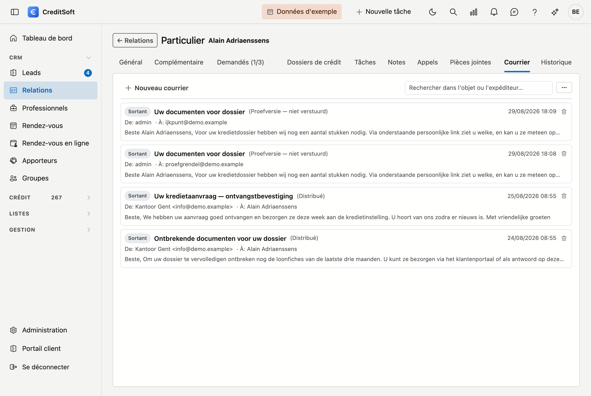

# Courrier

Sous **Courrier** figure la correspondance partie de CreditSoft au sujet de cette fiche — qui a reçu quoi et
quand, et si le message est bien arrivé. Vous pouvez aussi y rédiger immédiatement un nouveau message.

## Envoyer un message

Cliquez sur **Nouveau**. Dans la fenêtre qui s'ouvre :

- **À** — l'adresse e-mail du destinataire. Obligatoire.
- **Cc** — qui reçoit une copie. Séparez plusieurs adresses par une virgule.
- **Adresse d'envoi** — depuis quelle adresse le message part. Si vous laissez ce champ vide, CreditSoft utilise
  l'adresse par défaut. Les adresses proposées ici se gèrent sous
  [Adresses d'envoi](../administration/sender-addresses.md).
- **Objet** — obligatoire.
- **Message** — le texte lui-même.
- **Pièces jointes** — vous cochez parmi les [pièces jointes](bijlagen.md) de cette fiche, et vous pouvez en
  outre ajouter des fichiers isolés qui n'ont pas à rester dans le dossier.

CreditSoft demande une confirmation avant le départ du message, avec l'adresse à l'appui. Ensuite, il est parti
— un e-mail ne revient pas.

## Un e-mail groupé

Un e-mail groupé vous permet d'écrire en une fois à un groupe de clients — le bureau ferme, une nouvelle façon
de travailler, des conditions qui changent. Vous partez d'une liste : cochez les lignes dans
[Dossiers de crédit](../credit-management/credit-files.md#envoyer-un-e-mail-groupe) ou
[Relations](../crm/relations.md#envoyer-un-e-mail-groupe) et cliquez sur **E-mail groupé…** dans la bande au-dessus de la liste.
Il vous faut le droit **Envoyer un e-mail groupé**.

{ .volle-breedte }

**Chaque destinataire reçoit son propre e-mail.** Personne ne voit l'adresse d'un autre, et les variables comme
`{{recipient.greeting}}` ou `{{file.number}}` sont complétées par destinataire. Pour un dossier de crédit, chaque
demandeur ayant une adresse e-mail reçoit un e-mail ; si deux demandeurs partagent la même adresse, un seul part.

La fenêtre montre d'abord **qui reçoit l'e-mail et qui ne le reçoit pas**, avec la raison :

- **pas d'adresse e-mail** ou une **adresse non valide** — aussi lorsque *E-mail invalide* est coché sur la fiche ;
- **pas d'e-mail groupé** — la relation s'est désinscrite, ou quelqu'un a coché *Pas d'e-mail groupé* sur sa fiche ;
- **adresse en double** — cette adresse reçoit déjà l'e-mail par une autre ligne ;
- **supprimé** — la fiche se trouve entre-temps dans la corbeille.

Ensuite, vous choisissez le **texte** :

- un **modèle** — le message général ou un texte propre du bureau, sous [Modèles d'e-mail](../administration/mail-templates.md).
  Chaque destinataire le reçoit dans sa propre langue de documents, néerlandais ou français.
- un **texte libre** — vous tapez vous-même l'objet et le message. Il part dans votre propre langue vers tout le monde, formule d'appel comprise.

**Aperçu** montre l'e-mail tel que le premier destinataire le reçoit. **Envoyer** demande une confirmation avec le
nombre d'e-mails. En bas de chaque e-mail groupé figure un **lien de désinscription** : qui clique dessus et confirme
ne reçoit plus d'e-mails groupés. Les e-mails ordinaires concernant son propre dossier continuent d'arriver.

Chaque e-mail figure ensuite dans le courrier de son dossier ou de sa relation. La fenêtre indique combien sont
partis, combien ont été ignorés et, en cas de problème, pourquoi.

!!! note "Statut Incertain"
    Les e-mails groupés partent par séries. Si le serveur de messagerie refuse une partie d'une série sans dire
    lesquels, les e-mails de cette série reçoivent le statut *Incertain*. Consultez-les alors dans le
    [Suivi des e-mails](../administration/mail-monitoring.md).

## Ce que la liste affiche

Chaque message porte une étiquette **Sortant** ou **Entrant**, l'objet, et en dessous l'**expéditeur** et le
**destinataire**. Les messages sans objet reçoivent un texte de remplacement, afin qu'il y ait toujours quelque
chose de cliquable.

!!! note "Aujourd'hui, il s'agit de courrier sortant"
    CreditSoft enregistre ce qu'il envoie lui-même. Le courrier entrant n'est pas récupéré depuis votre boîte
    aux lettres — il reste où il est.

## Ouvrir un message

**Cliquez sur le message** pour le lire intégralement : expéditeur, destinataires, statut de la remise et le
texte tel qu'il a été envoyé. Cette fenêtre comporte trois boutons :

- **Imprimer** — crée un PDF du message.
- **Supprimer** — le retire de la liste ; il part vers la [Corbeille](../administration/recycle-bin.md).
- **Fermer**.

## Le statut d'un message

Un e-mail n'est pas arrivé du seul fait qu'il est parti. À côté d'un message figure donc un **statut**, et un
petit bouton pour l'**actualiser** lorsque vous voulez savoir où en sont les choses à l'instant.

Si vous préférez la vue d'ensemble sur tous les messages plutôt que par fiche, utilisez le
[Suivi des e-mails](../administration/mail-monitoring.md) dans l'Administration.

## Rechercher et exporter

Le **champ de recherche** filtre la liste au fur et à mesure de la frappe. Le bouton à côté exporte vers
**Excel** ou **CSV**.
