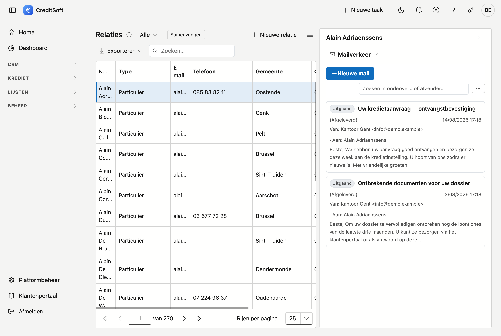

# Mailverkeer

Onder **Mailverkeer** staat de correspondentie die vanuit CreditSoft over deze fiche vertrokken is — wie wat
wanneer gekregen heeft, en of het aangekomen is. U kunt er ook meteen een nieuw bericht opstellen.

## Een bericht versturen

Klik **Nieuw**. In het venster dat opent:

- **Aan** — het e-mailadres van de bestemmeling. Verplicht.
- **Cc** — wie een kopie krijgt. Meerdere adressen scheidt u met een komma.
- **Verzendadres** — vanaf welk adres het vertrekt. Laat u dit leeg, dan gebruikt CreditSoft het standaard
  adres. Welke adressen hier in de keuzelijst staan, beheert u bij
  [Verzendadressen](../administration/sender-addresses.md).
- **Onderwerp** — verplicht.
- **Bericht** — de tekst zelf.
- **Bijlagen** — u kiest met een vinkje uit de [bijlagen](bijlagen.md) van deze fiche, en u kunt daarnaast nog
  losse bestanden toevoegen die niet in het dossier hoeven te blijven.

CreditSoft vraagt een bevestiging vóór het bericht vertrekt, met het adres erbij. Daarna is het weg — een mail
komt niet terug.

## Wat u in de lijst ziet

Elk bericht toont een label **Uitgaand** of **Inkomend**, het onderwerp, en daaronder de **afzender** en de
**bestemmeling**. Berichten zonder onderwerp krijgen een vervangende tekst, zodat er altijd iets aanklikbaars
staat.

!!! note "Vandaag is dit uitgaand verkeer"
    CreditSoft registreert wat het zelf verstuurt. Binnenkomende mail wordt niet opgehaald uit uw mailbox — die
    blijft staan waar ze staat.

## Een bericht openen

**Klik het bericht aan** om het volledig te lezen: afzender, bestemmelingen, de status van de aflevering en de
tekst zoals ze verstuurd is. In dat venster staan drie knoppen:

- **Afdrukken** — maakt een PDF van het bericht.
- **Verwijderen** — haalt het uit de lijst; het gaat naar de [Prullenbak](../administration/recycle-bin.md).
- **Sluiten**.

## De status van een bericht

Een mail is niet aangekomen omdat hij verstuurd is. Naast een bericht staat daarom een **status**, en een
knopje om die te **vernieuwen** wanneer u wil weten hoe het er nú voor staat.

Wilt u het overzicht over alle berichten heen in plaats van per fiche, dan gebruikt u
[Mailmonitoring](../administration/mail-monitoring.md) in het Platformbeheer.

## Zoeken en exporteren

Het **zoekveld** filtert de lijst terwijl u typt. Met de knop ernaast exporteert u naar **Excel** of **CSV**.
