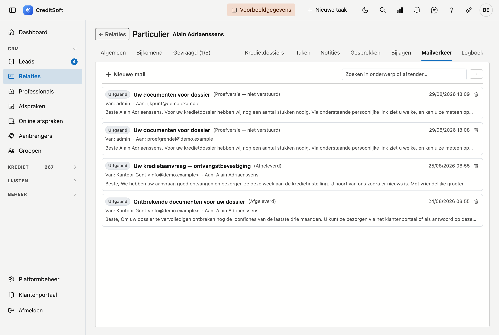

# Mailverkeer

Onder **Mailverkeer** staat de correspondentie die vanuit CreditSoft over deze fiche vertrokken is — wie wat
wanneer gekregen heeft, en of het aangekomen is. U kunt er ook meteen een nieuw bericht opstellen.

## Een bericht versturen

Klik **Nieuw**. In het venster dat opent:

- **Aan** — het e-mailadres van de bestemmeling. Verplicht.
- **Cc** — wie een kopie krijgt. Meerdere adressen scheidt u met een komma.
- **Verzendadres** — vanaf welk adres het vertrekt. Laat u dit leeg, dan gebruikt CreditSoft het standaard
  adres. Welke adressen hier in de keuzelijst staan, beheert u bij
  [Verzendadressen](../administration/sender-addresses.md).
- **Onderwerp** — verplicht.
- **Bericht** — de tekst zelf.
- **Bijlagen** — u kiest met een vinkje uit de [bijlagen](bijlagen.md) van deze fiche, en u kunt daarnaast nog
  losse bestanden toevoegen die niet in het dossier hoeven te blijven.

CreditSoft vraagt een bevestiging vóór het bericht vertrekt, met het adres erbij. Daarna is het weg — een mail
komt niet terug.

## Een groepsmail

Met een groepsmail schrijft u in één keer een groep klanten aan — het kantoor sluit, er komt een nieuwe werkwijze,
de voorwaarden wijzigen. U vertrekt van een lijst: vink in [Kredietdossiers](../credit-management/credit-files.md#een-groepsmail-sturen)
of [Relaties](../crm/relations.md#een-groepsmail-sturen) de rijen aan en klik **Groepsmail…** in de band boven de lijst.
Daarvoor hebt u het recht **Groepsmail versturen** nodig.

{ .volle-breedte }

**Elke ontvanger krijgt zijn eigen mail.** Niemand ziet het adres van een ander, en variabelen zoals
`{{recipient.greeting}}` of `{{file.number}}` worden per ontvanger ingevuld. Bij een kredietdossier krijgt elke
aanvrager met een mailadres een mail; staan twee aanvragers op hetzelfde adres, dan gaat er één.

Het venster toont eerst **wie de mail krijgt en wie niet**, met de reden:

- **geen mailadres** of een **ongeldig adres** — ook als op de fiche *E-mail ongeldig* aangevinkt staat;
- **geen groepsmail** — de relatie meldde zich af, of iemand vinkte *Geen groepsmail* aan op haar fiche;
- **dubbel adres** — dat adres krijgt de mail al via een andere rij;
- **verwijderd** — de fiche staat intussen in de prullenbak.

Daarna kiest u de **tekst**:

- een **sjabloon** — het algemene bericht of een eigen tekst uit [Mailsjablonen](../administration/mail-templates.md).
  Elke ontvanger krijgt het in zijn eigen documenttaal, Nederlands of Frans.
- een **vrije tekst** — u typt onderwerp en bericht zelf. Die gaat in uw eigen taal naar iedereen, ook de aanhef.

**Voorbeeld** toont de mail zoals de eerste ontvanger haar krijgt. **Versturen** vraagt een bevestiging met het
aantal mails. Onderaan elke groepsmail staat een **afmeldlink**: wie erop klikt en bevestigt, krijgt geen
groepsmails meer. Gewone mails over het eigen dossier blijven wel komen.

Elke mail staat daarna in het mailverkeer van haar dossier of relatie. Het venster toont hoeveel er vertrokken,
hoeveel er overgeslagen werden en, als het misliep, waarom.

!!! note "Status Onzeker"
    Groepsmails vertrekken in reeksen. Weigert de mailserver een deel van een reeks zonder te zeggen welke mails,
    dan krijgen de mails van die reeks de status *Onzeker*. Bekijk ze dan in
    [Mailmonitoring](../administration/mail-monitoring.md).

## Wat u in de lijst ziet

Elk bericht toont een label **Uitgaand** of **Inkomend**, het onderwerp, en daaronder de **afzender** en de
**bestemmeling**. Berichten zonder onderwerp krijgen een vervangende tekst, zodat er altijd iets aanklikbaars
staat.

!!! note "Vandaag is dit uitgaand verkeer"
    CreditSoft registreert wat het zelf verstuurt. Binnenkomende mail wordt niet opgehaald uit uw mailbox — die
    blijft staan waar ze staat.

## Een bericht openen

**Klik het bericht aan** om het volledig te lezen: afzender, bestemmelingen, de status van de aflevering en de
tekst zoals ze verstuurd is. In dat venster staan drie knoppen:

- **Afdrukken** — maakt een PDF van het bericht.
- **Verwijderen** — haalt het uit de lijst; het gaat naar de [Prullenbak](../administration/recycle-bin.md).
- **Sluiten**.

## De status van een bericht

Een mail is niet aangekomen omdat hij verstuurd is. Naast een bericht staat daarom een **status**, en een
knopje om die te **vernieuwen** wanneer u wil weten hoe het er nú voor staat.

Wilt u het overzicht over alle berichten heen in plaats van per fiche, dan gebruikt u
[Mailmonitoring](../administration/mail-monitoring.md) in het Platformbeheer.

## Zoeken en exporteren

Het **zoekveld** filtert de lijst terwijl u typt. Met de knop ernaast exporteert u naar **Excel** of **CSV**.
