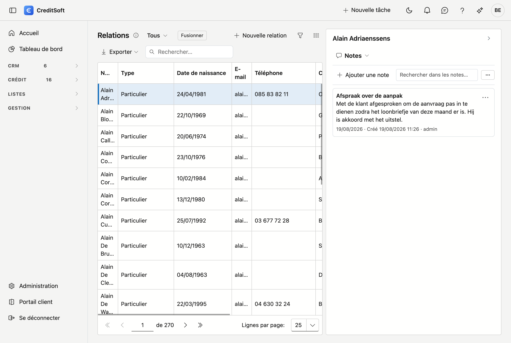

# Notes

Une **note** est ce que vous voulez consigner sans que quelqu'un doive en faire quelque chose : pourquoi un
dossier est à l'arrêt, quel accord a été conclu oralement, ce que vous ne voulez pas oublier. Là où une
[tâche](taken.md) regarde vers l'avant, une note regarde en arrière.

S'agissait-il du **téléphone** ? Utilisez alors les [Appels](gesprekken.md) : vous y consignez aussi qui a
appelé, dans quel sens et ce que l'appel a donné.

## Créer une note

Cliquez sur **Ajouter**. Deux champs sont obligatoires :

- **Titre** — l'objet de la note.
- **Date** — celle des faits. Ce n'est pas nécessairement aujourd'hui : si vous notez après coup ce qui s'est
  dit lundi, indiquez lundi.

Le **contenu** est libre et peut être aussi long que nécessaire.

## Ce que la liste affiche

Les notes se suivent avec leur titre, leur date et leur contenu. En bas de chaque note figurent qui l'a créée et
quand — et si elle a été modifiée par la suite, également par qui et quand.

Ce dernier point n'est pas visible par hasard : une note est un compte rendu, et un compte rendu doit porter sa
date et son auteur.

## Modifier ou supprimer

À droite de chaque note se trouve un bouton de menu avec **Modifier** et **Supprimer**. La suppression demande
une confirmation et place la note dans la [Corbeille](../administration/recycle-bin.md).

## Rechercher et exporter

Le **champ de recherche** en haut filtre au fur et à mesure de la frappe. Le bouton à côté exporte la liste vers
**Excel** ou **CSV**.
