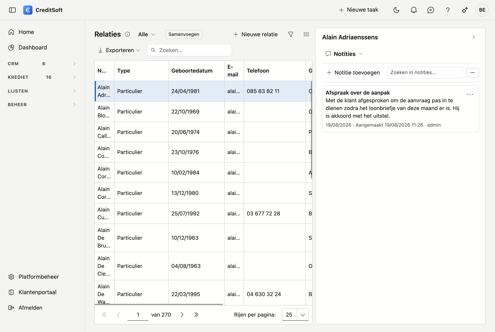

# Notities

Een **notitie** is wat u wil vastleggen zonder dat er iemand iets mee moet doen: waarom een dossier stilligt,
welke afspraak er mondeling gemaakt werd, wat u niet wil vergeten. Waar een [taak](taken.md) vooruitkijkt,
kijkt een notitie terug.

Ging het over de **telefoon**? Gebruik dan [Gesprekken](gesprekken.md): daar houdt u ook bij wie er belde, in
welke richting en wat het opleverde.

## Een notitie aanmaken

Klik **Toevoegen**. Twee velden zijn verplicht:

- **Titel** — waar de notitie over gaat.
- **Datum** — waarop het gebeurde. Dat hoeft niet vandaag te zijn: noteert u achteraf wat er maandag gezegd is,
  dan zet u maandag.

**Inhoud** is vrij en mag zo lang zijn als nodig.

## Wat u in de lijst ziet

De notities staan onder elkaar met hun titel, datum en inhoud. Onderaan elke notitie staat wie ze aanmaakte en
wanneer — en werd ze nadien nog aangepast, dan ook door wie en wanneer.

Dat laatste is niet toevallig zichtbaar: een notitie is een verslag, en bij een verslag hoort te staan van
wanneer het is en wie het schreef.

## Aanpassen of verwijderen

Rechts van elke notitie staat een menuknop met **Bewerken** en **Verwijderen**. Verwijderen vraagt een
bevestiging en zet de notitie in de [Prullenbak](../administration/recycle-bin.md).

## Zoeken en exporteren

Het **zoekveld** bovenaan filtert terwijl u typt. Met de knop ernaast exporteert u de lijst naar **Excel** of
**CSV**.
