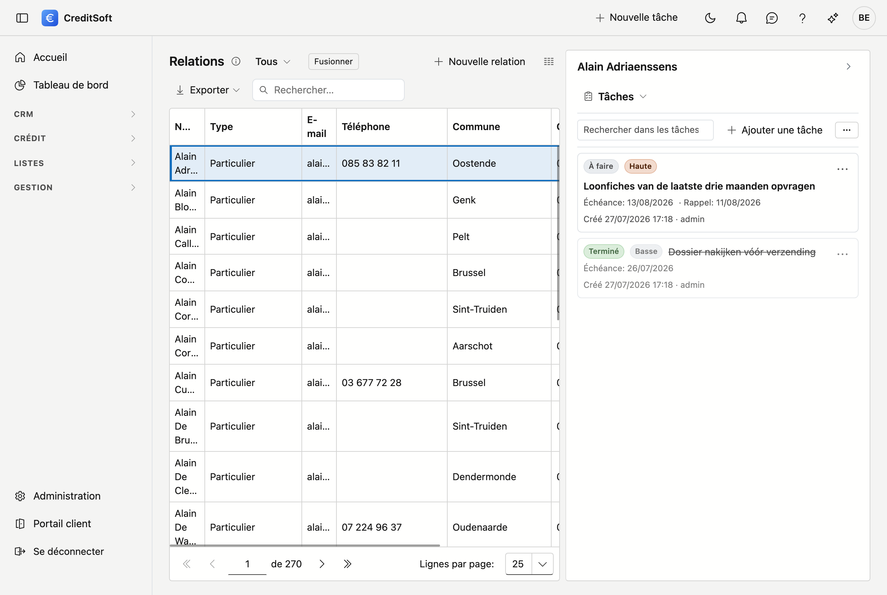

# Le journal

Au-delà de ce qui figure *dans* une fiche — un nom, une adresse, un montant — il y a tout ce qui se passe
*autour* d'elle : une tâche en attente, une note prise lors d'un appel, un document signé, un e-mail envoyé.
C'est le **journal**.

Le journal n'appartient pas à un seul écran. Il fonctionne sur chaque fiche où cela a du sens, et toujours de la
même manière. Ce que vous lisez ici vaut donc pour tous ces écrans à la fois.

## Où le trouver

À droite de l'écran se trouve un **rail** étroit portant le mot *Journal*. Cliquez dessus et le tiroir s'ouvre à
côté de la liste. Il affiche toujours le journal de la **ligne que vous avez sélectionnée** — sélectionnez une
autre ligne et le tiroir suit. Vous ne devez donc pas ouvrir la fiche pour voir ce qui s'y rattache.

Si rien n'est encore sélectionné, le tiroir vous invite d'abord à choisir une ligne.

!!! tip "La hauteur est réglable"
    Vous pouvez agrandir ou réduire le tiroir en tirant sur son bord. Ce choix reste enregistré pour la fois
    suivante.

## Les cinq parties

Les parties figurent côte à côte en haut du tiroir. Dans un tiroir étroit, seules les icônes des parties
inactives sont visibles ; survolez-les pour en voir le nom.

| Partie | À quoi elle sert |
|---|---|
| [Tâches](taken.md) | Ce qui doit encore être fait, par qui, et pour quand |
| [Notes](notities.md) | Ce que vous voulez consigner sans que ce soit une tâche |
| [Pièces jointes](bijlagen.md) | Les documents et fichiers liés à cette fiche |
| [Courrier](mailverkeer.md) | Les e-mails partis de CreditSoft au sujet de cette fiche |
| [Historique](logboek.md) | Qui a modifié quel champ, et de quelle valeur vers quelle autre |

## Sur quels écrans

Le journal figure sur les six fiches principales de CreditSoft :

- [Dossiers de crédit](../credit-management/credit-files.md)
- [Relations](../crm/relations.md)
- [Professionnels](../crm/professionals.md)
- [Apporteurs](../crm/contributors.md)
- [Institutions de crédit](../credit-management/financial-institutions.md)
- [Assureurs](../credit-management/insurance-companies.md)

## Tout le monde ne voit pas la même chose

Les parties que vous voyez dans le tiroir dépendent de vos **droits**. Les tâches, les notes, le courrier et
l'historique correspondent chacun à un droit distinct : si vous ne l'avez pas, la partie n'apparaît pas — elle
n'est donc pas vide ni grisée, elle n'est pas là. Qui possède quels droits se règle sous
[Rôles](../administration/roles.md).

L'[Historique](logboek.md) demande le même droit que le [Journal d'activité](../administration/activity-log.md) :
qui peut voir au niveau de l'application qui a fait quoi, peut le voir aussi par fiche.

## Rechercher et exporter

Les tâches, les notes, les pièces jointes et le courrier disposent chacun de **leur propre champ de recherche**
et d'un bouton pour **exporter** vers Excel ou CSV. Ce que vous exportez correspond à ce que la liste contient à
ce moment-là — votre terme de recherche est donc repris.

## Supprimer

Ce que vous supprimez dans le journal est **archivé** et non effacé, comme partout dans CreditSoft. Vous le
retrouvez dans la [Corbeille](../administration/recycle-bin.md), où les tâches, les notes, les pièces jointes et
le courrier forment chacun leur propre groupe.

L'[Historique](logboek.md) fait exception : rien ne s'y supprime. Un historique dans lequel vous pouvez effacer
n'est pas un historique.
