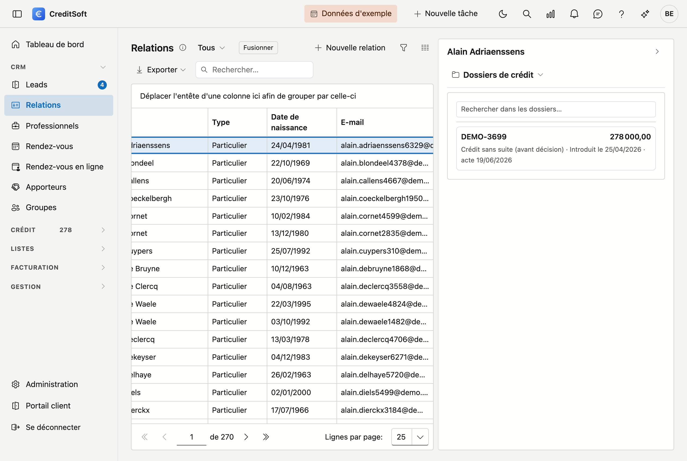

# Le journal

Au-delà de ce qui figure *dans* une fiche — un nom, une adresse, un montant — il y a tout ce qui se passe
*autour* d'elle : une tâche en attente, une note prise lors d'un appel, un document signé, un e-mail envoyé.
C'est le **journal**.

Le journal n'appartient pas à un seul écran. Il fonctionne sur chaque fiche où cela a du sens, et toujours de la
même manière. Ce que vous lisez ici vaut donc pour tous ces écrans à la fois.

## Où le trouver

À **deux endroits**, avec le même contenu : à côté de la liste, et dans la fiche même.

### À côté de la liste

À droite d'un écran de liste se trouve un **rail** étroit portant le mot *Journal*. Cliquez dessus et le tiroir
s'ouvre à côté de la liste. Il affiche toujours le journal de la **ligne que vous avez sélectionnée** —
sélectionnez une autre ligne et le tiroir suit. Vous ne devez donc pas ouvrir la fiche pour voir ce qui s'y
rattache.

Si rien n'est encore sélectionné, le tiroir vous invite d'abord à choisir une ligne.

!!! tip "La hauteur est réglable"
    Vous pouvez agrandir ou réduire le tiroir en tirant sur son bord. Ce choix reste enregistré pour la fois
    suivante.

### Dans la fiche

Lorsque vous ouvrez une fiche, le journal figure en haut sous la forme d'un seul onglet **Journal**, à droite des
onglets de la fiche elle-même. Cliquez dessus et les parties apparaissent en dessous sous forme de sous-onglets. La
rangée du haut reste ainsi sobre pendant que vous travaillez sur l'enregistrement, et tout reste à un clic.

- Survolez l'onglet **Journal** pour voir les sous-onglets qu'il contient.
- Si vous passez à un autre onglet et revenez, le sous-onglet choisi en dernier est à nouveau ouvert.

Dans ce manuel, nous l'écrivons en bref **Journal › Notes** : l'onglet Journal, et dans celui-ci le sous-onglet
Notes.

Il s'agit du même contenu que dans le tiroir. Une tâche que vous ajoutez ici, votre collègue la voit également
lorsqu'il sélectionne la ligne dans la liste.

## Les parties

Dans le tiroir, les parties figurent côte à côte en haut ; dans un tiroir étroit, seules les icônes des parties
inactives sont visibles — survolez-les pour en voir le nom. Sur une fiche, *Dossiers de crédit* et *Factures* ont leur
propre onglet à côté de **Journal** — c'est souvent la raison pour laquelle vous ouvrez la fiche — et les autres
parties figurent en sous-onglets sous **Journal**.

| Partie | À quoi elle sert |
|---|---|
| [Dossiers de crédit](kredietdossiers.md) | Les dossiers de ce client — **uniquement sur une relation** |
| [Factures](../facturatie/facturen.md) | Les factures et notes de crédit de ce client — **uniquement sur une relation** |
| [Tâches](taken.md) | Ce qui doit encore être fait, par qui, et pour quand |
| [Notes](notities.md) | Ce que vous voulez consigner sans que ce soit une tâche |
| [Appels](gesprekken.md) | Les appels téléphoniques concernant cette fiche |
| [Pièces jointes](bijlagen.md) | Les documents et fichiers liés à cette fiche |
| [Courrier](mailverkeer.md) | Les e-mails partis de CreditSoft au sujet de cette fiche |
| [Historique](logboek.md) | Qui a modifié quel champ, et de quelle valeur vers quelle autre |

Le tiroir s'ouvre sur la **première** partie de cette liste. Pour une relation, il s'agit des *Dossiers de crédit*.
Sur une fiche, l'onglet **Journal** s'ouvre sur *Tâches*.

## Sur quels écrans

Le journal figure sur ces écrans de CreditSoft :

| Écran | À côté de la liste | Dans la fiche |
|---|---|---|
| [Relations](../crm/relations.md) | ✔ | ✔ |
| [Leads](../crm/leads.md) | ✔ | ✔ |
| [Professionnels](../crm/professionals.md) | ✔ | ✔ |
| [Apporteurs](../crm/contributors.md) | ✔ | ✔ |
| [Institutions de crédit](../credit-management/financial-institutions.md) | ✔ | ✔ |
| [Assureurs](../credit-management/insurance-companies.md) | ✔ | ✔ |
| [Dossiers de crédit](../credit-management/credit-files.md) | ✔ | — |

Pour un dossier de crédit, vous utilisez le journal via le tiroir situé à côté de la liste. L'écran du dossier
lui-même affiche tant de données qu'il possède sa propre organisation.

## Tout le monde ne voit pas la même chose

Les parties que vous voyez dans le tiroir dépendent de vos **droits**. Les tâches, les notes, le courrier et
l'historique correspondent chacun à un droit distinct : si vous ne l'avez pas, la partie n'apparaît pas — elle
n'est donc pas vide ni grisée, elle n'est pas là. Qui possède quels droits se règle sous
[Rôles](../administration/roles.md).

L'[Historique](logboek.md) demande le même droit que le [Journal des actions](../administration/activity-log.md) :
qui peut voir au niveau de l'application qui a fait quoi, peut le voir aussi par fiche.

## Rechercher et exporter

Les tâches, les notes, les pièces jointes et le courrier disposent chacun de **leur propre champ de recherche**
et d'un bouton pour **exporter** vers Excel ou CSV. Ce que vous exportez correspond à ce que la liste contient à
ce moment-là — votre terme de recherche est donc repris.

## Supprimer

Ce que vous supprimez dans le journal est **archivé** et non effacé, comme partout dans CreditSoft. Vous le
retrouvez dans la [Corbeille](../administration/recycle-bin.md), où les tâches, les notes, les pièces jointes et
le courrier forment chacun leur propre groupe.

L'[Historique](logboek.md) fait exception : rien ne s'y supprime. Un historique dans lequel vous pouvez effacer
n'est pas un historique.
