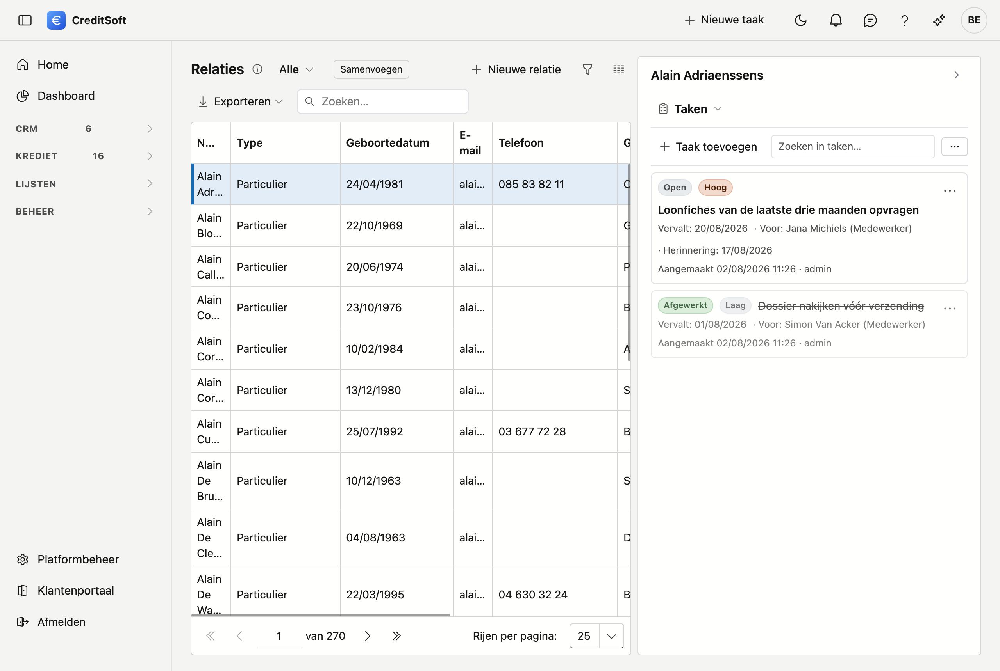
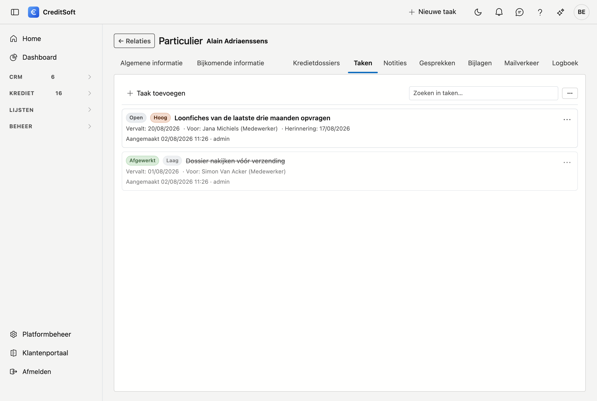

# Het journaal

Naast wat er *in* een fiche staat — een naam, een adres, een bedrag — is er ook alles wat er *rond* die fiche
gebeurt: een taak die openstaat, een notitie van een telefoongesprek, een getekend document, een verstuurde
mail. Dat is het **journaal**.

Het journaal hangt niet aan één scherm. Het werkt op elke fiche waar het zinvol is, en het werkt er telkens op
dezelfde manier. Wat u hier leest, geldt dus voor al die schermen samen.

## Waar u het vindt

Op **twee plaatsen**, met dezelfde inhoud: naast de lijst, en in de fiche zelf.

### Naast de lijst

Rechts op een lijstscherm zit een smalle **rail** met het woord *Journaal*. Klik erop en de lade schuift open
naast de lijst. De lade toont altijd het journaal van de **rij die u geselecteerd hebt** — klikt u een andere
rij aan, dan volgt de lade mee. U hoeft de fiche dus niet te openen om te zien wat eraan hangt.

Staat er nog niets geselecteerd, dan vraagt de lade u eerst een rij te kiezen.

!!! tip "De hoogte is instelbaar"
    U kunt de lade hoger of lager slepen aan de rand. Die keuze blijft bewaard voor de volgende keer.

### In de fiche

Opent u een fiche, dan staan dezelfde onderdelen bovenaan als **tabbladen**, rechts van de tabbladen van de
fiche zelf. Zo blijft alles bij de hand terwijl u aan het record werkt.

Het is dezelfde inhoud als in de lade. Een taak die u hier toevoegt, ziet uw collega ook wanneer hij de rij in
de lijst aanklikt.

## De onderdelen

In de lade staan de onderdelen bovenaan naast elkaar; in een smalle lade ziet u van de niet-actieve onderdelen
enkel het icoon — wijs het aan om de naam te zien. Op een fiche staan ze voluit als tabbladen.

| Onderdeel | Waarvoor |
|---|---|
| [Kredietdossiers](kredietdossiers.md) | De dossiers van deze klant — **alleen op een relatie** |
| [Taken](taken.md) | Wat er nog moet gebeuren, voor wie, en tegen wanneer |
| [Notities](notities.md) | Wat u wil vastleggen zonder dat het een taak is |
| [Gesprekken](gesprekken.md) | De telefoongesprekken die over deze fiche gingen |
| [Bijlagen](bijlagen.md) | Documenten en bestanden bij deze fiche |
| [Mailverkeer](mailverkeer.md) | De mails die vanuit CreditSoft over deze fiche vertrokken |
| [Logboek](logboek.md) | Wie welk veld wijzigde, en van welke waarde naar welke |

De lade opent op het **eerste** onderdeel uit deze lijst. Bij een relatie is dat *Kredietdossiers*.

## Op welke schermen

Het journaal staat op de zes hoofdfiches van CreditSoft:

| Scherm | Naast de lijst | Als tabbladen in de fiche |
|---|---|---|
| [Relaties](../crm/relations.md) | ✔ | ✔ |
| [Professionals](../crm/professionals.md) | ✔ | ✔ |
| [Aanbrengers](../crm/contributors.md) | ✔ | ✔ |
| [Kredietinstellingen](../credit-management/financial-institutions.md) | ✔ | ✔ |
| [Verzekeraars](../credit-management/insurance-companies.md) | ✔ | ✔ |
| [Kredietdossiers](../credit-management/credit-files.md) | ✔ | — |

Bij een kredietdossier werkt u met het journaal via de lade naast de lijst. Het dossierscherm zelf toont zoveel
gegevens dat het een eigen indeling heeft.

## Niet iedereen ziet hetzelfde

Welke onderdelen u in de lade ziet, hangt af van uw **rechten**. Taken, notities, mailverkeer en het logboek
zijn elk een apart recht: heeft u er geen, dan verschijnt dat onderdeel niet — het staat er dus niet leeg of
grijs, het staat er niet. Wie welke rechten heeft, regelt u bij [Rollen](../administration/roles.md).

Het [Logboek](logboek.md) vraagt hetzelfde recht als het [Actielogboek](../administration/activity-log.md): wie
op app-niveau mag zien wie wat deed, mag dat ook per fiche.

## Zoeken en exporteren

Taken, notities, bijlagen en mailverkeer hebben elk **een eigen zoekveld** en een knop om te **exporteren**
naar Excel of CSV. Wat u exporteert, is wat er op dat moment in de lijst staat — uw zoekterm gaat dus mee.

## Verwijderen

Wat u in het journaal verwijdert, wordt **gearchiveerd** en niet gewist, net als overal in CreditSoft. U vindt
het terug in de [Prullenbak](../administration/recycle-bin.md), waar taken, notities, bijlagen en mailverkeer
elk hun eigen groep hebben.

Het [Logboek](logboek.md) is de uitzondering: daar valt niets te verwijderen. Een geschiedenis waarin u kan
schrappen, is geen geschiedenis.
