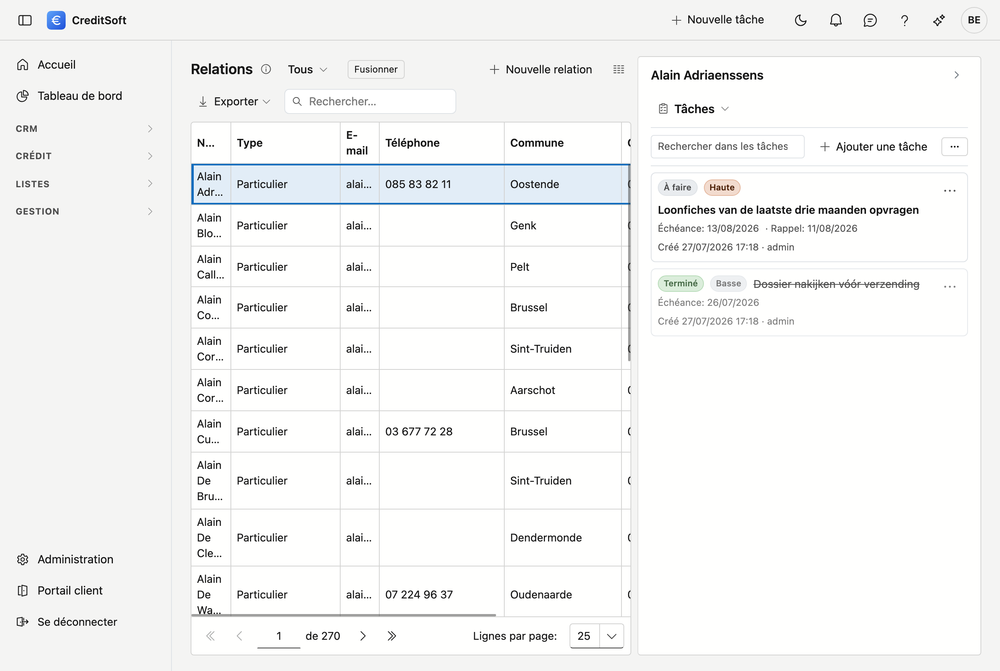

# Tâches

Une **tâche** est quelque chose qui doit encore être fait, avec un nom dessus et une date pour quand. Dans le
[journal](overzicht.md), elle figure auprès de la fiche qu'elle concerne : une tâche sur un dossier, une tâche
sur une relation. Vous ne devez donc pas retenir à quoi elle se rattachait — vous ouvrez la fiche et elle est là.

## Créer une tâche

Cliquez sur **Ajouter** en haut de la liste. Dans la fenêtre qui s'ouvre, quatre champs sont obligatoires — ils
portent un astérisque rouge :

- **Titre** — l'objet de la tâche, en une ligne.
- **Responsable** — qui l'exécute. Ce peut être un **collaborateur** ou un **apporteur** ; le type figure
  chaque fois derrière le nom.
- **Date de début** et **Date d'échéance** — à partir de quand, et pour quand.

Le reste est facultatif :

- **Description** — l'explication qui ne tient pas dans le titre.
- **Statut** — *À faire*, *En cours*, *Terminé* ou *Annulé*.
- **Priorité** — *Basse*, *Normale* ou *Haute*.
- **Rappel** — une date à laquelle vous souhaitez qu'on vous le rappelle.

!!! warning "L'échéance ne peut précéder la date de début"
    Si vous les inversez, la tâche n'est pas enregistrée et CreditSoft vous dit pourquoi. Il en va de même
    lorsqu'un champ obligatoire reste vide : vous ne perdez rien, vous complétez et enregistrez à nouveau.

## Ce que la liste affiche

Chaque tâche affiche son titre et, en dessous en petit, la **date d'échéance**, le **responsable** et le
**rappel** — chaque fois uniquement ce qui est rempli. En bas de la tâche figurent qui l'a créée et quand, et si
elle a été modifiée par la suite, par qui et quand cela s'est produit.

## Modifier ou supprimer une tâche

À droite de chaque tâche se trouve un bouton de menu avec **Modifier** et **Supprimer**. La suppression demande
d'abord une confirmation, et la tâche part vers la [Corbeille](../administration/recycle-bin.md).

## Rechercher et exporter

Le **champ de recherche** en haut filtre la liste au fur et à mesure de la frappe. Le bouton à trois points
juste à côté exporte ce que vous voyez vers **Excel** ou **CSV**.

## Aussi dans une liste toutes fiches confondues

Le journal montre les tâches d'**une seule** fiche. Si vous voulez voir tout ce qui est en attente — tous
dossiers et relations confondus, filtré sur qui doit le faire — utilisez l'écran
[Tâches](../credit-management/tasks.md) du menu *Listes*. Ce sont les mêmes tâches, vues autrement.
