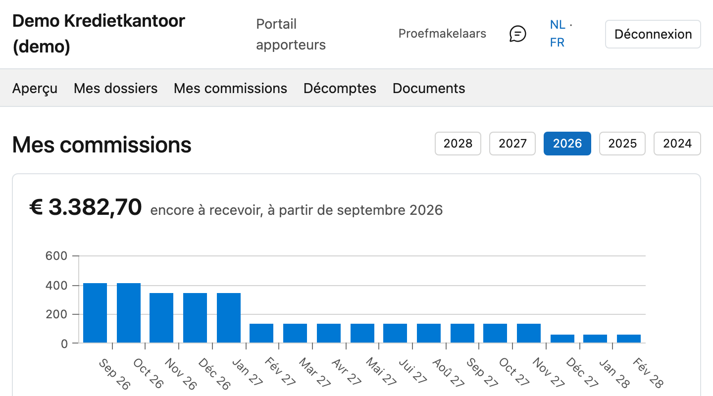

# Mes commissions

Ce qui est comptabilisé en commission pour vous.

## Ouvrir l'écran

Dans le portail, cliquez en haut sur **Mes commissions**.

Si cette partie n'apparaît pas, votre bureau n'affiche pas les commissions dans le portail. Vous obtenez
alors le message *« Les commissions ne sont pas disponibles dans votre portail. »*

## Choisir l'année

L'année se choisit en haut. Seules les années où des écritures existent figurent dans la liste.

À côté de l'année s'affichent le **total** et le nombre d'**écritures**.

## La liste par mois

Une seule liste, **groupée par mois**. La ligne de mois indique le nombre de lignes et le total de ce
mois ; cliquez sur la flèche à gauche pour la déplier. En dessous figure chaque écriture séparément : la
**date**, le **dossier**, une **description** et le **montant**.

Le total annuel figure en bas. En haut à droite, vous pouvez rechercher, trier et exporter la liste.

!!! tip "Tout est replié à l'ouverture"
    C'est voulu : avec plusieurs milliers d'écritures, une liste dépliée est illisible. Les lignes de mois
    vous donnent la vue d'ensemble, et vous dépliez ce que vous souhaitez vérifier.

## Le bordereau d'un mois

Si un mois est décompté, le bouton **Bordereau** figure sur la ligne du mois. Il ouvre le document de
décompte de ce mois — à l'écran, pas en téléchargement. Pour le conserver, utilisez le bouton
d'enregistrement de votre navigateur.

S'il n'y a pas de bouton, c'est que ce mois n'est pas encore décompté. Si, exceptionnellement, plusieurs
bordereaux concernent le même mois, ils figurent tous, chacun avec son numéro.

!!! info "De qui voyez-vous la commission ?"
    La vôtre uniquement, par défaut. Si vous êtes apporteur principal et que votre bureau vous a accordé le
    droit aux chiffres de vos collaborateurs, cette liste inclut la leur. Ce droit est distinct de celui de
    voir leurs *dossiers* — vous pouvez donc voir sur quoi quelqu'un travaille sans savoir ce que cela lui
    rapporte.
