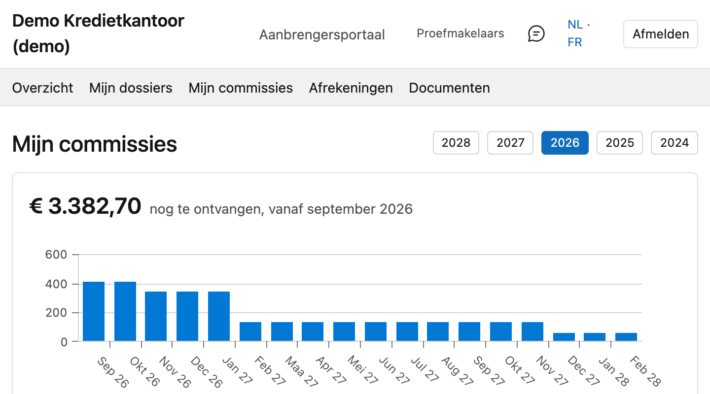

# Mijn commissies

Wat er voor u aan commissie geboekt staat.

## Het scherm openen

Klik in het portaal bovenaan op **Mijn commissies**.

Staat dat onderdeel er niet, dan toont uw kantoor geen commissies in het portaal. U krijgt dan de melding
*"Commissies zijn niet beschikbaar in uw portaal."*

## Het jaar kiezen

Bovenaan kiest u het jaar. Alleen jaren waarin er effectief geboekt is, staan in de lijst.

Naast het jaar staat het **totaal** en hoeveel **boekingen** dat zijn.

## De lijst per maand

Eén lijst, **gegroepeerd per maand**. De maandregel toont het aantal lijnen en het totaal van die maand;
klik op het pijltje links om ze open te klappen. Daaronder staat elke boeking apart: de **datum**, het
**dossier**, een **omschrijving** en het **bedrag**.

Onderaan staat het jaartotaal. Rechtsboven kunt u zoeken, sorteren en de lijst exporteren.

!!! tip "Alles staat dicht bij het openen"
    Dat is bewust: bij enkele duizenden boekingen is een open lijst niet te overzien. De maandregels geven
    u het beeld, en u klapt open wat u wilt nakijken.

## Het borderel van een maand

Is een maand afgerekend, dan staat op de maandregel de knop **Borderel**. Daarmee opent u het
afrekendocument van die maand — in beeld, niet als download. Wilt u het bewaren, dan gebruikt u de
bewaarknop van uw browser.

Staat er geen knop, dan is die maand nog niet afgerekend. Zijn er bij uitzondering meerdere borderellen
in dezelfde maand, dan staan ze er alle, elk met hun nummer.

!!! info "Wiens commissie ziet u hier?"
    Standaard enkel de uwe. Bent u hoofdaanbrenger én heeft uw kantoor u het recht op de cijfers van uw
    medewerkers gegeven, dan telt deze lijst die van hen mee. Dat recht staat los van het recht om hun
    *dossiers* te zien — u kunt dus wel zien waaraan iemand werkt zonder te weten wat het hem opbrengt.
