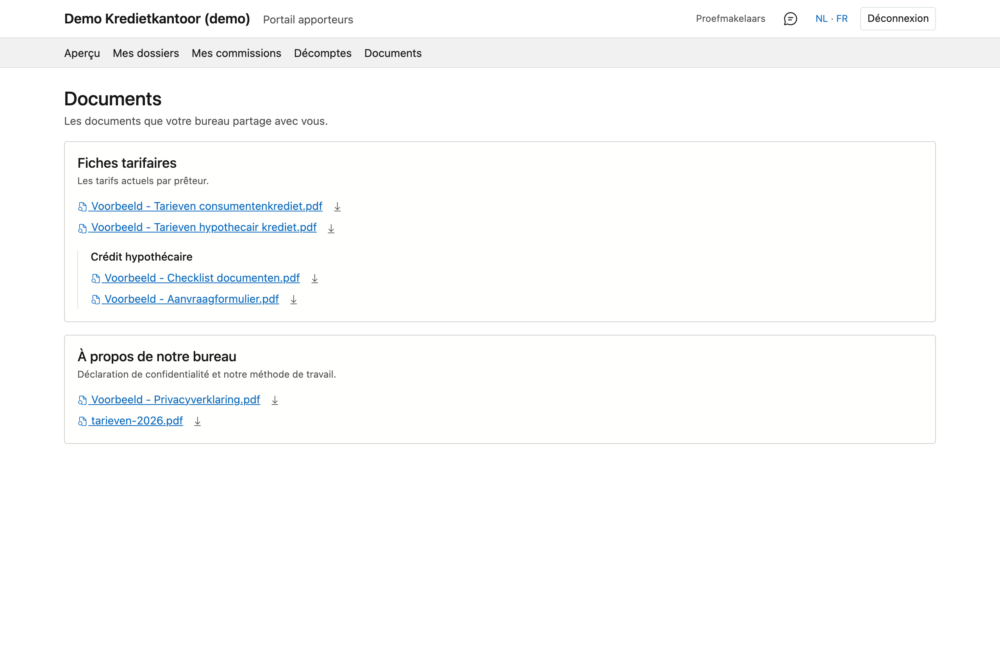

# Documents

Les documents que votre bureau partage avec vous : fiches tarifaires, listes de contrôle, formulaires de
demande, déclaration de confidentialité.

## Ouvrir l'écran

Dans le portail, cliquez en haut sur **Documents**.

Si cette rubrique n'apparaît pas, c'est que votre bureau n'a encore rien préparé pour vous. Il n'y a donc
pas de dossier vide à parcourir — l'entrée de menu reste simplement absente tant qu'il n'y a rien.

## Les dossiers

Les documents sont regroupés en **dossiers**, avec une courte explication sous chacun. Votre bureau
détermine le classement ; vous ne voyez que les dossiers destinés aux apporteurs.

Un dossier peut comporter des subdivisions. S'il est vide, vous le lisez.

## Ouvrir ou enregistrer un document

Deux possibilités par fichier :

- **Cliquez sur le nom** et le document s'ouvre dans un nouvel onglet, à l'écran. Vous voyez ainsi tout de
  suite s'il s'agit bien de ce que vous cherchez.
- **Cliquez sur la flèche** à côté et le fichier est enregistré sur votre ordinateur.

!!! info "Tous les fichiers ne s'affichent pas à l'écran"
    Les PDF et les images, votre navigateur les ouvre lui-même. Un fichier Word ou Excel, non : dans ce cas
    le nom déclenche directement le téléchargement. Vous le voyez à l'icône — un document avec une loupe
    signifie *consulter*, une flèche signifie *enregistrer*.

## Voir aussi

- [Mes dossiers](dossiers.fr.md) — pour les documents liés à un dossier précis
