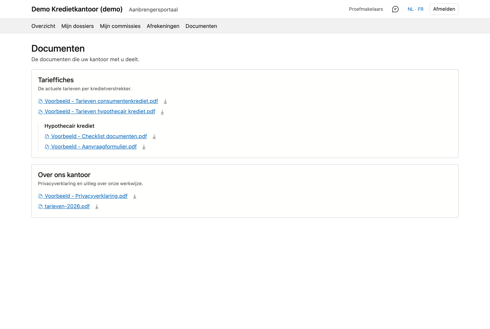

# Documenten

De documenten die uw kantoor met u deelt: tariefkaarten, checklists, aanvraagformulieren, de
privacyverklaring.

## Het scherm openen

Klik in het portaal bovenaan op **Documenten**.

Staat dat onderdeel er niet, dan heeft uw kantoor nog niets voor u klaargezet. Er is dan geen lege map om
door te bladeren — het menu-item blijft gewoon weg tot er iets staat.

## De mappen

De documenten staan gegroepeerd in **mappen**, met onder elke map een korte uitleg. Uw kantoor bepaalt de
indeling; u ziet alleen de mappen die voor aanbrengers bedoeld zijn.

Een map kan onderverdelingen hebben. Staat er in een map niets, dan leest u dat.

## Een document openen of bewaren

Per bestand staan twee manieren:

- **Klik op de naam** en het document opent in een nieuw tabblad, in beeld. Zo ziet u meteen of het is wat
  u zoekt.
- **Klik op het pijltje** ernaast en het bestand wordt bewaard op uw computer.

!!! info "Niet elk bestand kan in beeld"
    PDF's en afbeeldingen opent uw browser zelf. Een Word- of Excel-bestand kan dat niet: daar is de naam
    meteen de download. U merkt dat aan het icoon — een document met een vergrootglas betekent *bekijken*,
    een pijltje betekent *bewaren*.

## Zie ook

- [Mijn dossiers](dossiers.md) — voor de documenten die bij één dossier horen
