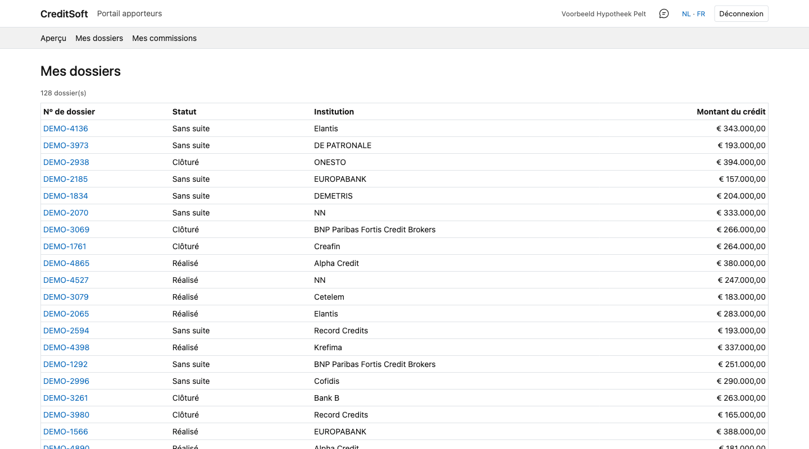
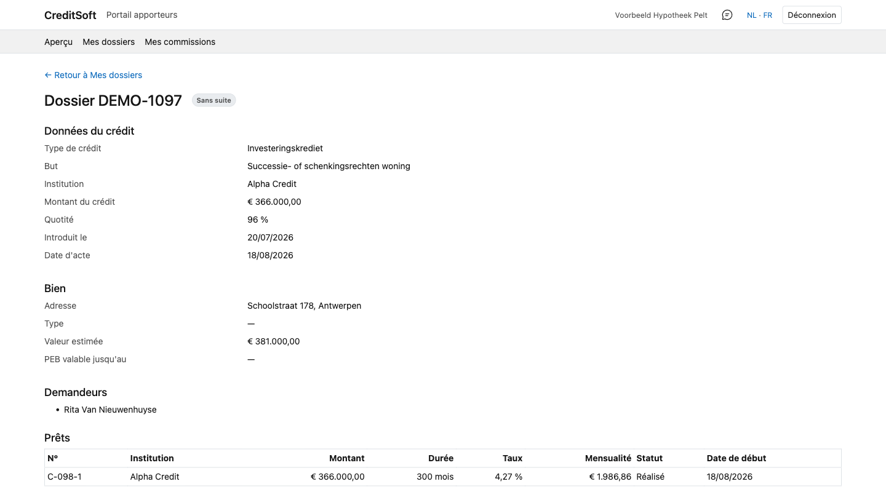

# Mes dossiers

Les dossiers dans lesquels vous figurez comme apporteur.

## Ouvrir l'écran

Dans le portail, cliquez en haut sur **Mes dossiers**.

## La liste

Au-dessus de la liste figure le nombre de dossiers. Pour chacun, vous voyez le **numéro de dossier**, le
**statut**, l'**institution** et le **montant du crédit**.

Si vous êtes apporteur principal et que votre bureau l'a réglé ainsi, les dossiers des bureaux et
collaborateurs qui dépendent de vous s'y trouvent également. Sinon, vous ne voyez que vos propres dossiers.

Cliquez sur un numéro de dossier pour l'ouvrir.

## Consulter un dossier

Le dossier s'ouvre sur une page distincte. Tout ce qui s'y trouve est **en lecture seule** : vous ne pouvez
rien modifier.

**Données du crédit** — type de crédit, but, institution, montant, quotité, date d'introduction et date de
l'acte.

**Bien** — adresse, type, valeur estimée et validité du PEB. Si aucun bien n'est rattaché au dossier, ce
bloc n'apparaît pas.

**Demandeurs** — qui demande le crédit.

**Prêts** — par prêt : le numéro, le montant, la durée en mois, le taux, la mensualité, le statut et la date
de début.

**Documents** — l'état de la checklist : quelle pièce est **présente**, **validée**, **refusée** ou **encore à
fournir**. Ce bloc n'apparaît que si votre bureau affiche les documents dans le portail.

**Retour à Mes dossiers** vous ramène à la liste.

!!! info "Un dossier que vous ne pouvez pas voir"
    Si vous ouvrez un dossier hors de votre portée, vous obtenez *« Ce dossier n'est pas disponible. »* C'est
    la même limite que celle de la liste : ce qui n'y figure pas ne s'ouvre pas non plus via la barre
    d'adresse.
