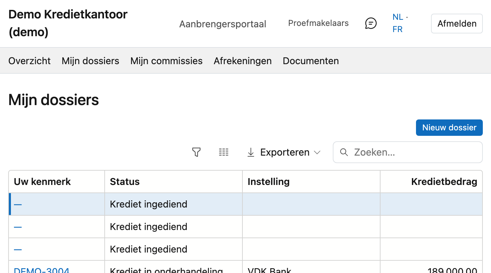
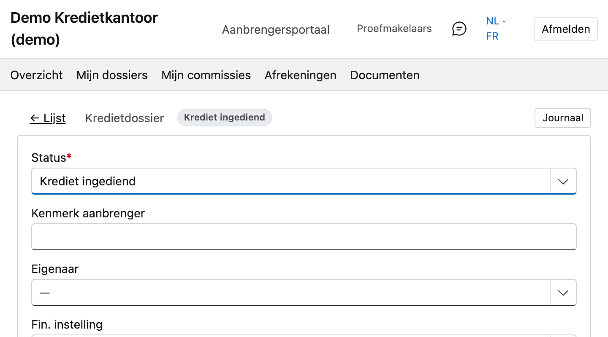

# Mijn dossiers

De dossiers waarin u als aanbrenger staat.

## Het scherm openen

Klik in het portaal bovenaan op **Mijn dossiers**.

## De lijst

Boven de lijst staat hoeveel dossiers er zijn. Per dossier ziet u het **dossiernummer**, de **status**, de
**instelling** en het **kredietbedrag**.

Rechtsboven staat een **zoekveld**. Typ een stuk van een dossiernummer, een naam of een instelling en de
lijst beperkt zich meteen. U kunt ook per kolom sorteren en filteren, en de lijst exporteren.

Bent u hoofdaanbrenger en heeft uw kantoor dat zo ingesteld, dan staan hier ook de dossiers van de
kantoren en medewerkers onder u. Anders ziet u enkel uw eigen dossiers.

Klik op een dossiernummer om het dossier te openen.

## Een dossier openen

Het dossier opent op een eigen pagina, met dezelfde inhoud als uw kantoor ziet: kredietgegevens, het pand,
de aanvragers, de contracten, de betrokken partijen en het journaal.

**Of u iets mag wijzigen, hangt af van wat uw kantoor u toestaat.** Mag u het niet, dan staat alles er ter
inzage en is er geen bewaarknop. Mag u het wel, dan werkt het scherm zoals in de backoffice: u past aan en
klikt op **Bewaren**.

!!! info "Twee rechten, los van elkaar"
    Uw kantoor bepaalt apart of u dossiers mag **zien** en of u ze mag **bijwerken**. Ziet u de dossiers
    van uw medewerkers, dan betekent dat dus niet automatisch dat u ze ook mag aanpassen.

## De tabbladen rechts

Rechts op het dossier staan tabbladen. Welke u ziet, hangt af van het dossier en van uw rechten.

**Betrokken partijen** — notaris, schatter, architect en andere derden bij dit dossier.

**Opmerkingen** — de opmerkingen die bij het dossier horen.

**Documenten** — de stand van de documentenchecklist: welk stuk **aanwezig**, **gevalideerd**, **geweigerd**
of **nog te bezorgen** is.

**Documenten opvragen** — hiermee vraagt u ontbrekende stukken rechtstreeks bij uw klant op. Zie
[Documenten opvragen](#documenten-opvragen-bij-uw-klant) hieronder.

**Commissie doorgeven** — alleen wanneer u zelf commissie op dit dossier ontvangt en met eigen makelaars
werkt. Zie [Afrekeningen aan mijn makelaars](afrekeningen.md).

## Documenten opvragen bij uw klant

Op het tabblad **Documenten opvragen** kiest u de aanvrager uit de lijst en klikt u op **Aanvraag
versturen**. Uw klant krijgt een link waarmee hij zijn stukken oplaadt.

De link verschijnt ook op uw scherm — wie hem liever telefonisch doorgeeft, heeft hem bij de hand.

!!! info "De aanvraag komt van u, niet van het kantoor"
    Uw klant ziet uw eigen e-mailadres als afzender, en zijn antwoord komt dus bij u terecht.

!!! warning "Waarom u soms geen knop ziet"
    Een e-mail kan alleen vertrekken van een domein dat daarvoor geregistreerd is. Dat is geen instelling
    van CreditSoft maar een beveiliging van het internet zelf: ze verhindert dat iemand post verstuurt in
    andermans naam.

    Staat uw adres op het domein van uw kantoor, dan werkt het meteen. Staat het op een eigen domein of op
    een algemeen adres zoals Gmail, dan leest u in plaats van de knop kort waarom het niet kan. Uw kantoor
    kan dat domein laten registreren.

## Terug naar de lijst

Linksboven staat **Lijst**. Uw zoekopdracht en sortering blijven bewaard, dus u komt terug waar u was.

!!! info "Een dossier dat u niet mag zien"
    Opent u een dossier dat buiten uw bereik valt, dan krijgt u *"Dit dossier is niet beschikbaar."* Dat is
    dezelfde grens als de lijst hanteert: wat er niet in staat, opent ook niet via de adresbalk.

## Zie ook

- [Mijn commissies](commissies.md)
- [Afrekeningen aan mijn makelaars](afrekeningen.md)
