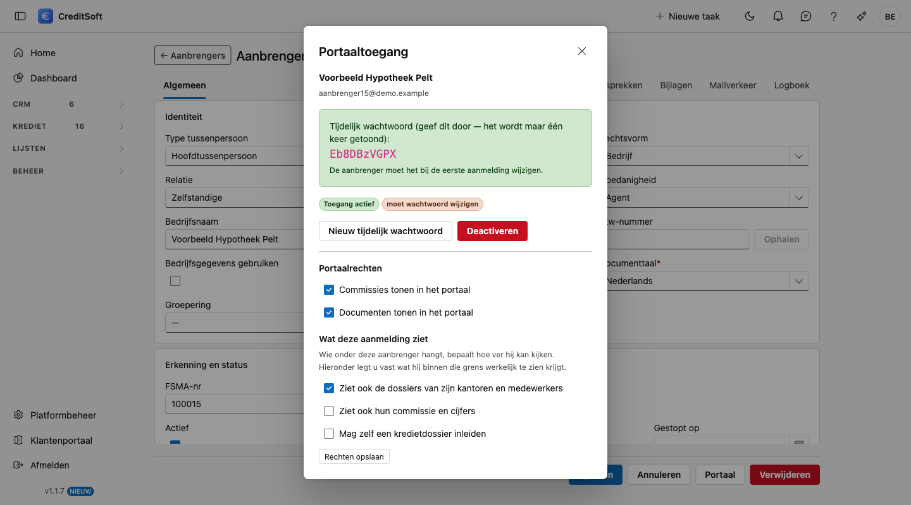

# Het aanbrengersportaal

Uw aanbrengers kunnen zelf aanmelden op CreditSoft en er hun eigen dossiers en commissies bekijken. Ze
komen in een apart, afgeschermd deel van de toepassing: ze zien enkel wat van hen is, en niets van uw
kantoor.

Deze pagina's beschrijven wat een aanbrenger te zien krijgt. Als makelaar leest u ze om te weten wat u
uitdeelt wanneer u iemand toegang geeft.

## Toegang geven

U regelt de toegang op de fiche van de aanbrenger zelf.

1. Open **CRM › Aanbrengers** en dubbelklik de aanbrenger.
2. Klik bovenaan op **Portaal**.
3. Klik op **Nieuw tijdelijk wachtwoord**.

Het wachtwoord verschijnt **één keer** op het scherm. Geef het door aan de aanbrenger; hij moet het bij
zijn eerste aanmelding zelf wijzigen. Bent u het kwijt, dan maakt u gewoon een nieuw tijdelijk wachtwoord
aan — het oude vervalt dan.

Met **Deactiveren** sluit u de toegang weer af. De fiche en alle gegevens blijven staan; enkel het
aanmelden werkt niet meer.

## Wat een aanbrenger mag zien

In hetzelfde venster staan de rechten. Ze bepalen samen wat er in het portaal verschijnt.

| Instelling | Wat ze doet |
|---|---|
| **Commissies tonen in het portaal** | Zonder dit vinkje verdwijnt het hele onderdeel *Mijn commissies*. |
| **Documenten tonen in het portaal** | Bepaalt of de documentenlijst op een dossier zichtbaar is. |
| **Ziet ook de dossiers van zijn kantoren en medewerkers** | Voor een hoofdaanbrenger: hij ziet dan ook wat er onder hem hangt. Zonder dit vinkje ziet hij enkel zijn eigen dossiers. |
| **Ziet ook hun commissies en cijfers** | Een apart recht, los van het vorige. Een kantoorhoofd mag zien waaraan zijn mensen werken zonder te weten wat het hun opbrengt. |

!!! tip "De twee rechten op cijfers staan los van elkaar, en dat is met opzet"
    Iemand kan dus wél de dossiers van zijn medewerkers zien en níét hun commissie. Op elk scherm in het
    portaal staat een zin die zegt over hoeveel kantoren de getoonde cijfers gaan — zo weet de lezer altijd
    waar hij naar kijkt.

De schakelaar **Kan zelf een kredietdossier inleiden** staat er al, maar er hangt vandaag nog geen scherm
aan. Zet u hem aan, dan verandert er voorlopig niets.

## De schermen

- [Overzicht](overzicht.md) — de cijfers van het jaar, een grafiek per maand en de laatst afgesloten kredieten
- [Mijn dossiers](dossiers.md) — de lijst, en wat er op een dossier staat
- [Mijn commissies](commissies.md) — per jaar, per maand en per boeking
